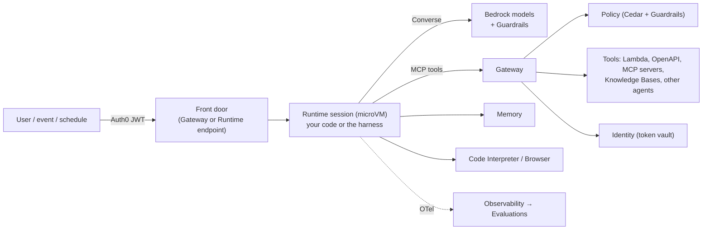
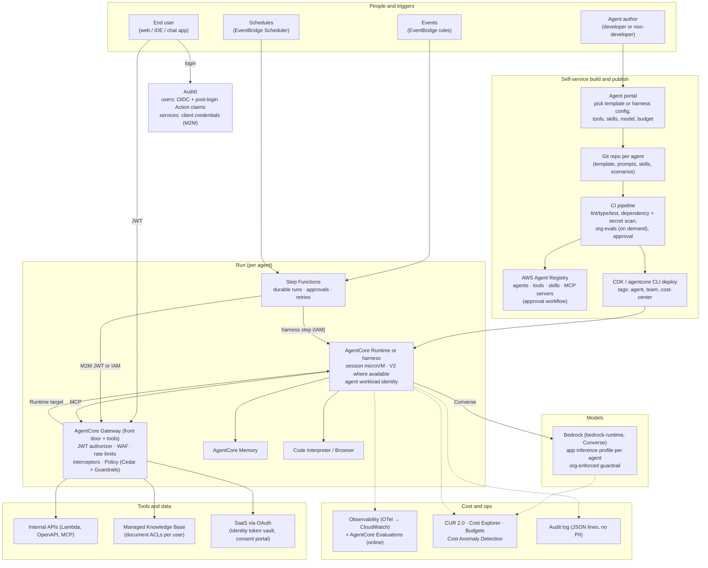
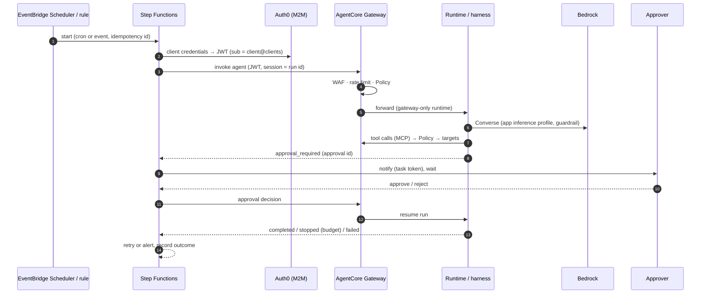
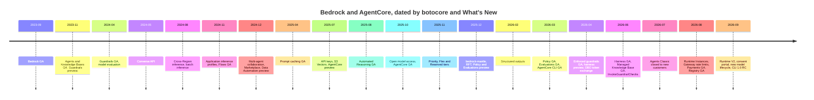

# Amazon Bedrock and AgentCore, part by part (September 2026)

This is a companion to [`AGENTIC_FRAMEWORK_SCOPING.md`](AGENTIC_FRAMEWORK_SCOPING.md), [`AGENTS_BUILDING_BLOCKS.md`](AGENTS_BUILDING_BLOCKS.md), [`AGENT_IDENTITY_AUTH0.md`](AGENT_IDENTITY_AUTH0.md) and [`templates/README.md`](templates/README.md).

For each part of **Amazon Bedrock AgentCore** (the agent platform) and **Amazon Bedrock** (models and model-adjacent services), this document explains:
- what it is, and what familiar thing it is like;
- what you get from it;
- what changed (old vs new);
- what we should do with it.

It ends with a **reference architecture for a self-service agent platform**. That architecture covers cost control, user and agent identities, and agents that run from live prompts, events, chat messages or a schedule.

Everything was checked on **2026-09-27** against AWS documentation, What's New posts, the AgentCore CLI package and the botocore service models, which were diffed month by month up to botocore 1.43.103. **[verify]** marks things we could not confirm or that need a PoC.

---

## Contents

1. [Mental model in one page](#1-mental-model-in-one-page)
2. [AgentCore, part by part](#2-agentcore-part-by-part)
3. [Bedrock, part by part](#3-bedrock-part-by-part)
4. [Old vs new at a glance](#4-old-vs-new-at-a-glance)
5. [Reference architecture: a self-service agent platform](#5-reference-architecture-a-self-service-agent-platform)
6. [What this means for our templates](#6-what-this-means-for-our-templates)
7. [Timeline and sources](#7-timeline-and-sources)

---

## 1. Mental model in one page

The split is simple:
- **Bedrock** is where models live, and it holds model-adjacent services: guardrails, knowledge bases, document extraction and fine-tuning.
- **AgentCore** is where agents live. It runs them, connects them to tools, gives them identity, memory and policy, and observes and evaluates them.

Each AgentCore part can be used on its own, from any framework and with any model.

| Part | One-line answer | It is like… |
|---|---|---|
| **Runtime** | Serverless hosting for *your* agent code. Every conversation gets its own isolated microVM that lives up to 8 hours | Lambda crossed with Fargate, built for long, stateful, streaming agent sessions. It is a host, **not** an agent |
| **Harness** | A **managed agent loop**: you declare model, prompt, tools, skills and memory, and AWS runs the loop inside Runtime | The closest thing to a **managed, remote Claude Code**: a configured agent with a shell, a filesystem and skills, running in a cloud sandbox |
| **Gateway** | One governed endpoint that turns APIs, Lambdas and MCP servers into MCP tools. It can also front other agents and LLMs | An API gateway for tools (and models) that speaks MCP |
| **Identity** | Identities for agents plus a token vault, so agents act for users or as themselves without holding secrets | Okta for workloads, plus a secrets broker for OAuth tokens |
| **Policy** | Cedar rules checked on every tool call at the Gateway, with Bedrock Guardrails inside | An authorization firewall (like OPA or AWS Verified Permissions) for agent actions |
| **Memory** | Managed short-term conversation history plus long-term extracted memories | A managed conversation store with a "facts about the user" index |
| **Code Interpreter / Browser** | Managed sandboxes for running code and driving a headless browser | A hosted Jupyter/shell sandbox, and a hosted Chrome under Playwright |
| **Skills** | Markdown and script bundles loaded on demand (AgentSkills.io format) | Claude Code skills, fetched from S3, Git or AWS |
| **Agent Registry** | A governed catalogue of agents, tools, skills and MCP servers | An internal service catalogue (like Backstage) for agent assets |
| **Observability** | OpenTelemetry traces and metrics into CloudWatch | X-Ray/APM for agent steps |
| **Evaluations / Optimization** | Scores agent traces with built-in or custom judges; recommends prompt changes; runs A/B tests | A CI test suite plus experimentation for agents |
| **Payments** | Lets agents pay for APIs with wallets (x402/MPP) | A corporate card for agents |

The rest of AgentCore is the CLI, the SDKs, the CDK constructs and an MCP server for coding assistants.

**How the parts connect.** In the target shape for our templates, a request arrives with an Auth0 token. It either goes to the Gateway, which can front the Runtime, or goes straight to the Runtime. From there:
1. **The runtime** (our code, or the harness) calls **Bedrock** for the model.
2. **Tool calls** go out through the **Gateway**, where **Policy** checks them against Cedar rules and guardrails.
3. **Identity** supplies the credentials a tool needs.
4. **Memory** remembers the conversation and extracted facts.
5. **Observability** records each step, and **Evaluations** scores the recorded traces.

---

## 2. AgentCore, part by part

**Status overview.** Every part below is GA, with these exceptions:
- **Insights** (part of Optimization) and **managed session storage** are in preview.
- Some parts run in fewer regions: Runtime V2 in 5, Registry in 5, Instances in 9, Harness and Memory in 16, out of 22 regions in total.

**Where the part sits in the API:**
- `bedrock-agentcore-control` is the control plane: you create things there.
- `bedrock-agentcore` is the data plane: you call things there.

### 2.1 Runtime: serverless hosting for agent code

**What it is.** Runtime is a place to run an agent you wrote, in any framework and with any model.
- You give it an ARM64 container, or a zip of Python or Node code.
- It gives each **session** (`runtimeSessionId`) its own **microVM** with isolated CPU, memory and filesystem.
- That microVM survives across requests until it has been idle for 15 minutes (configurable) or reaches its 8-hour maximum.
- The container serves `POST /invocations` and `GET /ping` on port 8080, or MCP, A2A or AG-UI on their own contracts.
- AgentCore handles scaling, isolation, authentication of callers, streaming (SSE, WebSocket, WebRTC) and trace plumbing.

**Is it a managed agent?** No. **Runtime is the host, not the brain.** The loop that decides what to do next is your code: Strands, LangGraph, Pydantic AI, pi, opencode, or anything else. If you want AWS to provide the loop too, use the **harness** (§2.2), which runs on top of Runtime.

**What you get:**
- **Session affinity and isolation.** One user's conversation never shares a VM with another's. This is why our templates keep thread state in memory per session.
- **Versions and endpoints.** Each update is an immutable version. The `DEFAULT` endpoint follows the latest version, and named endpoints pin one. That gives safe rollouts and rollbacks.
- **Shell access into the session VM.** `InvokeAgentRuntimeCommand` runs one command; interactive shells (up to 10 per session) arrived in 2026-06. Use them for deterministic steps (clone a repo, run tests) without paying for model tokens.
- **Filesystems:**
  - session storage (preview): up to 1 GB kept for 14 days;
  - bring-your-own **S3 Files / EFS** (2026-05), for workspaces that outlive a session.
- **Protocols:**
  - HTTP and MCP (2025-07);
  - **A2A** (2025-10), agent-to-agent with an agent card;
  - **AG-UI** (2026-03), streaming UI events to front ends.

**Deployment models:**

| | Runtime V1 (microVM) | **Runtime V2** (`platformVersion`, GA 2026-09-18) | **Runtime Instances** (GA 2026-08-06) |
|---|---|---|---|
| Where it runs | AWS-managed microVM | AWS-managed microVM, restored from a snapshot | **EC2 in your account** (capacity provider), with GPUs available |
| Cold start | Image-size dependent (P75 5–30 s) | **P75 about 2 s** | Instance already running |
| Max session | 8 h | 8 h | **14 days** |
| Memory billing | Peak | **Elastic**: idle memory is reclaimed after 120 s | EC2 prices plus a management fee |
| Price | $0.0895/vCPU-h, $0.00945/GB-h | $0.1276/vCPU-h, $0.0169/GB-h (committed discount "by Oct 2026") | EC2 (Savings Plans apply) plus a fee |
| Catch | – | Code must be **snapshot-safe**: nothing computed at startup (credentials, random values, a Gateway tool list) or it is frozen. **5 regions** (incl. eu-west-1). CLI 0.30.0 cannot set it | Several agents share an instance (weaker isolation). 9 regions |

**Networking and access:**
- **Inbound:** callers authenticate with SigV4/IAM **or** a JWT authorizer, one or the other per runtime. The Auth0 details are in `AGENT_IDENTITY_AUTH0.md`.
- **Network access:** a public endpoint or **VPC** mode, plus **PrivateLink** into AgentCore.
- **Headers:** an allowlist controls which request headers reach the container, and any custom header can be passed through since 2026-05.
- **Resource-based policies** (2025-12).
- **"Accept only traffic from the Gateway"** (2026-06), via `aws:SourceArn` or JWT claims. This makes the Gateway the only way in.
- **Condition keys** for VPC, subnets and authorizer type, for enforcing this org-wide.

**Quotas.** 1,000 TPS on the data plane per account, 25 TPS for new sessions, and 2,500–5,000 active sessions per region (2026-08).

**Old vs new:**
- It started in 2025-07 with containers only.
- Direct code deploy arrived 2025-11.
- Instances arrived 2026-08.
- V2 arrived 2026-09.
- The API only grew; nothing was removed. The `RetryableConflictException` (409) is modelled but "not yet enforced", so clients should retry it.

**Our take.** This is the home of all 8 of our template variants. Plan to make the templates snapshot-safe, then adopt V2 where our region supports it. Use Instances only for long-running or GPU workloads that don't need per-session isolation.

### 2.2 Harness: the managed agent loop ("managed remote Claude Code")

**What it is.** A **declarative agent**. You call `CreateHarness` with:
- a **model**: Bedrock, OpenAI, Gemini or LiteLLM;
- a **system prompt**;
- **tools**: remote MCP, the AgentCore Gateway, Browser, Code Interpreter, inline functions, and built-in **shell and file tools**;
- **skills** (§2.9) and **memory**;
- **truncation** settings, **limits** and lifecycle **hooks**.

You then call `InvokeHarness`. AWS runs the loop, which is **powered by Strands Agents**, inside a Runtime microVM that has its own filesystem and shell. Most changes (switching the model, adding a tool) are configuration updates, not redeploys.

**Is it like a managed remote Claude Code?** Close, yes:
- **Like Claude Code:** it is a ready-made agent loop with a shell, a filesystem, skills and tools, running in a sandbox you don't operate.
- **Where it differs:**
  - it is general-purpose, not tuned for coding;
  - the loop is Strands rather than Anthropic's;
  - you configure it through an API rather than a CLI session;
  - it is multi-tenant by session, with the same microVM isolation as Runtime.

**What you get:**
- **Lifecycle hooks** before and after each invocation and each tool call:
  - a Lambda target gives a synchronous allow/deny, which can block a tool call (our approval and command policy fit here);
  - SNS or EventBridge targets give notifications.
- **Native Step Functions integration**: a harness step inside a state machine, with per-invocation overrides of model, prompt and tools. Combined with Step Functions' human-approval pattern, this covers durable workflows.
- **Export to code**: `agentcore export harness` produces a Strands project, which is the escape hatch when configuration runs out.
- **Versions and endpoints**, as for Runtime.
- **Custom containers**: a custom container image for the environment.
- **Observability**: traces with no setup.

**Price.** **There is no charge for the harness itself.** You pay for the Runtime session, model tokens, Memory and the tools it uses. Note that every allowed tool's definition adds input tokens, even when the tool is never called.

**Old vs new.** The harness is AWS's successor to **Bedrock Agents Classic**:
- preview 2026-04-22, GA 2026-06-17;
- CLI 1.0 makes a harness project the default.

Classic still does a few things the harness does not:
- router-style multi-agent;
- a custom orchestration Lambda;
- per-stage prompt overrides.

**Our take.** Add an **`agentcore-harness` variant** as the "Tier 0" managed default for non-developers. That matches the Tier 0 recommendation in the scoping document. Use hooks for approvals and policy, and keep Runtime plus our own code for anything the configuration can't express.

### 2.3 Gateway: one governed front door for tools, agents and models

**What it is.** A managed endpoint, speaking MCP for tools and HTTP for passthrough, that sits between agents and everything they call. It turns existing services into **MCP tools** so that every agent, in any framework, discovers and calls tools the same way.

**Target types** (what the Gateway can put behind itself):

| Target | What it turns into a tool | Since |
|---|---|---|
| Lambda, OpenAPI spec, Smithy model | Your functions and REST APIs | 2025-07 |
| **MCP server** (with sync of tool lists) | Existing MCP servers, including ours (`generic-tools`) | 2025-10 |
| API Gateway REST stages | Existing API Gateway APIs | 2025-12 |
| **Managed connectors** | Web search ($7 per 1,000 queries), **Bedrock Managed Knowledge Bases**, Memory | 2026-06 → 08 |
| **Runtime as a target** / HTTP passthrough (MCP, A2A, inference, custom) | Other agents, or any HTTP service, behind the same front door | 2026-06 |
| **Inference targets** | LLM providers (Bedrock or others) with model mapping and per-model token limits: an **LLM gateway** | 2026-06 |

**Features:**
- **Inbound authentication**: JWT (Auth0), IAM or none, with custom claim matching.
- **Outbound credentials** from Identity: IAM role, OAuth (including 3LO user consent), API key, the caller's IAM credentials, or JWT passthrough.
- **Interceptors**: Lambdas run on each request and response, for redaction, enrichment and audit.
- **Semantic tool search**, for agents with hundreds of tools.
- **MCP sessions and streaming**: elicitation, sampling and progress.
- **Rules** for routing, weighted routes and configuration-bundle overrides. These are the basis of A/B tests.
- **Rate limits**: requests per second or minute, tokens per minute, and connections, keyed by JWT claim, IAM principal, target, tool or model (2026-08).
- **WAF**, fail-open or fail-close.
- **VPC egress** to private targets through VPC Lattice.
- **Custom domains** and CMK encryption.

**Price.** $0.005 per 1,000 invocations. Semantic search is extra.

**Our take.** Make the Gateway **the only way agents reach tools, and the front door for users where practical**. That puts per-user rate limits, WAF, Policy and audit in one place. Our pi and opencode templates already reach tools through `TOOLS_MCP_URL`, and the Python variants can move their tools behind the Gateway the same way.

### 2.4 Traffic and networking, in one place

| Concern | Feature | Part |
|---|---|---|
| Who may call an agent | JWT authorizer (Auth0: audience, scopes, custom claims) or IAM; resource-based policies | Runtime, Gateway |
| Force all traffic through one door | "Accept only traffic from the Gateway" (`aws:SourceArn` / JWT); Runtime as a Gateway target | Runtime + Gateway |
| Private connectivity into AgentCore | PrivateLink interface endpoints (Runtime, Gateway, Memory, Identity, Optimization) | All |
| Agents reaching private systems | Runtime **VPC mode**; Gateway **VPC egress** (managed or self-managed Lattice); private IdPs for inbound auth | Runtime, Gateway, Identity |
| Abuse and flood protection | Gateway **rate limits** (per user or tool, TPM per model) and **WAF**; account-level Runtime TPS quotas | Gateway |
| Streaming to clients | SSE, WebSocket (with OAuth for browsers), WebRTC, AG-UI | Runtime |
| Agent-to-agent | A2A protocol plus agent cards; Runtime as a Gateway target | Runtime, Gateway |
| Model traffic | PrivateLink for `bedrock-runtime`; geo inference profiles for residency | Bedrock |
| Org-wide enforcement | IAM condition keys (`bedrock-agentcore:Subnets`, `SecurityGroups`, `RuntimeAuthorizerType`, `aws:VpceOrgID`) in SCPs | IAM |

### 2.5 Identity: identities for agents, credentials for their tools

**What it is.** Identity has three jobs:
1. **Inbound**: validate the caller's token, which for us is the Auth0 JWT.
2. **Workload identity**: every Runtime, harness and Gateway gets an **agent identity** automatically. Tokens are exchanged for a *workload access token* that is bound to the agent and the user.
3. **Outbound**: a **token vault** of credential providers (OAuth2, API keys; 25 vendors including **Auth0**). The agent gets a downstream token **for this user** or **as itself** without ever holding a client secret.

**Added since preview:**
- **On-behalf-of token exchange** (RFC 8693, 2026-04).
- **Private Key JWT client authentication** signed with KMS, so there are no client secrets at all (2026-07).
- Bring-your-own Secrets Manager secrets (2026-05).
- A hosted **consent portal**, where users grant OAuth consent to agents (2026-09).
- Private IdPs inside a VPC (2026-04).

**Price.** Free when used through Runtime or Gateway.

**Our take.** The identity model is in `AGENT_IDENTITY_AUTH0.md` and in the templates' `Caller` types:
- Auth0 `sub` is the authorization key.
- The org user id is the business key.
- Service clients get their own identity.

Adopt OBO and Private Key JWT, and put the consent portal in front of third-party OAuth tools.

### 2.6 Policy: Cedar authorization on every tool call

**What it is.** Policy engines attached to a Gateway. Each tool call is an authorization request:
- the principal is the user (`sub`), and every JWT claim becomes a tag on it;
- the action is the tool;
- the context is the tool's arguments.

A call is allowed only if a **Cedar** policy permits it. Features:
- **LOG_ONLY** and **ENFORCE** modes;
- policies generated from natural language;
- temporal policies;
- AWS Config summaries;
- **Bedrock Guardrails inside Policy** (2026-06): content filters, prompt-attack detection and PII redaction on tool inputs and outputs at the perimeter.

Policy went GA on 2026-03-03 and runs in all 22 regions. It costs $0.000025 per authorization.

**Our take.** Encode tool permissions and amount limits as Cedar policies ("treasury role may transfer < 10k"). Start in LOG_ONLY mode, then switch to ENFORCE. This complements our in-process tool policy; it does not replace it.

### 2.7 Memory

**What it is:**
- **Short-term memory**: conversation *events* per actor and session, with payloads up to 100 KB.
- **Long-term memory**: *records* extracted asynchronously by **strategies**:
  - semantic facts;
  - summaries;
  - user preferences;
  - **episodic** memory with reflection (2025-12);
  - custom or self-managed strategies.
- **Retrieval**: by namespace (`namespaceTemplates`, which replaced the deprecated `namespaces`) with metadata filters.
- **Other features**: Kinesis streaming of changes, direct `IngestData` (2026-08), cross-account access, and resource policies.

**Price.** $0.25 per 1,000 events; $0.75 per 1,000 stored records per month; $0.50 per 1,000 retrievals.

**Our take.** Use Memory for cross-session personalization, keyed by our org user id rather than the email address. Use `extractionMode: SKIP` for sensitive turns.

### 2.8 Built-in tools: Code Interpreter and Browser

- **Code Interpreter.** A sandboxed session that executes Python, JavaScript or TypeScript code and shell commands, with file I/O.
  - Network modes: public, **sandbox** (no network) or VPC.
  - Supports a custom root CA and bring-your-own S3/EFS storage.
  - This is the natural sandbox for our **coding-agents** category, via the `CodeInterpreterEnv` option in `templates/README.md`.
- **Browser.** A managed headless Chrome driven over CDP.
  - Live view and session recording.
  - Profiles, which persist cookies.
  - Proxies and enterprise policies.
  - OS-level mouse and keyboard actions.
  - Web Bot Auth, to reduce CAPTCHAs (preview).
  - **Nova Act** (a separate AWS service) can drive it.
- **Price.** Both cost $0.0895 per vCPU-hour and $0.00945 per GB-hour of active use.

### 2.9 Skills

**What they are.** **Agent skills** are bundles of markdown and scripts in the open **AgentSkills.io** format: a `SKILL.md` file with name/description frontmatter, plus `scripts/`, `references/` and `assets/` directories. The agent sees only each skill's short description (about 100 tokens) up front and loads the full instructions through a tool call when it needs them. This "progressive disclosure" is the same idea as Claude Code skills.

**Where they are used:**
- **Harness** skills come from four sources:
  - **AWS Skills**: pre-built skills from the AWS Agent Toolkit;
  - **Git**;
  - **S3**, which is governed by IAM and KMS;
  - a **filesystem path**.

  They are fetched once per session, and a skill passed when the harness is invoked overrides a configured one with the same name.
- **Registry** can catalogue skills (the `AGENT_SKILLS` descriptor type).
- **Evaluations** has skill evaluators: `SkillSelectionAccuracy` and `SkillInstructionFollowing`.
- **CLI:** `agentcore add skill`.

**Our take.** Skills are how non-developers extend an agent without code. Keep them in S3 (versioned and encrypted, with IAM access) or in a reviewed Git repository. Treat them as code: review them, scan them, and pin versions, because a skill can include scripts.

### 2.10 Agent Registry (and "model registry")

**What it is.** **AWS Agent Registry** is a governed catalogue of **agents, tools, skills, MCP servers and custom resources**:
- descriptor types: MCP, A2A, AGENT_SKILLS, HTTP, AG-UI and custom;
- an approval workflow (submit, then approve);
- search, including an MCP endpoint;
- EventBridge notifications;
- RAM sharing across accounts;
- AWS Organizations auto-detection.

Registry was a preview inside AgentCore in 2026-04, then moved to its own service **`agent-registry`** with a breaking schema. It went GA on 2026-08-31. **The old AgentCore-namespace API shuts down on 2026-10-30.** It runs in 5 regions. The first 5,000 records per month are free, then it costs $0.40 per 1,000.

**Model registry?** Bedrock has no MLOps-style model registry. What it has instead:
- the **model catalogue**: `ListFoundationModels`, with lifecycle fields;
- **custom models** and **imported models**, as account resources;
- **Marketplace endpoints**;
- **inference profiles**: system-defined ones for cross-Region routing, and our own tagged application profiles.

For versioned model artifacts, use the SageMaker Model Registry. For "which agents use which model", put the model or inference profile in each agent's Registry record, or in its configuration bundle.

**Our take.** The Registry is the backbone of the self-service platform (§5): every published agent, tool and skill gets a record there, and it goes live only after approval. Build only on `agent-registry`.

### 2.11 Observability

**What it is.** OpenTelemetry (ADOT) traces, spans and metrics sent to **CloudWatch**:
- GenAI observability dashboards;
- Transaction Search;
- the `AWS/Bedrock-AgentCore` metrics namespace;
- one-click enablement for Memory and Gateway;
- cross-account monitoring;
- traces available within 10 s.

Since 2026-07 an agent's spans land in its own log group by default. Each model call, tool call, memory operation and shell command is a span. The price is CloudWatch's.

**Our take.** Frameworks that already emit OTel GenAI spans (Strands, LangGraph, Pydantic AI) get this nearly free. The pi and opencode templates must emit **OTel GenAI spans**, or AgentCore Evaluations cannot score them. Our JSON-lines audit stays as the compliance record, and it contains no PII.

### 2.12 Evaluations and Optimization

**Evaluations** (GA 2026-03-31) scores **traces** at three levels: session, trace and tool call.

- **Evaluators:**
  - **13 built-in** (`Builtin.Correctness`, `Faithfulness`, `Helpfulness`, `GoalSuccessRate`, `ToolSelectionAccuracy`, `Refusal`…) plus 2 skill evaluators;
  - custom LLM-as-judge;
  - Lambda code evaluators;
  - third-party evaluators (DeepEval…).
- **Modes:**
  - **on-demand**: `agentcore run eval`, with assertions, an expected tool trajectory and **datasets**;
  - **online**: sampled production traces;
  - **batch**: 25% cheaper.
- **Frameworks:** Strands, LangGraph, OpenAI Agents, Claude Agent SDK, and any **OTel GenAI / OpenInference** source.

**Optimization:**
- **recommendations** that rewrite system prompts and tool descriptions from traces (free; you pay for the evaluations);
- **A/B tests** that split Gateway traffic and report statistical significance;
- **configuration bundles**: versioned, branchable configuration snapshots;
- **Insights**: failure clustering, in preview.

**Our take.** Our `org-evals` suite and the autoresearch loop (`templates/shared/evals`) run **before merge**, locally, on demand. AgentCore Evaluations and A/B tests take over **after deploy**. Keep one scenario set and export it to AgentCore datasets later **[verify the format mapping]**.

### 2.13 Payments

**What it is.** Agents paying for things: paid APIs, MCP servers and content.
- **Resources:** payment managers, connectors (Coinbase CDP or Stripe/Privy), embedded **crypto wallets (USDC)** and budgeted sessions.
- **Protocols:** x402 and MPP.
- **Status:** preview 2026-05-07, **GA 2026-08-18**, 12 regions.

**Our take.** This is out of scope for a regulated fintech unless compliance approves a specific use case.

### 2.14 Tooling: CLI, SDKs, infrastructure as code

- **`@aws/agentcore` CLI** (npm).
  - A CDK-based project (`agentcore.json`) with create/dev/deploy/invoke/add, evals, A/B tests, datasets and imports.
  - GA 0.4.0 on 2026-03-28; `latest` is 0.30.0; **1.0.0-rc.4** (2026-09-22) restructures the commands and defaults to a harness project.
  - It does not yet expose Runtime V2 or Registry.
- The **Starter Toolkit** (Python `agentcore configure/launch`) is **"no longer supported"**. Both tools install a command called `agentcore`, so uninstall the old one.
- **SDKs:** `bedrock-agentcore` for Python (1.23.1) and TypeScript (0.4.4); boto3/botocore **≥ 1.43.103** for the latest APIs.
- **CDK L2 constructs** have been stable since 2026-05; the Policy submodule is still alpha. CloudFormation support has existed since 2025-09.
- The **AgentCore MCP server** (awslabs/mcp) lets coding assistants (Claude Code, Kiro, Cursor) build on AgentCore.

---

## 3. Bedrock, part by part

### 3.1 Models and model access

**What it is.** A catalogue of serverless models from 18 providers:
- **Anthropic**:
  - current: Claude Opus 5.5 / 5 / 4.8, Sonnet 5 / 4.6, **Haiku 4.5**, Fable 5.1;
  - gated: Mythos.
- **Amazon**: Nova 2.
- **Others**: OpenAI (gpt-oss, GPT-5.6/6), Meta Llama, Mistral, DeepSeek, Qwen, Google Gemma, xAI Grok, Moonshot, Cohere, Writer, TwelveLabs, NVIDIA and more.

**What changed:**
- **Access is open by default** since 2025-10-15. The per-model "request access" page is gone, and the first call auto-subscribes the account through AWS Marketplace. Anthropic still needs a one-time use-case form, which member accounts inherit from the Org management account. **Governance is now deny-based**: an SCP or IAM allowlist of model and profile ARNs. Denying `aws-marketplace:Subscribe` does not block the first call.
- **Newest models are cross-Region only.** Opus 5.5, Opus 4.8 and Fable 5.1 have no in-Region endpoint, so you must use `eu.`/`us.` geo profiles or `global.` profiles (§3.3).
- **Shorter lifecycle:**
  - Models launched on or after 2026-09-07 show "EOL no sooner than" dates and can have a **45-day** Legacy period.
  - Older models go through a higher-priced "extended access" phase.
  - Coming up: Claude Sonnet 4 reaches EOL on **2026-10-14**, and Claude Opus 4.1 moves to extended-access pricing on **2026-10-08**.
- **Data retention is now explicit.** A per-Region `data_retention_mode` setting was added 2026-06. Claude Fable 5/5.1 retain all traffic for up to 30 days for abuse detection, and GPT-5.x retains flagged traffic; both need compliance sign-off.

### 3.2 Inference endpoints and APIs

| | `bedrock-runtime` (recommended) | `bedrock-mantle` (compatibility) |
|---|---|---|
| APIs | InvokeModel, **Converse**, CountTokens, async, bidirectional stream, **plus** `/openai/v1` (Chat Completions, Responses) and `/anthropic` (Messages) | OpenAI (Chat Completions, Responses, Projects, fine-tuning) and Anthropic (Messages, Workspaces) only |
| Guardrails, invocation logging, cross-Region profiles, application inference profiles, request metadata, Claude structured outputs | **Yes** | **No** |
| Only here | – | Background Responses, server-side tools and Web Search, `/models`, some mantle-only models |
| History | Since 2023-09; Converse since 2024-05 | 2025-12-03; recommended for a while, then AWS switched the recommendation back to runtime (2026-08-15) |

**Other API features:**
- **Converse** is the model-agnostic API: tools, documents, citations, reasoning/effort, `cachePoint` and **structured outputs** (JSON schema and strict tools, 2026-02-04).
- **API keys** (bearer tokens, 2025-07) exist for non-SDK clients. Prefer short-term keys, and deny long-term keys by condition key.

**Our take.** Standardize on Converse over `bedrock-runtime`, which every template already uses, including pi and opencode via ConverseStream. Use mantle only for an approved mantle-only model, because its traffic is not in invocation logs.

### 3.3 Inference profiles, regions, capacity, quotas, caching

- **Inference profiles:**
  - **geo** profiles (`eu.`, `us.`…) process data within that geography;
  - **global** profiles are about 10% cheaper but can route to any commercial Region;
  - **application inference profiles** (our own, tagged) are one per agent for cost attribution.

  For residency, default to geo profiles and allow `global.` only with approval.
- **Service tiers:**
  - Standard;
  - **Priority** (up to 25% faster output) and **Flex** (cheaper, slower), from 2025-11;
  - **Reserved** (1 or 3 months, TPM-based, through the account team).

  They replace **Provisioned Throughput**, which now covers only old models. **The newest Claude models support none of these tiers.**
- **Quotas:**
  - per-model TPM, plus a **single cross-model tokens-per-day quota** (2026-09-21);
  - Claude output tokens count 5×, 10× or 15× against TPM;
  - `max_tokens` is reserved up front.
- **Prompt caching:**
  - `cachePoint` with a **5-minute or 1-hour TTL** (1 h since 2026-01);
  - a minimum of 512–4,096 tokens per checkpoint, depending on the model;
  - cache writes count toward TPM;
  - no caching in batch.
- **Batch inference** costs 50% of on-demand, and accepts the Converse format since 2026-02.
- **Stale, so avoid:** latency-optimized inference and intelligent prompt routing. Both support only Claude 3.x-era models.

### 3.4 Guardrails

**What it is.** Configurable safeguards on prompts and responses:
- content filters, including image filters;
- denied topics;
- word filters;
- PII and regex filters;
- contextual grounding, for hallucination checks in RAG;
- **Automated Reasoning** checks: formal logic over a policy document, GA 2025-08.

**How you apply them:**
1. per call (`guardrailConfig`);
2. by **IAM condition** (`bedrock:GuardrailIdentifier`, which denies calls without the guardrail);
3. by **account- or org-level enforcement** (GA 2026-04-03), which applies the guardrail automatically to every call in member accounts;
4. at the **AgentCore Gateway**, inside Policy;
5. with **`InvokeGuardrailChecks`** (2026-06): no guardrail resource needed, returns scores instead of blocking, and is designed for per-step checks inside agent loops.

The **Standard** tier is multilingual and catches prompt leakage, but needs cross-Region inference; the **Classic** tier does not.

**Our take.** Use all layers:
- an org-enforced baseline;
- the IAM backstop;
- Guardrails in Policy at the Gateway;
- `InvokeGuardrailChecks` on tool outputs inside our guard hooks.

Keep Automated Reasoning out of enforced guardrails, because AWS documents that it causes runtime failures there.

### 3.5 Knowledge Bases (RAG)

**Managed Knowledge Base** (GA 2026-06-17, 8 regions) is the new default. AWS runs ingestion, storage, embedding and reranking. Only the managed version has:
- **connectors**: S3, SharePoint, Confluence (including Data Center), Google Drive, OneDrive, Web, ServiceNow, Salesforce and Zendesk;
- **per-user document permissions** (`userContext.userId`);
- **agentic retrieval** (`AgenticRetrieveStream`: plan, search, rerank, judge sufficiency, answer with citations; integrates with AgentCore Memory);
- a native **Gateway connector**;
- VPC configurations for private sources (2026-09-25).

Its one limitation: custom embeddings must be float32 at 1024 dimensions.

**Customer-managed knowledge bases** (since 2023-11) remain for special cases:
- your own vector store: OpenSearch, Aurora pgvector, MongoDB, Pinecone, Redis or **S3 Vectors**;
- **GraphRAG** on Neptune;
- **NL→SQL** over Redshift;
- plus `Rerank`.

Avoid the `KENDRA` type, since Kendra has been in maintenance since 2026-07-30.

### 3.6 Data Automation (BDA)

**What it is.** Extraction from documents, images, audio and video into standard or **blueprint**-defined output:
- blueprints with instruction optimization and fallbacks;
- a sync API;
- **PII detection and redaction**;
- a custom-vocabulary library.

It requires cross-Region inference, so check residency. It is the natural engine for KYC documents and statements in the **docs-agents / processing** category.

### 3.7 Customization and prompt tools

- **Fine-tuning:**
  - supervised fine-tuning and continued pre-training cover Nova, Titan and Llama. **No current Claude model can be fine-tuned.**
  - **reinforcement fine-tuning** (2025-12) covers Nova 2 Lite, gpt-oss-20b and Qwen3 32B;
  - **on-demand deployment** of custom models (no Provisioned Throughput);
  - Custom Model Import, and distillation (now stale).
- **Prompt tools:**
  - **Advanced Prompt Optimization** (2026-05) compares prompts across up to 5 models, which is useful for model migrations;
  - **Prompt Management** stores versioned prompts. Git-versioned prompts are simpler for us.
- **Evaluations:** model and **RAG evaluation jobs** (LLM-as-judge, custom metrics) cover models and retrieval. Agents are scored in AgentCore Evaluations.

### 3.8 Legacy and stagnant parts

| Part | Status | Use instead |
|---|---|---|
| **Bedrock Agents** → "Agents Classic" (action groups, return of control, multi-agent, inline agents, agent memory, code interpretation) | **Closed to new customers 2026-07-30**; model catalogue frozen; no EOL | Harness or Runtime (§2.1, §2.2); AWS publishes a migration skill in `aws/agent-toolkit-for-aws` |
| Flows (formerly Prompt Flows) | GA but stagnant; async executions and inline code still preview after 15 months | Strands/LangGraph graphs, or Step Functions with harness steps |
| Session management APIs | Preview since 2025-02 | AgentCore Memory, or LangGraph checkpointers on our own store |
| Bedrock Studio → IDE | Folded into SageMaker Unified Studio (2025-03) | – |
| Provisioned Throughput, latency-optimized inference, intelligent prompt routing | Legacy or stale | Service tiers |
| Watermark detection | Preview, no public SDK | – |

---

## 4. Old vs new at a glance

| Old | New | Since |
|---|---|---|
| Bedrock Agents | AgentCore **harness** (managed loop) or **Runtime** (your code) | Closed 2026-07-30 |
| Starter Toolkit CLI | `@aws/agentcore` CLI (1.0 in RC) | 2026-03-28 |
| Runtime V1 | Runtime **V2** (snapshots, elastic memory) and **Instances** (EC2, 14-day sessions) | 2026-09 / 2026-08 |
| Registry in the AgentCore namespace | `agent-registry` service | Old API off 2026-10-30 |
| Memory `namespaces` | `namespaceTemplates` | 2026-03 |
| Per-model access requests | Open by default plus deny policies | 2025-10-15 |
| `bedrock-mantle` recommended | `bedrock-runtime` recommended | 2026-08-15 |
| In-Region model IDs | Geo or global inference profiles (the newest models are cross-Region only) | 2024-08 → 2026 |
| Provisioned Throughput | Priority / Flex / Reserved tiers | 2025-11 |
| Per-model tokens-per-day quota | One cross-model TPD | 2026-09-21 |
| Implicit zero data retention | Explicit `data_retention_mode` | 2026-06 |
| ≥12-month model lifecycle | Per-model dates; 45-day Legacy possible | 2026-09-07 |
| Guardrails per call or by IAM | Plus org/account enforcement and `InvokeGuardrailChecks` | 2026-04 / 2026-06 |
| Customer-managed knowledge bases | Managed Knowledge Base | 2026-06-17 |
| `OptimizePrompt` | Advanced Prompt Optimization; AgentCore recommendations | 2026-05 / 2026-06 |
| Model evaluation for everything | Model/RAG evaluation in Bedrock; agent evaluation in AgentCore | 2026-03 |

---

## 5. Reference architecture: a self-service agent platform

### 5.1 Requirements

- **Self-service.** Employees, including non-developers, create agents from templates or configuration and publish them after review.
- **Authenticated users.** Users sign in with Auth0, and every request carries their identity (email required, names optional; stable user id).
- **Identities for agents.** Each agent has its own identity and credentials, and acts either **on behalf of a user** or **as itself**.
- **Four ways to run:**
  1. live user prompts (chat, streaming);
  2. chat-platform messages (e.g. Slack or Teams);
  3. events (a ticket created, a file landed, a transaction flagged);
  4. a schedule (cron).
- **Cost control** per agent, team and user, with hard limits and alerts.
- **Governance.** Only approved models, tools and skills. Policy on every tool call, guardrails on every model call, and an audit trail without PII.

### 5.2 Components

**Which option to pick when:**
- **Harness vs template.**
  - Non-developers get a **harness** configuration (model, prompt, tools, skills, limits), filled in through the portal. It needs no code.
  - Developers pick one of our **templates** (Strands, LangGraph, Pydantic AI, pi, opencode…) on Runtime.
  - Both land in the same Registry and run behind the same Gateway, policies and budgets.
- **One front door.** Users and automation reach agents through the Gateway, with the runtime set to accept only Gateway traffic. Rate limits, WAF, Policy and audit then apply to everything.
- **The Registry is the source of truth.** An agent, tool or skill appears in the portal only after its Registry record is approved.

### 5.3 Identities: who is who

| Identity | Issued by | Used for | In our code |
|---|---|---|---|
| **User** | Auth0 (OIDC). The post-login Action adds `<ns>email`, names and `<ns>user_id` | Authorization (`sub`), approvals, per-user rate limits and document ACLs | `HumanUser` (email required, stable `UserId`) |
| **Service client** (automation) | Auth0 client credentials (`<client>@clients`) | Scheduled and event runs that act **as a system**, not as a person | `ServiceClient` |
| **Agent** | AgentCore workload identity (automatic per Runtime, harness or Gateway) | Getting downstream tokens from the token vault, and tagging the agent in traces and costs | Runtime execution role plus workload identity |
| **Agent acting for a user** | Identity **OBO token exchange** (RFC 8693), or 3LO via the consent portal | Calling downstream APIs *as the user*, with the user's permissions | `WorkloadAccessToken`, forwarded to tools |
| **Approver** | Auth0 user with an approver role | Four-eyes approvals | `ApprovalPolicy` in each template |

**Rules:**
- A scheduled or event-driven agent runs as a **service client** unless the trigger carries a user. In that case it uses OBO, never a stored user token.
- The agent never holds client secrets. It uses Private Key JWT (KMS) and the token vault.
- **PII** (email, names) may appear in ticket requester fields, approval requests and the first-name greeting. It never appears in audit logs.

### 5.4 Four ways to run an agent

| Mode | Path | Session | Notes |
|---|---|---|---|
| **Live prompt** (chat UI, IDE) | Client → Auth0 login → Gateway (JWT) → Runtime; streamed over SSE/WebSocket/AG-UI | One session per conversation thread | Steering, queuing, cancel and approvals are handled by our thread state machine |
| **Chat-platform message** (Slack, Teams) | Bot → verify the platform's signature → map the chat user to their Auth0 user → Gateway → Runtime | One session per chat thread | Reply asynchronously for long runs; approvals come back as buttons |
| **Event** | EventBridge rule → **Step Functions** → Gateway (M2M JWT) → Runtime, or the native **harness step** | A fresh session per event (idempotent session id = event id) | Retries, timeouts and human approvals (task token) in Step Functions; the dead-letter queue is observable |
| **Schedule** | **EventBridge Scheduler** (cron/rate) → Step Functions → as for events | A fresh session per run | AgentCore has no built-in scheduler. Scheduler plus Step Functions is the AWS-native pattern |

**Inbound authentication for automation.** A Runtime accepts JWT or IAM, not both.
- **Option 1: keep one JWT door.** Step Functions gets an Auth0 M2M token (a Lambda step) and calls through the Gateway.
- **Option 2: harness plus native Step Functions integration.** This uses IAM, so the harness endpoint is IAM-authenticated and separate from the user-facing door.

**[verify in PoC]:** whether EventBridge Scheduler's universal targets or Step Functions' SDK integrations can call `InvokeAgentRuntime` directly.

### 5.5 Cost management

Cost is controlled in layers, from the individual model call up to the organisation:

| Layer | Control | Where |
|---|---|---|
| **Per run** | Turn, token, **USD**, wall-clock and tool-call limits; loop detection; kill switch | Our `RunGuard` (templates); harness limits |
| **Per model call** | `max_tokens`; prompt caching (1 h TTL across approval pauses); a cheap model for evals (Haiku) | Templates |
| **Per user / per agent** | Gateway **rate limits** (requests/minute, **TPM per model**, per JWT claim or tool) | Gateway |
| **Per session** | Idle timeout (15 min default) and max lifetime; V2 elastic memory; shell commands for deterministic steps (no model tokens) | Runtime |
| **Attribution** | **One application inference profile per agent** (tags: agent, team, cost-center); IAM-principal cost allocation (tagged runtime roles); `requestMetadata` (agent, session, user id) in invocation logs; resource tags on Runtime, Gateway and Memory | Bedrock, CUR 2.0 |
| **Account / org** | AWS **Budgets** per tag with alerts; **Cost Anomaly Detection** (covers third-party models); service quotas (cross-model TPD); an SCP allowlist of models (no surprise Opus 5.5 usage) | AWS Billing, Organizations |
| **Capacity** | The Standard tier by default. Reserved or Priority only for proven steady load on models that support them | Bedrock |

**The platform's cost loop:**
1. The portal shows each agent's spend from CUR, by application inference profile and tags.
2. Budgets alert the owner at 80% and 100%.
3. The agent's kill switch (`AGENT_KILL_SWITCH`) and Gateway rate limits are the emergency brake.

### 5.6 Governance checklist for publishing an agent

1. **Template or harness configuration**: the model is on the allowlist (a geo profile), tools are in the Registry, and skills come from approved S3 or Git sources.
2. **CI:**
   - lint, type and tests (offline, fake model);
   - dependency and secret scans with a 7-day cooldown;
   - `org-evals` dev and holdout suites on demand, with **0 safety failures**.
3. **Human review**: the prompt diff, the tool list, the Cedar policies (in LOG_ONLY first) and the budget.
4. **Deploy with CDK or the CLI**: tags, application inference profile, gateway-only runtime, guardrails, Memory settings.
5. **Registry**: submit the record, then approve it, and the agent appears in the portal.
6. **After deploy**:
   - online evaluations on sampled traces;
   - A/B tests for prompt changes;
   - `agentcore run recommendation` for prompt and tool-description improvements, which go back through review.

---

## 6. What this means for our templates

### 6.1 Confirmed

- **Hosting:** Runtime plus our own code for the 8 variants.
- **Tools and identity:** Gateway, Identity (Auth0) and Policy (Cedar) as designed.
- **CLI:** the `@aws/agentcore` CLI.
- **Inference:** Converse on `bedrock-runtime` with `cachePoint`. pi and opencode use ConverseStream too.
- **Evals:** on-demand before merge, with AgentCore Evaluations after deploy.

### 6.2 Backlog

| # | Change | Why |
|---|---|---|
| 1 | Add an **`agentcore-harness` variant** (hooks for approvals and policy, skills from S3, export-to-code path) | AWS's successor to Agents Classic; the no-code tier for the self-service portal |
| 2 | Test the **CLI 1.0** migration and update `templates/agentcore/agentcore.json` and the READMEs | 1.0 restructures the commands |
| 3 | Make templates **snapshot-safe** (nothing computed at import time), then adopt **Runtime V2** where available | Faster cold starts, cheaper idle time |
| 4 | Pin boto3/botocore ≥ 1.43.103; retry the 409 `RetryableConflictException` | New APIs; the 409 will be enforced |
| 5 | Ship the **model allowlist SCP**, Anthropic use-case form, `global.` deny and long-term API key deny | Models are open by default |
| 6 | Set `data_retention_mode` explicitly per Region; get compliance sign-off for Fable 5.x and GPT-5.x | Some models retain data |
| 7 | **Layered guardrails** (org-enforced + IAM + Gateway Policy + `InvokeGuardrailChecks` in guard hooks) | Closes the guardrail "[verify]" items in the pi and opencode docs |
| 8 | Add IAM-principal cost allocation and `requestMetadata` alongside per-agent application inference profiles | Finer cost attribution |
| 9 | 1-hour cache TTL for agents that pause for approvals; native **structured outputs** for extraction tools | New Bedrock features |
| 10 | OTel GenAI spans from pi and opencode | Needed by AgentCore Evaluations |
| 11 | Memory: `namespaceTemplates`, `extractionMode: SKIP` for sensitive turns | Deprecated field; PII hygiene |
| 12 | **docs-agents:** Managed Knowledge Base with per-user ACLs from the Auth0 user, via the Gateway connector; BDA with PII redaction | The new recommended RAG and extraction paths |
| 13 | **workflow-agents:** EventBridge Scheduler and rules → Step Functions → harness step or Gateway | The standard pattern for event and schedule runs (§5.4) |
| 14 | **coding-agents:** Code Interpreter (sandbox mode), or Runtime shell commands plus S3 Files/EFS workspaces | The execution environment design in `templates/README.md` |
| 15 | Model lifecycle check in CI (`legacyTime`, extended access) | 45-day Legacy windows |

### 6.3 Avoid or hold

- **Agents Classic** (including inline agents, multi-agent collaboration and the Flows Agent node).
- **Starter Toolkit.**
- **The AgentCore-namespace Registry APIs.**
- **Knowledge-base type `KENDRA`.**
- **Previews and stale features:**
  - session-management APIs;
  - Flows executions and inline code;
  - Insights;
  - latency-optimized inference and prompt routing;
  - new Provisioned Throughput.
- **`bedrock-mantle`**, unless an approved model is mantle-only.
- **Payments**, unless compliance approves.
- **Runtime Instances** for multi-tenant agents.

---

## 7. Timeline and sources

**API growth** (operations, from botocore snapshots):

| Service | 2025-09 | 2026-09 |
|---|---|---|
| `bedrock` | 94 | 108 |
| `bedrock-runtime` | 10 | 11 |
| `bedrock-agent` (Agents, KB, Flows) | 72 | 79 (all additions are for Managed KB) |
| `bedrock-agentcore` / `-control` | 26 / 54 | **67 / 171** |

Nothing was removed.

**Sources** (all fetched 2026-09-27):

- **Bedrock User Guide**: [main](https://docs.aws.amazon.com/bedrock/latest/userguide/), [document history](https://docs.aws.amazon.com/bedrock/latest/userguide/bedrock-ug-doc-history.html), [Agents Classic maintenance](https://docs.aws.amazon.com/bedrock/latest/userguide/agents-classic-maintenance-mode.html).
- **AgentCore devguide**:
  - [main](https://docs.aws.amazon.com/bedrock-agentcore/latest/devguide/), [release notes](https://docs.aws.amazon.com/bedrock-agentcore/latest/devguide/release-notes.html), [regions](https://docs.aws.amazon.com/bedrock-agentcore/latest/devguide/agentcore-regions.html);
  - [harness vs Runtime](https://docs.aws.amazon.com/bedrock-agentcore/latest/devguide/harness-vs-runtime.html), [harness skills](https://docs.aws.amazon.com/bedrock-agentcore/latest/devguide/harness-skills.html), [harness costs](https://docs.aws.amazon.com/bedrock-agentcore/latest/devguide/harness-operations.html);
  - [Runtime V2](https://docs.aws.amazon.com/bedrock-agentcore/latest/devguide/runtime-v2-optimize.html), [registry FAQ](https://docs.aws.amazon.com/bedrock-agentcore/latest/devguide/registry-faq.html).
- **[AgentCore pricing](https://aws.amazon.com/bedrock/agentcore/pricing/)**.
- **What's New**:
  - [AgentCore preview](https://aws.amazon.com/about-aws/whats-new/2025/07/amazon-bedrock-agentcore-preview/) (2025-07-16) and [GA](https://aws.amazon.com/about-aws/whats-new/2025/10/amazon-bedrock-agentcore-available/) (2025-10-13);
  - [Payments GA](https://aws.amazon.com/about-aws/whats-new/2026/08/bedrock-agentcore-payments-ga/) (2026-08-18);
  - [new AgentCore Runtime](https://aws.amazon.com/about-aws/whats-new/2026/09/new-agentcore-runtime-generally-available/) (2026-09-18);
  - 408 Bedrock/AgentCore items from the What's New directory.
- **botocore service models**:
  - all `bedrock*`, `agent-registry*`, `s3vectors` and `nova-act` services, at month-end releases 2023-08 → 1.43.103;
  - the [CHANGELOG](https://raw.githubusercontent.com/boto/botocore/develop/CHANGELOG.rst).
- **Packages**:
  - npm `@aws/agentcore` 0.30.0 and 1.0.0-rc.4;
  - PyPI `bedrock-agentcore`, `bedrock-agentcore-starter-toolkit`, `strands-agents`;
  - GitHub `aws/agentcore-cli`, `aws/agent-toolkit-for-aws`.
