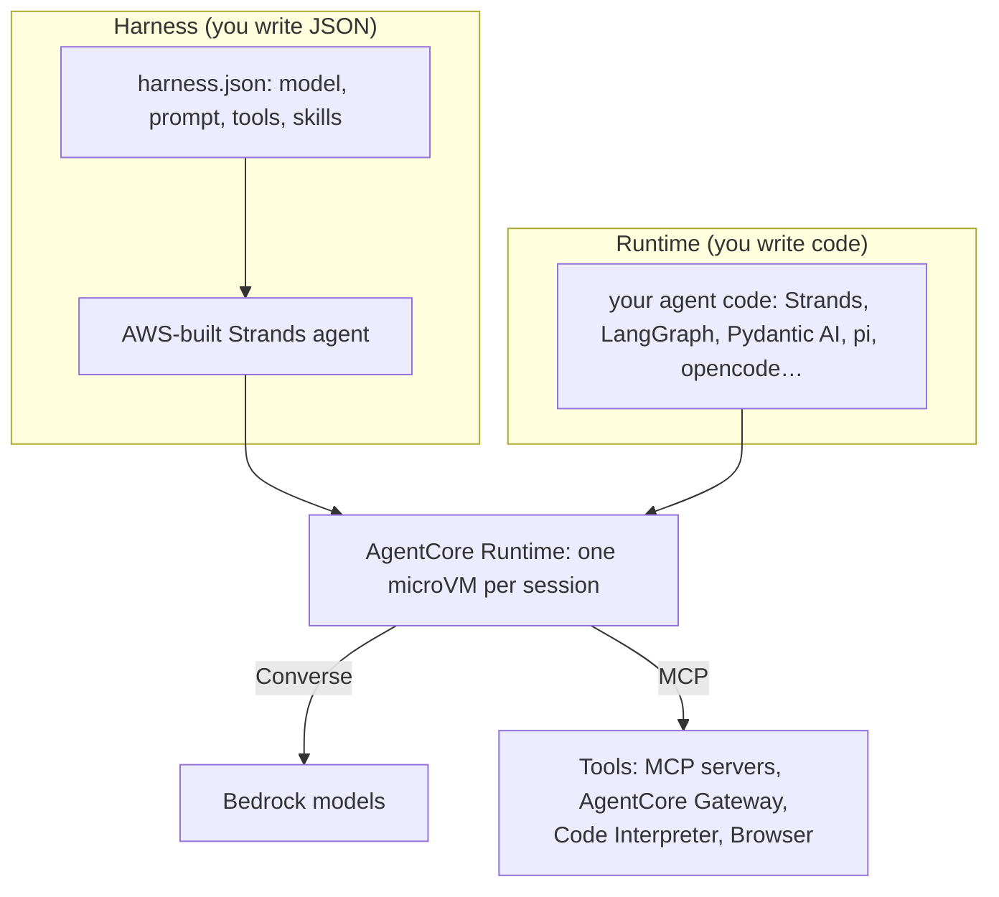
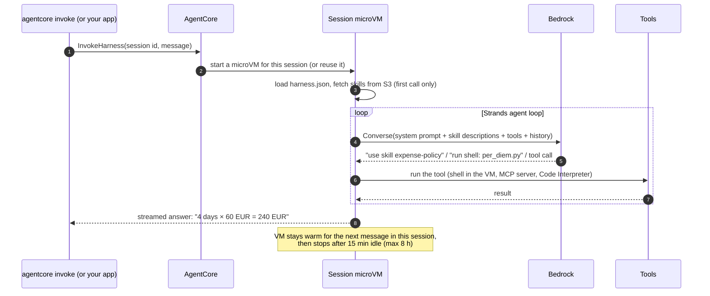
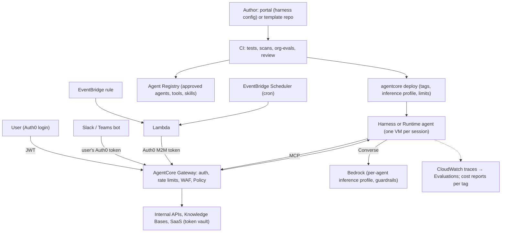
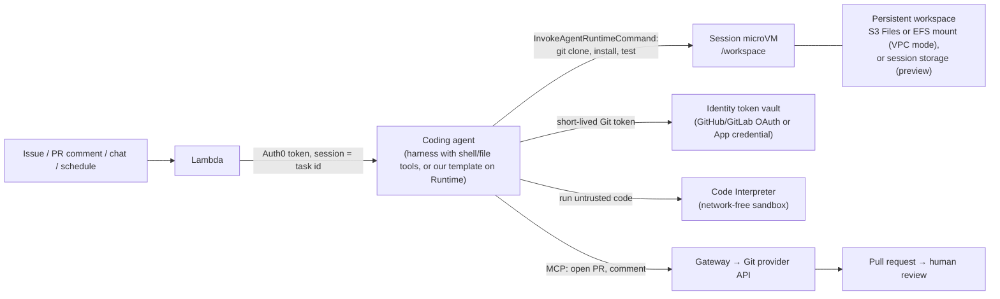

# AgentCore and Bedrock: a developer's introduction

This page explains what AWS gives you for building agents by **building one**:
1. create an agent with the `agentcore` CLI;
2. give it a skill and some tools;
3. prompt it;
4. see what runs where;
5. turn it into code when configuration isn't enough.

After that it covers the platform pieces, what you pay for, and how this fits a self-service agent platform.

The CLI output and generated files shown here come from running `@aws/agentcore` 0.30.0 on 2026-09-27. Prices come from the AWS pricing pages on the same date.

---

## 1. Three layers

| Layer | What it is | Who writes it |
|---|---|---|
| **Bedrock** | The models. You send messages; you get text or tool calls back (the `Converse` API) | AWS / model providers |
| **Strands Agents** | An open-source **library** (Python, TypeScript) containing the **agent loop**: call the model → run the tools it asked for → call the model again → until it answers | You import it, like LangGraph or Pydantic AI |
| **AgentCore** | Where agents **run**, and the services they plug into (tools, identity, memory, policy, traces) | AWS |

AgentCore has two ways to run an agent:

- **Runtime.** A serverless server for **your agent code**. You deploy a container or zip that answers `POST /invocations`. Each conversation (session) gets its own Firecracker microVM, which stays alive between messages for up to 8 hours and is destroyed when the session ends. Only Memory, mounted storage, or anything your code saved elsewhere survives. Runtime does not contain an agent loop; your code does, whether that is Strands, LangGraph, or anything else.
- **Harness.** **AWS's own Strands agent, pre-built and running in Runtime.** You don't write code; you give it a JSON config (model, prompt, tools, skills). It is the closest thing AWS has to a managed, remote Claude Code: an agent loop with a shell, a filesystem and skills, in a sandbox you don't operate.



So: **the harness is a Runtime agent that AWS wrote for you.** Step 7 shows this literally: the CLI can export a harness as the Strands code it runs.

---

## 2. Walkthrough: from nothing to a prompted agent

### Step 1: create a project

```bash
npm install -g @aws/agentcore        # Node 20+; also needs uv for Python agents
agentcore create --project-name helpdesk --defaults
cd helpdesk
```

The default project is a **harness**. The CLI generated these files:

```
helpdesk/
├── agentcore/
│   ├── agentcore.json        # the project: lists harnesses, runtimes, gateways, memories…
│   ├── aws-targets.json      # which account/region to deploy to
│   └── cdk/                  # CDK app the CLI uses to deploy (you rarely touch it)
└── app/helpdesk/
    ├── harness.json          # the agent
    └── system-prompt.md      # its instructions
```

`app/helpdesk/harness.json`:

```json
{
  "name": "helpdesk",
  "model": { "provider": "bedrock", "modelId": "global.anthropic.claude-sonnet-4-6" },
  "tools": [],
  "skills": [],
  "memory": { "mode": "disabled" }
}
```

### Step 2: write the instructions

Edit `app/helpdesk/system-prompt.md`:

```markdown
You are the internal IT and expenses helpdesk for Fintech Ltd.
Answer policy questions from the skills you have. Open a ticket only when the user asks for one.
Never reveal credentials or personal data.
```

To use a cheaper model while developing, change `modelId` to `global.anthropic.claude-haiku-4-5-20251001-v1:0`.

### Step 3: give it a skill

A **skill** is a folder with a `SKILL.md` file (name and description in front matter, then instructions). It can also hold `scripts/`, `references/` and `assets/`. This is the open AgentSkills.io format, the same one Claude Code uses.

The agent sees only each skill's one-line description until it decides the skill is relevant. Then it loads the full instructions through a tool call. So you can attach many skills without filling the context.

```
expense-policy/
├── SKILL.md
└── scripts/
    └── per_diem.py
```

```markdown
---
name: expense-policy
description: Fintech Ltd expense rules (hotel, meals, claim deadlines) and how to compute per-diem totals.
---
# Expense policy
- Hotels: up to 180 EUR per night in major cities.
- Meals: up to 60 EUR per day.
- Claims must be submitted within 30 days with itemised receipts.

To compute a trip allowance, run `python scripts/per_diem.py --days N --city-class major`.
```

Upload the folder to S3 and attach it:

```bash
aws s3 sync expense-policy/ s3://fintech-agent-skills/expense-policy/
agentcore add skill --harness helpdesk --s3 s3://fintech-agent-skills/expense-policy/
```

Skills can also come from Git (`--git`), from AWS's pre-built skills (`--aws-skills`), or from a path already inside the agent's VM (`--path`).

This is where **scripts** fit in. A skill's scripts run **inside the agent's own VM** when the agent calls its shell tool. That is deterministic code the model triggers, with no extra service needed.

### Step 4: give it tools

```bash
# an existing MCP server (e.g. our ticketing tools)
agentcore add tool --harness helpdesk --type remote_mcp --name tickets --url https://tools.fintech.example/mcp

# a sandbox for running code
agentcore add tool --harness helpdesk --type agentcore_code_interpreter --name code
```

`harness.json` now reads:

```json
{
  "name": "helpdesk",
  "model": { "provider": "bedrock", "modelId": "global.anthropic.claude-sonnet-4-6" },
  "tools": [
    { "type": "remote_mcp", "name": "tickets", "config": { "remoteMcp": { "url": "https://tools.fintech.example/mcp" } } },
    { "type": "agentcore_code_interpreter", "name": "code" }
  ],
  "skills": [ { "s3Uri": "s3://fintech-agent-skills/expense-policy/" } ],
  "memory": { "mode": "disabled" }
}
```

The harness also always has a built-in **shell** tool and a **file** tool, which work in its VM. Other tool types:
- `agentcore_gateway`: all tools behind an AgentCore Gateway (§5);
- `agentcore_browser`: a managed headless Chrome;
- `inline_function`: a tool your calling application executes.

Settings you will want soon:

```bash
agentcore add harness --help   # shows, among others:
#   --max-iterations, --max-tokens, --timeout       limits per invocation (cost control)
#   --memory-mode managed --memory-strategies ...   remember users across sessions
#   --truncation-strategy sliding_window|summarization
#   --network-mode VPC --subnets ... --security-groups ...
#   --idle-timeout, --max-lifetime                  how long a session VM lives
```

### Step 5: deploy

```bash
agentcore deploy
```

The CLI turns `agentcore.json` into a CDK app and deploys it as a CloudFormation stack. For this project the stack holds:
- the **harness** resource (`AWS::BedrockAgentCore::Harness`);
- an **IAM execution role**, the agent's AWS permissions: calling the model, reading the skill bucket, writing logs;
- anything else you added (memory, gateway, credentials).

The agent also gets a **workload identity** automatically. Nothing runs yet, and nothing costs money until someone invokes it.

### Step 6: prompt it

```bash
agentcore invoke --session-id "$(uuidgen)" "How much can I claim for meals on a 4-day trip to Paris?"
```

What happens:



**Things to know:**
- **Sessions.** The same `--session-id` means the same VM and the same conversation. A new id means a fresh VM. There is no shared state between sessions unless you add Memory.
- **Deterministic commands, no model.** You can run commands in the session VM directly, with no model involved (no tokens):

  ```bash
  agentcore invoke --exec --session-id "$SID" "ls -la /tmp && python --version"
  ```

  Use this to prepare a workspace (clone a repo, install packages) before prompting, or to collect results afterwards.
- **Logs and traces:** `agentcore logs`, `agentcore traces list`. Every model call, tool call and shell command is a span in CloudWatch.

### Step 7: it's just an API, and underneath it's Strands

The CLI is a thin wrapper. The same agent via the plain AWS CLI:

```bash
aws bedrock-agentcore-control create-harness \
  --harness-name helpdesk \
  --execution-role-arn arn:aws:iam::111122223333:role/helpdesk-agent \
  --model '{"bedrockModelConfig":{"modelId":"global.anthropic.claude-sonnet-4-6"}}' \
  --system-prompt '[{"text":"You are the internal IT and expenses helpdesk for Fintech Ltd. ..."}]' \
  --skills '[{"s3":{"uri":"s3://fintech-agent-skills/expense-policy/"}}]' \
  --memory '{"disabled":{}}' \
  --max-iterations 20 --max-tokens 200000
```

Through the API, a new harness gets managed memory unless you disable it, as above.

To prompt it, use an SDK (`invoke_harness` in boto3, `InvokeHarnessCommand` in the JavaScript SDK) or `agentcore invoke`. The AWS CLI has **no** `invoke-harness` command: it leaves out operations that stream their answer, and `invoke-agent-runtime-command` and `invoke-code-interpreter` are missing for the same reason.

Most of these fields (model, prompt, tools, skills, limits) can also be **overridden per invocation**.

**Export the harness to see what it runs:**

```bash
agentcore export harness --name helpdesk
```

This writes `app/helpdeskAgent/`, a normal Python project that depends on `strands-agents`, `strands-agents-tools`, `bedrock-agentcore` and `mcp`. Its `main.py`, shortened:

```python
from strands import Agent, AgentSkills, tool
from strands_tools.code_interpreter import AgentCoreCodeInterpreter
from bedrock_agentcore.runtime import BedrockAgentCoreApp

app = BedrockAgentCoreApp()          # the HTTP server Runtime talks to (/invocations, /ping)

tools = [AgentCoreCodeInterpreter().code_interpreter, shell, file_operations]   # built-ins
tools += get_all_remote_mcp_clients()                                           # "tickets" MCP server

@app.entrypoint
async def invoke(payload, context):
    skills = resolve_s3_skills(["s3://fintech-agent-skills/expense-policy/"])   # download SKILL.md folders
    agent = get_or_create_agent(context.session_id, [AgentSkills(skills=skills)])  # one Strands Agent per session
    async for event in agent.stream_async(payload["prompt"]):                   # the Strands loop
        yield event                                                             # streamed back to the caller

if __name__ == "__main__":
    app.run()
```

This is the whole picture:
- **`BedrockAgentCoreApp`** makes it a Runtime agent.
- **`strands.Agent`** is the loop.
- The tools and skills are the ones you configured.

**What kind of app is this?** It is **not FastAPI**:
- `BedrockAgentCoreApp` is a **Starlette** app (FastAPI is built on Starlette) served by **uvicorn**, with three routes: `POST /invocations`, `GET /ping` and a `/ws` WebSocket.
- It copies the platform's request headers (session id, workload access token) into a `context`, calls your `@app.entrypoint`, and streams any generator back as server-sent events.
- `/ping` reports `HealthyBusy` while background tasks run (`app.add_async_task`), so AgentCore keeps the session alive.

The major Python dependencies:

| Package | What it brings | Its main dependencies |
|---|---|---|
| `bedrock-agentcore` | The Runtime app and clients for Memory, Identity, Code Interpreter and Browser | starlette, uvicorn, pydantic, boto3, websockets |
| `strands-agents` | The agent loop | boto3, pydantic, httpx, mcp, jsonschema, OpenTelemetry API/SDK |
| `strands-agents-tools` | Ready-made tools (shell, files, Code Interpreter, Browser, HTTP…) | aiohttp, requests, sympy, rich, slack-bolt, … (a wide set: pin it or vendor only the tools you use) |
| `mcp` | MCP client, to talk to MCP servers and the Gateway | anyio, httpx, starlette, pydantic |
| `aws-opentelemetry-distro` (ADOT) | Traces to CloudWatch. The app is started as `opentelemetry-instrument python main.py` | OpenTelemetry SDK plus many auto-instrumentations |

The CLI builds it with **uv**. A zip build runs on an AWS-managed Python on Amazon Linux 2023; a container build uses `python:3.12-slim` and runs as a non-root user. TypeScript agents are a Node 22 app run with `tsx`.

Once exported, the harness is a **Runtime agent with code you own**. Change anything (add hooks, custom tools, guards), then `agentcore deploy` again.

### Step 8: write your own agent from the start

Skip the harness when you need things configuration can't express:
- your own approval flow;
- budgets and loop detection;
- custom state;
- a different framework.

```bash
agentcore create --project-name helpdesk2 --framework Strands --model-provider Bedrock --build CodeZip
# or --framework LangChain_LangGraph | OpenAIAgents | GoogleADK | VercelAI, --language TypeScript, --build Container
agentcore dev        # run locally on :8080
agentcore deploy
agentcore invoke "hello"
```

The contract your code must meet is small:
- serve `POST /invocations` and `GET /ping` on port 8080;
- run on ARM64 (the build handles this);
- read the session id from the request.

That is what all eight of our templates in `templates/generic-agents/` do, in Strands, LangGraph, Pydantic AI, pi and opencode. They add the org controls the harness doesn't have: run budgets, loop detection, four-eyes approvals, idempotent tools, a PII-free audit log and Auth0 caller identity.

**Which to use:**

| Choose | When |
|---|---|
| **Harness** | Non-developers; standard assistants; you want model, prompt, tools and skills as config; approvals via hook Lambdas are enough |
| **Runtime + your code** | You need control over the loop, custom guards, a non-Strands framework, or our org templates |

---

## 3. The `agentcore` CLI under the hood

The CLI is **a project generator plus a CDK wrapper**. It adds no AWS capability of its own: every resource it makes is an ordinary CloudFormation resource, which you could also create with the AWS CLI, CDK or Terraform.

**What each command group does:**

| Command | What it does | Touches AWS? |
|---|---|---|
| `create` | Writes a project folder: `agentcore/agentcore.json` (the list of resources), `aws-targets.json` (account and region), a CDK app in `agentcore/cdk/`, and the agent (`harness.json`, or code for Strands/LangGraph/…) | No |
| `add …` / `remove …` | Edits `agentcore.json` / `harness.json` (harness, tool, skill, gateway, memory, credential, policy, evaluator…) | No |
| `dev` | Runs a code agent locally on :8080 | No |
| `deploy` | Creates or updates everything in AWS (below) | Yes |
| `invoke`, `invoke --exec` | Calls `InvokeHarness` / `InvokeAgentRuntime` / `InvokeAgentRuntimeCommand` | Yes |
| `status`, `logs`, `traces` | Reads the deployed state, CloudWatch logs and traces | Yes |
| `run eval`, `run recommendation`, `run batch-evaluation` | Starts evaluation jobs | Yes |
| `export harness` | Writes the Strands code equivalent of a harness (Step 7) | No |

**What `agentcore deploy` does, in order:**
1. **Creates credential providers** (OAuth, API keys) with direct API calls, because they hold secrets that shouldn't pass through CloudFormation.
2. **Runs the CDK app.** It bootstraps the account for CDK if needed, synthesizes a template, uploads assets to S3 and deploys **one CloudFormation stack per target**, named `AgentCore-<project>-<target>`.
3. **Records what was deployed** in `agentcore/.cli/deployed-state.json`. Later `invoke`, `status` and `logs` read ARNs from this file.
4. **Enables CloudWatch Transaction Search**, so traces show up.

**What the stack contains:**

| You added | Stack resources |
|---|---|
| A **harness** | `AWS::BedrockAgentCore::Harness` + an IAM role. The role allows: model invocation, S3 read for skills, logs, X-Ray, metrics, the workload-identity token, and Browser, Code Interpreter, Gateway and Memory actions for the tools you configured |
| A **code agent**, zip build (default) | The code, bundled with `uv` for ARM64 and uploaded as an S3 asset; `AWS::BedrockAgentCore::Runtime` pointing at it; an IAM role (Bedrock invoke on models and inference profiles, logs, X-Ray) |
| A **code agent**, container build | The above, plus an **ECR repository** (KMS-encrypted, scanned on push), an **ARM64 CodeBuild project** that builds your Dockerfile, and a custom resource that runs the build during deploy. **No Docker needed on your machine** |
| Memory, gateway, policy engine, evaluator… | `AWS::BedrockAgentCore::Memory`, `::Gateway` + `::GatewayTarget`, `::PolicyEngine` + `::Policy`, `::Evaluator`… Every memory is granted to every agent in the project, and its id is injected as `MEMORY_<NAME>_ID` |

**Created by AgentCore itself, not by the stack:**
- the agent's **workload identity**;
- **version 1** and the **`DEFAULT` endpoint** of each runtime;
- the **log group** `/aws/bedrock-agentcore/runtimes/<id>-<endpoint>`.

### The same pieces in the AWS CLI, CloudFormation and Terraform

AgentCore has two APIs:
- `aws bedrock-agentcore-control …` **creates** things (the control plane);
- `aws bedrock-agentcore …` **uses** them (the data plane).

| Piece | `agentcore` CLI | CloudFormation (`AWS::BedrockAgentCore::…`) | AWS CLI: create / use | Terraform `hashicorp/aws` 6.66 | Terraform `hashicorp/awscc` 1.103 |
|---|---|---|---|---|---|
| Harness | `add harness`, `add tool`, `add skill` | `Harness`, `HarnessEndpoint` | `create-harness` / (SDK only: `InvokeHarness`) | `aws_bedrockagentcore_harness` | `awscc_bedrockagentcore_harness`, `…_harness_endpoint` |
| Code agent (Runtime) | `create --framework …` | `Runtime`, `RuntimeEndpoint` | `create-agent-runtime`, `create-agent-runtime-endpoint` / `invoke-agent-runtime` (SDK only: `InvokeAgentRuntimeCommand`) | `aws_bedrockagentcore_agent_runtime`, `…_agent_runtime_endpoint` | `awscc_bedrockagentcore_runtime`, `…_runtime_endpoint` |
| Gateway + tools | `add gateway`, `add gateway-target` | `Gateway`, `GatewayTarget`, `GatewayRule`, `GatewayRateLimit` | `create-gateway`, `create-gateway-target`, `create-gateway-rule`, `create-gateway-rate-limit` / (agents call it over MCP HTTP) | `aws_bedrockagentcore_gateway`, `…_gateway_target`, `…_gateway_rule` | `awscc_bedrockagentcore_gateway`, `…_gateway_rule`, `…_gateway_rate_limit` |
| Credentials (token vault) | `add credential` | `OAuth2CredentialProvider`, `ApiKeyCredentialProvider` | `create-oauth2-credential-provider`, `create-api-key-credential-provider` | `aws_bedrockagentcore_oauth2_credential_provider`, `…_api_key_credential_provider` | `awscc_bedrockagentcore_o_auth_2_credential_provider`, `…_api_key_credential_provider` |
| Agent identity | automatic | `WorkloadIdentity` | `create-workload-identity` | `aws_bedrockagentcore_workload_identity` | `awscc_bedrockagentcore_workload_identity` |
| Policy (Cedar) | `add policy-engine`, `add policy` | `PolicyEngine`, `Policy` | `create-policy-engine`, `create-policy` | `aws_bedrockagentcore_policy_engine`, `…_policy` | `awscc_bedrockagentcore_policy_engine`, `…_policy` |
| Memory | `add memory` (or `--memory-mode managed` on a harness) | `Memory` | `create-memory` / `create-event`, `retrieve-memory-records` | `aws_bedrockagentcore_memory`, `…_memory_strategy` | `awscc_bedrockagentcore_memory` |
| Code Interpreter / Browser | a tool on the harness | `CodeInterpreterCustom`, `BrowserCustom` | `create-code-interpreter`, `create-browser` / `start-code-interpreter-session` (SDK only: `InvokeCodeInterpreter`) | `aws_bedrockagentcore_code_interpreter`, `…_browser` | `awscc_bedrockagentcore_code_interpreter_custom`, `…_browser_custom` |
| Evaluations | `add evaluator`, `add online-eval`, `run eval` | `Evaluator`, `OnlineEvaluationConfig`, `Dataset` | `create-evaluator`, `create-online-evaluation-config`, `create-dataset` / `start-batch-evaluation` | `aws_bedrockagentcore_evaluator`, `…_online_evaluation_config` | `awscc_bedrockagentcore_evaluator`, `…_online_evaluation_config` |
| Resource policy | – | `ResourcePolicy` | `put-resource-policy` | `aws_bedrockagentcore_resource_policy` | `awscc_bedrockagentcore_resource_policy` |

- **Which provider:** `hashicorp/aws` has hand-written resources. `awscc` is generated from CloudFormation, so it gets new types first (e.g. capacity providers, configuration bundles, gateway rate limits, payments).
- **Registry caveat:** `aws_bedrockagentcore_registry` exists, but the Registry is moving to its own `agent-registry` API and the old one shuts down 2026-10-30. **[verify]** which API the Terraform resource calls before using it.

**The walkthrough's harness in Terraform** (`hashicorp/aws` 6.66):

```hcl
resource "aws_iam_role" "helpdesk" {
  name = "helpdesk-agent"
  assume_role_policy = jsonencode({
    Version = "2012-10-17"
    Statement = [{ Effect = "Allow", Action = "sts:AssumeRole",
                   Principal = { Service = "bedrock-agentcore.amazonaws.com" } }]
  })
}
# + policies: bedrock:InvokeModel* on the model/profile, s3:GetObject on the skills bucket, logs

resource "aws_bedrockagentcore_harness" "helpdesk" {
  harness_name       = "helpdesk"
  execution_role_arn = aws_iam_role.helpdesk.arn

  model {
    bedrock_model_config { model_id = "global.anthropic.claude-sonnet-4-6" }
  }
  system_prompt { text = file("${path.module}/system-prompt.md") }

  skill { s3 { uri = "s3://fintech-agent-skills/expense-policy/" } }

  tool {
    type = "remote_mcp"
    name = "tickets"
    config { remote_mcp { url = "https://tools.fintech.example/mcp" } }
  }
  tool {
    type = "agentcore_code_interpreter"
    name = "code"
  }

  max_iterations  = 20
  timeout_seconds = 600
}
```

**Which tool when:**

| Tool | Use it for |
|---|---|
| **`agentcore` CLI** | Development: scaffolding, `dev`, quick deploys, invoking, logs, evals |
| **CDK** (what the CLI generates) | Keeping the CLI's defaults (roles, builds) in real infrastructure code |
| **Terraform** | Platform teams that already run Terraform: harnesses, gateways, policies and identities next to the rest of the account setup |
| **AWS CLI / SDK** | Scripts, CI checks, and **invoking** agents from other services |

For a code agent, Terraform needs the artifact to exist first: build and push the container, or upload the zip to S3, in CI, then point `agent_runtime_artifact` at it. The CLI hides that build step.

---

## 4. Strands in five minutes

Strands is the loop both options above run on (the harness always; Runtime if you choose it).

```python
from strands import Agent, tool

@tool
def calculate(expression: str) -> str:
    """Evaluate an arithmetic expression exactly."""
    ...

agent = Agent(
    model="global.anthropic.claude-haiku-4-5-20251001-v1:0",   # Bedrock by default
    system_prompt="You are a helpful assistant.",
    tools=[calculate],
)
result = agent("What is 0.1 + 0.2?")
```

**What `agent(...)` does:**
1. It sends the prompt, the system prompt and the tool schemas to the model.
2. If the model asks for tools, it runs them and appends the results.
3. It calls the model again, until the model stops asking for tools.

That cycle is the whole "agent".

**What you can plug into it:**

| Piece | What it's for |
|---|---|
| `model=` | Bedrock (default), Anthropic, OpenAI, Gemini, LiteLLM, Ollama… |
| `tools=` | `@tool` functions, MCP clients (a whole MCP server's tools), the `strands-agents-tools` package (shell, files, Code Interpreter, Browser…) |
| `hooks=` | Callbacks before and after model calls and tool calls. **This is where guards go**: our templates block disallowed tools, enforce budgets and pause for approvals here |
| `conversation_manager=` | What to do when history grows: sliding window, summarizing, or none |
| `session_manager=` | Persist conversations: file, S3, or **AgentCore Memory** |
| `plugins=[AgentSkills(...)]` | Skills |
| Multi-agent | Agents as tools, swarm, graph, workflow, A2A |
| Tracing | OpenTelemetry spans out of the box, which is what AgentCore Observability shows |

---

## 5. The platform pieces you add next

Each piece is independent. You add them with `agentcore add …` and connect them to a harness or runtime.

### Gateway: one front door for tools (and agents)

An AgentCore **Gateway** is a managed MCP endpoint (`agentcore add gateway`, `agentcore add gateway-target`).

**What it can put behind itself as tools:**
- Lambda functions;
- REST APIs (from an OpenAPI spec);
- existing MCP servers;
- API Gateway stages;
- Bedrock Knowledge Bases;
- web search;
- other agents.

**What it adds on every call:**
- inbound auth (Auth0 JWT);
- outbound credentials;
- request/response Lambda interceptors (for redaction and audit);
- rate limits per user, tool or model;
- WAF;
- **Policy**.

Every agent, in any framework, then sees the same governed tools through one URL (`--type agentcore_gateway` on a harness, or an MCP client in code).

### Identity: users sign in with Auth0; agents get their own identity

Setup for our Auth0 tenant `fintech.eu.auth0.com`, with the agents API audience `https://agents.fintech.example`:

| Who | Auth0 side | AgentCore side |
|---|---|---|
| **A user** (Alice) | Signs in to the agent portal (Authorization Code + PKCE, audience = agents API). A post-login Action adds `https://fintech.example/email`, `given_name`, `family_name`, `user_id` and `role` claims | The Runtime or Gateway **JWT authorizer**: discovery URL `https://fintech.eu.auth0.com/.well-known/openid-configuration`, `allowedAudience` = the agents API |
| **Automation** (a schedule, an event) | An M2M application per workload (e.g. `agent-scheduler`), client credentials. Tokens have `sub = <client_id>@clients` | Same authorizer. Our templates treat it as a service client with no profile |
| **The agent itself** | – | A **workload identity**, created automatically. The agent gets downstream credentials from the **token vault** (credential providers, e.g. `Auth0Oauth2`) and never holds a secret |
| **The agent acting as Alice** | On-behalf-of token exchange (RFC 8693) to e.g. `https://payments.fintech.example`, with narrower scopes | A `CustomOauth2` credential provider with token exchange. **[verify in PoC]** that the Auth0 tenant has the OBO feature |
| **An approver** | A user with an approver role; CIBA push (Auth0 Guardian) for high-risk actions | Our templates' four-eyes approval, or a Gateway tool waiting on CIBA |

The full Auth0 setup is in [`AGENT_IDENTITY_AUTH0.md`](AGENT_IDENTITY_AUTH0.md).

### Policy: who may call which tool

A **Policy engine** attached to the Gateway checks every tool call against **Cedar** rules. Every Auth0 claim becomes a tag you can test:

```cedar
permit(principal, action == AgentCore::Action::"Payments___transfer", resource)
when {
  principal.hasTag("https://fintech.example/role") &&
  principal.getTag("https://fintech.example/role") == "treasury" &&
  context.input.amount < 10000
};
```

- Start in `LOG_ONLY` mode, then switch to `ENFORCE`.
- Bedrock **Guardrails** (content filters, prompt-injection detection, PII masking) can run inside the same policy step on tool inputs and outputs.

### Conversations and memory

**Where a conversation thread lives.** Pick one of three places:

| Where | How | Survives the session? |
|---|---|---|
| **The session VM's memory** | The default for the harness and our templates: the Strands `Agent` keeps its message list in memory | No. It is gone after 15 minutes idle or 8 hours |
| **Your application** | The caller stores the messages (e.g. in DynamoDB) and sends them with each call. `InvokeHarness` accepts a `messages` list | Yes. The agent itself stays stateless |
| **AgentCore Memory (short-term)** | Each message is stored as an *event*, keyed by user (`actorId`) and session. Enable it with `--memory-mode managed` on a harness (`--memory-messages-count` = how many recent messages to load), or with the AgentCore Memory session manager in Strands | Yes. Managed by AWS, with configurable expiry |

Use the VM for short chats. Use Memory or your own store when a thread must outlive a session, for example a long wait for an approval.

**Long-term memory.** AgentCore Memory can also extract facts, preferences, summaries and episodes from conversations. The agent retrieves them in later sessions. Key memory by our stable user id, not the email address.

**Forking a conversation** (branching from an earlier point):
- **With Memory:** write the next event with a `branch` (a name plus the id of the event to branch from). Both branches keep their own history, and `ListEvents` reads one branch.
- **With your own store:** copy the messages up to the fork point into a new thread and start a new session id.

**Keeping token costs down with the prompt cache.** Every model call resends the whole conversation, so this matters. Bedrock can cache the **start** of a request: the system prompt, then the tool definitions, then earlier messages.
- **Price:** a cached read costs about **10% of the input price**. Writing the cache costs more than a normal read: 125% of the input price for a 5-minute cache, about 200% for a 1-hour cache.
- **Turning it on:**
  - in Strands: `BedrockModel(cache_config=CacheConfig(strategy="auto"))`, which our Strands template uses;
  - in raw `Converse`: `cachePoint` blocks.
  - Whether the harness caches automatically is **[verify]**; check `cacheReadInputTokens` in its traces.
- **What keeps the cache hitting:**
  1. **Same system prompt and tools for everyone.** Put per-user details (like the user's first name) in the **first user message**, never in the system prompt. Our templates already do this.
  2. **Stable tool list and order.** Every tool definition is part of the cached prefix.
  3. **Append-only history.** Trimming or summarizing old messages changes the start of the prompt and causes a full cache miss. Trim rarely, in big steps.
  4. **Long enough prefix.** Below the model's minimum (1,024 tokens for Sonnet 4.6, 4,096 for Haiku 4.5) nothing is cached.
  5. **1-hour TTL when the agent pauses.** Use it if the agent waits more than 5 minutes, e.g. for an approval.
- **Other token levers:** fewer tools per agent (unused tool definitions still cost tokens), `--max-tokens` / `--max-iterations` limits, and a cheaper model for simple agents (§6).

### Built-in sandboxes

- **Code Interpreter:** run Python or JS code and shell commands in an isolated sandbox, which can be network-free.
- **Browser:** a managed headless Chrome, with live view and recording.

Both are tools the agent calls; they are separate from the agent's own VM.

### Observability and evaluations

- **Traces.** OpenTelemetry traces land in CloudWatch automatically for the harness. With your own code you get them through the Strands, LangGraph or Pydantic AI instrumentation.
- **Evals before merge.** Our `org-evals` suite runs scenario tests locally ([`templates/shared/evals`](templates/shared/evals/README.md)).
- **Evals after deploy.** AgentCore **Evaluations** scores real traces with built-in judges (correctness, tool selection, goal success…) or your own (`agentcore run eval`, online evals). **A/B tests** split Gateway traffic between two configurations.

### Registry

The **AWS Agent Registry** is a catalogue of approved agents, tools, skills and MCP servers, with an approval step. In a self-service platform it is the list of what people may use (§7).

---

## 6. What you pay for

**Nothing is charged while an agent sits idle.** Costs start when a session runs. In practice, **model tokens are 80–96% of the bill**.

| Item | Price (us-east-1 = eu-west-1) | Billed when |
|---|---|---|
| **Model tokens** (Bedrock, global profile, per 1M tokens) | Haiku 4.5: $1 in / $5 out. Sonnet 4.6: $3 / $15. Sonnet 5: $2 / $10. Opus 5.5: $4 / $20. Cache reads cost about 10% of input; 5-minute cache writes cost 125% of input | Every model call. **Geo profiles (`eu.`) cost 10% more**; batch costs 50% less |
| **Runtime** (your session VMs; also what a harness runs on) | $0.0895 per vCPU-hour + $0.00945 per GB-hour, per second | CPU only while actually computing (**not** while waiting for the model); memory while the session is alive |
| **Harness** | **Free** | You pay for the Runtime, model, tools and memory it uses |
| **Gateway** | $0.005 per 1,000 tool calls | Each tool call |
| **Policy** | $0.000025 per authorization | Each checked tool call |
| **Identity** | Free through Runtime or Gateway | – |
| **Memory** | $0.25 per 1,000 events; $0.75 per 1,000 stored long-term records per month; $0.50 per 1,000 retrievals | Writes, storage, reads |
| **Guardrails** | $0.15 per 1,000 text units (content filters, topics); $0.10 (PII) | Each checked input or output |
| **Code Interpreter / Browser** | Same rate as Runtime | While in use |
| **CloudWatch** | Log ingestion ($0.50–0.57/GB) and spans | Always on |
| **Evaluations** | Built-in judges: $2.40 in / $12 out per 1M tokens; batch 25% off | When you run evaluations |

**Worked examples (per month):**

| Scenario | Model | Total | Of which model tokens |
|---|---|---|---|
| Internal chat assistant: 200 users × 20 conversations × 6 turns, 2 model calls per turn, 8k input (60% cached) + 600 output tokens per call | Sonnet 4.6 | **≈ $1,045** | $962 (92%). Next: guardrails $38, memory $32, Runtime $9 |
| The same | Haiku 4.5 | **≈ $403** | $321 (80%) |
| Scheduled agent, hourly, 5 model calls per run | Haiku 4.5 | **≈ $22** | $21 (96%) |

**Cost levers, biggest first:**
1. **The model** (Haiku vs Sonnet: about 2.5× on the example).
2. **Prompt-cache hit rate** (60% → 90% saves about $300 on the Sonnet example).
3. **Guardrail scope.** Scan new input and the final answer ($38) rather than the whole prompt on every call ($672).
4. **Output tokens and model calls per turn.**
5. **Global vs geo profiles** (10%).
6. **Batch** for offline work.

Runtime, Gateway, Policy and Identity are rounding errors by comparison.

**Knowing who spent what:**
- one **application inference profile per agent**, tagged (agent, team, cost centre);
- IAM-principal cost allocation in CUR 2.0;
- per-run budgets in our templates' guard;
- AWS Budgets alerts and Cost Anomaly Detection.

---

## 7. Putting it together: a self-service agent platform

**Goal:**
- Employees create agents themselves, from harness configs or our templates.
- Users sign in with Auth0.
- Agents have their own identity.
- Every agent can run from live prompts, chat messages, events or a schedule.
- Costs are visible and capped.



**How each way of running works:**

| Mode | Path |
|---|---|
| **Live prompt** (web, IDE) | User signs in with Auth0 → Gateway → agent; answers stream back. One session per conversation |
| **Chat message** (Slack, Teams) | The bot verifies the message, maps the chat user to their Auth0 user (they link accounts once) and calls the Gateway with that user's token |
| **Event** | EventBridge rule → **Lambda** → Gateway, with the Auth0 M2M token of that workload |
| **Schedule** | EventBridge Scheduler (cron) → Lambda → as for events. AgentCore has no built-in scheduler |

**Long runs and approvals, without extra services:**
- **The Lambda only starts the run.** If the agent needs more than Lambda's 15 minutes, it replies "accepted" at once and keeps working in its own session as a background task (up to 8 hours). It reports the result on a queue or to the chat.
- **Approvals are part of the conversation.** The agent replies `approval_required`. The approver answers later, through the portal or chat, as a normal message in the same thread. If that can take hours, store the thread (§5, *Conversations and memory*) so the answer can resume it in a new session.

### A coding agent

A coding agent needs:
- a **workspace** (a checked-out repo, dependencies, build output);
- **git credentials**;
- a place to **run untrusted commands** (tests, builds);
- often more time than a chat turn.

On AgentCore that looks like this:



**How the pieces are used:**
- **Workspace.** The session VM's disk disappears when the session ends. Mount **S3 Files or EFS** (VPC mode) when a workspace must survive between sessions or be shared. Session storage (1 GB, kept 14 days) is simpler but still preview.
- **Git access.**
  - Clone and push with a **short-lived token** from the Identity token vault (an OAuth or GitHub-App credential provider), fetched when needed. Never put a long-lived token in environment variables.
  - The agent pushes to a branch and opens a **pull request** through a Gateway tool. A human merges.
- **Running code.**
  - Deterministic steps (clone, install, run tests) go through `InvokeAgentRuntimeCommand` or the agent's shell tool, inside its own VM.
  - Code you don't trust goes to **Code Interpreter** in sandbox mode (no network).
  - Restrict the agent VM's own network with VPC egress rules.
- **Time.** A Runtime session lasts up to **8 hours**. Runtime Instances (EC2 in your account) allow up to **14 days** for very long jobs.
- **Guards.** Commands are allowed as an argv list only (no shell strings from the model), with limits on turns and cost. Our coding-agent design is in [`templates/README.md`](templates/README.md) (execution environment section).

---

## 8. How the other vendors compare

| Part | AWS | Google Cloud | Microsoft Azure | Anthropic | OpenAI |
|---|---|---|---|---|---|
| Host your own agent code | **Runtime** (microVM per session, up to 8 h) | **Agent Runtime** (formerly Agent Engine): managed containers, no per-session VM | Foundry **hosted agents** (VM sandbox per session, ≤ 2 vCPU, Python/C#) | – | – (the Agents API can run tools on your compute) |
| Managed agent loop | **Harness** (Strands; shell, files, skills) | Managed Agents API (preview, "not for production") | Foundry prompt agents (no shell or files) | **Claude Managed Agents** (beta) | **Agents API** (beta, Codex loop) |
| Open-source agent library | Strands | ADK | Microsoft Agent Framework | Claude Agent SDK (runs the Claude Code binary) | Agents SDK |
| Tool gateway / MCP | **Gateway** | **Agent Gateway**, about 119 Google-managed MCP servers, Apigee | API Management + Foundry toolboxes | – | – |
| Agent identity + delegation | **Identity** (token vault, OBO; works with Auth0) | **Agent Identity** (SPIFFE, token vault) | **Entra Agent ID** (inbound Entra only) | Workload identity federation | Workload identity federation |
| Tool-call policy | **Cedar Policy** | IAM policies (CEL) at the Agent Gateway + Model Armor | Guardrails (mostly preview), APIM policies | – | – |
| Models | Many, incl. Claude and OpenAI | Gemini, Claude, others | OpenAI, Claude, others | Claude | OpenAI |
| EU data residency | Yes (geo profiles) | Yes (`eu` endpoint) | Yes (data zones) | **No** (global or US) | Yes (EU region, +10%) |

**Takeaway for us:**
- **Full stacks.** AWS, Google and Azure each offer the whole set: hosting your own code, a tool gateway, agent identity and tool-call policy.
- **Where AWS stands out:** per-session VM isolation and a GA managed loop. Google's governance (identity, gateway policies) is strong, but its managed loop is still preview.
- **Azure's catch:** inbound auth is tied to Entra, so Auth0 would need a gateway in front.
- **Anthropic and OpenAI:** their managed agents are betas without EU residency or zero data retention. Use their models through Bedrock, not their platforms.

---

## 9. Don't use

- **Bedrock Agents ("Agents Classic")**: closed to new customers. Use the harness or Runtime.
- **The Starter Toolkit CLI** (`pip install bedrock-agentcore-starter-toolkit`): unsupported. Both it and the new CLI install a command called `agentcore`, so uninstall it.
- **`bedrock-mantle` endpoint**: its traffic isn't in invocation logs, and it has no guardrails, no geo profiles and no application inference profiles. Stay on `bedrock-runtime` (Converse).
- **The Registry APIs under `bedrock-agentcore`**: they shut down 2026-10-30. Use `agent-registry`.
- **Knowledge-base type Kendra, Provisioned Throughput, latency-optimized inference, prompt routing**: legacy or unmaintained.
- **AgentCore Payments** (crypto wallets): out of scope unless compliance approves.

---

**Further reading:**
- [AgentCore developer guide](https://docs.aws.amazon.com/bedrock-agentcore/latest/devguide/): [harness vs Runtime](https://docs.aws.amazon.com/bedrock-agentcore/latest/devguide/harness-vs-runtime.html), [skills](https://docs.aws.amazon.com/bedrock-agentcore/latest/devguide/harness-skills.html)
- [AgentCore pricing](https://aws.amazon.com/bedrock/agentcore/pricing/)
- [Bedrock user guide](https://docs.aws.amazon.com/bedrock/latest/userguide/)
- [Strands Agents](https://strandsagents.com/)
- [AgentCore CLI](https://github.com/aws/agentcore-cli)

In this repo:
- [`AGENT_IDENTITY_AUTH0.md`](AGENT_IDENTITY_AUTH0.md): Auth0 in depth
- [`templates/`](templates/README.md): our agent templates and evals
