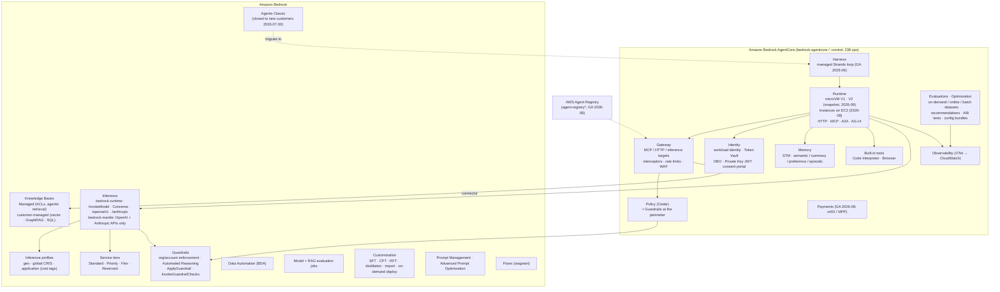

# Amazon Bedrock and AgentCore: every feature, old vs new (September 2026)

This is a companion to [`AGENTIC_FRAMEWORK_SCOPING.md`](AGENTIC_FRAMEWORK_SCOPING.md), [`AGENTS_BUILDING_BLOCKS.md`](AGENTS_BUILDING_BLOCKS.md), [`AGENT_IDENTITY_AUTH0.md`](AGENT_IDENTITY_AUTH0.md) and [`templates/README.md`](templates/README.md).

**Scope:** every capability of Amazon Bedrock and Amazon Bedrock AgentCore as of **2026-09-27**:
- what exists;
- when it appeared;
- what replaced what;
- what is legacy, preview or in maintenance;
- what it means for our templates.

**Method:** everything below was checked on 2026-09-27 against primary sources:
- the Bedrock User Guide and its [document history](https://docs.aws.amazon.com/bedrock/latest/userguide/bedrock-ug-doc-history.html);
- the AgentCore devguide, including its [release notes](https://docs.aws.amazon.com/bedrock-agentcore/latest/devguide/release-notes.html), [regions](https://docs.aws.amazon.com/bedrock-agentcore/latest/devguide/agentcore-regions.html) and [pricing](https://aws.amazon.com/bedrock/agentcore/pricing/);
- AWS What's New posts;
- the npm packages of the AgentCore CLI.

The API history is objective. We diffed the **botocore service models month by month** from 2023-08 to botocore **1.43.103 (2026-09-25)**, and each date comes with the botocore version that first shipped the API. **[unverified]** marks claims we could not confirm.

---

## 1. What changed, in ten lines

1. **Bedrock Agents is now "Bedrock Agents Classic".** It has been **closed to new customers since 2026-07-30**, and its model catalog is frozen. Accounts active in the last 12 months keep working, and there is no EOL date. AWS points everyone to **AgentCore**: the managed harness, or your own code on Runtime ([maintenance page](https://docs.aws.amazon.com/bedrock/latest/userguide/agents-classic-maintenance-mode.html)). Amazon Kendra entered maintenance in the same announcement.
2. **AgentCore went from preview to a broad platform in 14 months:**
   - preview 2025-07-16, GA 2025-10-13;
   - Policy (Cedar) GA 2026-03-03, Evaluations GA 2026-03-31;
   - managed **harness** GA 2026-06-17;
   - Runtime Instances on EC2 2026-08-06, Payments GA 2026-08-18, Agent Registry GA 2026-08-31;
   - **Runtime V2** GA 2026-09-18.

   The API grew from 77 to 238 operations, and none were removed.
3. **The CLI changed.** The Python **Starter Toolkit is "no longer supported"**, and the npm **`@aws/agentcore`** CLI replaces it (GA v0.4.0 on 2026-03-28, `latest` = 0.30.0). **1.0.0-rc.4** (2026-09-22) restructures the commands and makes a *harness* project the default.
4. **Model access is open by default.** Since **2025-10-15** every serverless model can be called without a per-model access request. Governance now means **explicit deny policies**.
5. **Bedrock now has two inference endpoints.** **`bedrock-runtime`** serves InvokeModel/Converse plus OpenAI- and Anthropic-compatible routes. **`bedrock-mantle`** (2025-12-03) serves only the OpenAI and Anthropic APIs. AWS first pushed mantle, then **since 2026-08-15 recommends `bedrock-runtime`** again. Guardrails, invocation logging, cross-Region inference and application inference profiles exist **only on bedrock-runtime**.
6. **The newest Claude models are cross-Region only.** Opus 5.5, Opus 4.8 and Fable 5.1 have **no in-Region endpoint**, so you must call them through `eu.`/`us.` geo profiles or `global.` profiles.
7. **Capacity has new options:**
   - service tiers: **Priority/Flex** (2025-11-18) and **Reserved** (2025-11-26);
   - on-demand custom-model deployment (2025-07-16).

   Provisioned Throughput now covers only old models. The newest Claude models are **Standard tier only**.
8. **Guardrails became an organisation-wide control:**
   - **account- and org-enforced guardrails** (GA 2026-04-03);
   - Standard/Classic tiers (2025-06-24);
   - Automated Reasoning checks (GA 2025-08-05);
   - **`InvokeGuardrailChecks`** (2026-06-16), resourceless scored checks designed for agent loops;
   - Guardrails inside AgentCore Policy at the Gateway (2026-06-17).
9. **RAG moved to Managed Knowledge Base** (GA 2026-06-17). Only the managed version gets document-level ACLs, agentic retrieval (`AgenticRetrieveStream`), managed connectors and a native AgentCore Gateway connector. The older vector-store knowledge bases are now called "customer-managed".
10. **The model lifecycle got shorter.** Models launched on or after 2026-09-07 can have a **45-day** Legacy period. Older models go through a higher-priced "extended access" phase before EOL.

---

## 2. The landscape today

---

## 3. Timeline

```mermaid
timeline
  title Bedrock and AgentCore, dated by botocore and What's New
  2023-09 : Bedrock GA (InvokeModel, fine-tuning, invocation logging)
  2023-11 : Agents and Knowledge Bases GA, Guardrails preview
  2024-04 : Guardrails GA, model evaluation, return of control
  2024-05 : Converse API
  2024-07 : ApplyGuardrail, Prompt Management and Flows preview
  2024-08 : Cross-Region inference, batch inference
  2024-11 : Application inference profiles, Flows GA, inline agents
  2024-12 : Multi-agent collaboration, Marketplace, Data Automation preview, prompt caching preview
  2025-04 : Prompt caching GA
  2025-07 : API keys, S3 Vectors, AgentCore preview (07-16)
  2025-08 : Automated Reasoning GA, CountTokens
  2025-10 : Open model access (10-15), AgentCore GA (10-13)
  2025-11 : Priority / Flex / Reserved tiers, org-enforced guardrails (preview)
  2025-12 : bedrock-mantle, RFT, AgentCore Policy + Evaluations preview, Nova 2, Nova Act
  2026-02 : Structured outputs
  2026-03 : Policy GA, Evaluations GA, AG-UI, AgentCore CLI GA (v0.4.0)
  2026-04 : Enforced guardrails GA, harness preview, Registry preview, OBO token exchange
  2026-06 : Harness GA, Managed Knowledge Base GA, InvokeGuardrailChecks, Agents Classic announced
  2026-07 : Agents Classic closed to new customers (07-30)
  2026-08 : Runtime Instances, Gateway rate limits, Payments GA, Registry GA (own namespace)
  2026-09 : Runtime V2 (platformVersion), consent portal, new model lifecycle policy, CLI 1.0 RC
```

**API surface growth.** Operation counts come from botocore snapshots at quarter ends.

| Quarter end | bedrock | bedrock-runtime | bedrock-agent | bedrock-agent-runtime | agentcore (data) | agentcore-control |
|---|---|---|---|---|---|---|
| 2023-12 | 20 | 2 | 40 | 3 | – | – |
| 2024-12 | 57 | 8 | 72 | 11 | – | – |
| 2025-09 | 94 | 10 | 72 | 31 | 26 | 54 |
| 2025-12 | 98 | 10 | 72 | 31 | 35 | 82 |
| 2026-06 | 108 | 11 | 75 | 33 | 65 | 153 |
| **2026-09** | **108** | **11** | **79** | **35** | **67** | **171** |

`bedrock-agent` (Agents, Flows, Prompts) gained **no operations from 2025-01 to 2026-05**. Its later additions are all for Managed Knowledge Base. Since 2025-Q3 AgentCore has had the most API changes of any Bedrock service.

**Services now.** Bedrock services in botocore:
- `bedrock`, `bedrock-runtime`;
- `bedrock-agent`, `bedrock-agent-runtime`;
- `bedrock-data-automation`, `bedrock-data-automation-runtime`;
- `bedrock-agentcore`, `bedrock-agentcore-control`.

Adjacent services:
- `agent-registry` and `agent-registry-control` (2026-08);
- `s3vectors` (2025-07);
- `nova-act` (2025-12), which is a separate service and not a Bedrock model API.

**`bedrock-mantle` is not in any AWS SDK model.** It is an HTTP surface for OpenAI and Anthropic SDKs.

---

## 4. Old vs new: what replaced what

| Old (still exists?) | New | When | What the old one still does that the new one doesn't |
|---|---|---|---|
| **Bedrock Agents** (2023-11) → *Agents Classic*, closed to new customers | **AgentCore harness** (config-defined Strands loop), or **your own code on AgentCore Runtime** | Announced 2026-06-30; effective 2026-07-30 | Stage-specific prompt overrides with parser Lambdas; declarative supervisor/**router** multi-agent; custom orchestration Lambda; automatic `AMAZON.UserInput` elicitation; a free orchestration layer (Runtime is billed). AWS's own migration skill stops on supervisors, custom orchestration and multimodal input |
| `InvokeInlineAgent` (2024-11) | Harness with per-invoke overrides | 403 for new accounts from 2026-07-30 | A fully ephemeral agent defined per request |
| Agent memory `SESSION_SUMMARY` (2024-07) and the session-management APIs (preview since 2025-02) | **AgentCore Memory** (short- and long-term strategies, episodic, `IngestData`) | 2025-07 onward | The LangGraph `BedrockSessionSaver` checkpointer uses the session APIs, which are still preview |
| Agents `AMAZON.CodeInterpreter` | **AgentCore Code Interpreter** | 2025-07 | – |
| Agent action groups (OpenAPI/function + Lambda) | **AgentCore Gateway** targets (Lambda, OpenAPI, Smithy, MCP servers, API Gateway, HTTP/inference passthrough) + **Policy** | 2025-07 → 2026-06 | – |
| **Starter Toolkit** (`bedrock-agentcore-starter-toolkit`, Python; `agentcore configure/launch`) | **`@aws/agentcore`** CLI (npm, CDK-based; `agentcore.json`) | GA 2026-03-28; the toolkit README says "no longer supported" | Nothing we need. Both install as `agentcore`, so uninstall the old one. The new CLI imports toolkit projects |
| `@aws/agentcore` 0.x (`create/add/deploy/invoke`) | **1.0** (`project create/deploy/invoke` + resource-scoped commands; harness is the default project) | RC 2026-09-22 | 0.30.0 is still `latest`. Expect breaking changes at 1.0 |
| AgentCore Runtime **V1** (microVM, image-size-dependent cold start) | **V2** via `platformVersion`: snapshot restore, P75 cold start about 2 s, elastic memory | GA 2026-09-18 | V1 does not require snapshot-safe code, runs in every region, and has lower unit prices ($0.0895/vCPU-h against $0.1276). V2 runs in only 5 regions and the CLI can't set it yet |
| Runtime microVMs (8 h max session) | **Runtime Instances** (EC2 in your account, 14-day sessions, GPUs) | 2026-08-06 | Scale to zero, per-session isolation, every region |
| Registry inside `bedrock-agentcore` (preview 2026-04) | **`agent-registry*`** service (GA 2026-08-31, breaking schema) | Old namespace **shuts down 2026-10-30** ([FAQ](https://docs.aws.amazon.com/bedrock-agentcore/latest/devguide/registry-faq.html)) | – |
| Memory strategy `namespaces` | `namespaceTemplates`, then flexible namespaces | Deprecated 2026-03-17 | – |
| Per-model **model access** requests (console) | **Open by default**, auto-subscription on first call. Anthropic keeps a one-time use-case form | 2025-10-15 | **Default deny**: you now have to build it with SCP/IAM on model ARNs |
| InvokeModel (model-specific bodies) | **Converse** (unified), then the OpenAI/Anthropic-compatible routes | 2024-05-30; 2025-12 | InvokeModel remains for model-specific features |
| `bedrock-mantle` as the recommended endpoint (2025-12 → mid-2026) | **`bedrock-runtime` recommended** for all APIs | 2026-08-15 / 2026-09-15 | Mantle only: background Responses, server-side tools and Web Search, Projects/Workspaces, `/models`, and a few mantle-only models. **Mantle traffic is not in invocation logs** |
| SigV4 only | **Bedrock API keys** (short-term preferred), with condition keys | 2025-07-07; conditions 2025-09-04 | – |
| In-Region model IDs with date suffixes | **Geo / global inference profiles**. The newest models are **cross-Region only**, and IDs have dropped date suffixes | 2024-08 → 2026 | In-Region processing (use geo profiles for residency) |
| **Provisioned Throughput** (Model Units) | **Priority / Flex / Reserved** tiers; on-demand custom deployment | 2025-11; 2025-07 | PT is still needed for classic custom models on old bases. The newest Claude models support **none** of these tiers |
| Latency-optimized inference (preview 2024-12), intelligent prompt routing (GA 2025-04) | Priority tier; your own routing | – | **Stale**: supported only for Claude 3.x-era, Nova v1 and Llama 3.x models |
| Prompt-engineered JSON / forced tool call | Native **structured outputs** (`outputConfig.textFormat`, strict tools) | 2026-02-04 | Not on mantle's Messages API. Incompatible with citations |
| Prompt caching 5 min | **1 h TTL** (`cachePoint.ttl`), simplified single breakpoint | 2026-01-26 | – |
| Per-model tokens-per-day quota | **One cross-model TPD per account**. Output tokens count **5×/10×/15×** for Claude | 2026-09-21 | – |
| Implicit zero data retention for all models | Explicit per-Region **`data_retention_mode`**. Some frontier models retain data for abuse detection (Claude Fable 5/5.1: all traffic up to 30 days; GPT-5.x: flagged traffic) | 2026-06-09 | – |
| Model lifecycle: ≥12 months, ≥6 months Legacy | Per-model "EOL no sooner than" date; Legacy can be **45 days**; extended-access pricing before EOL | Models launched ≥ 2026-09-07 | – |
| Claude fine-tuning (Claude 3 Haiku only) | None for current Claude. **RFT** for Nova 2 Lite / gpt-oss / Qwen3 (2025-12-03) | Claude 3 Haiku EOL 2026-09-10 | – |
| `OptimizePrompt` (sync) | **Advanced Prompt Optimization** jobs (compare up to 5 models); AgentCore **recommendations** for agents | 2026-05-14; 2026-06 | An instant synchronous rewrite (still offered) |
| Customer-managed vector knowledge bases | **Managed Knowledge Base** (recommended) | GA 2026-06-17 | Choice of vector DB; GraphRAG, SQL (NL→SQL) and Kendra types; any embedding size (Managed allows only float32 at 1024 dimensions) |
| Knowledge-base type `KENDRA` | Managed KB | Kendra in maintenance from 2026-07-30 | Reusing an existing Kendra index |
| Per-call `guardrailConfig` + the `bedrock:GuardrailIdentifier` IAM key (2025-03) | **Account/org-enforced guardrails** (GA 2026-04-03) | – | Use **both**: enforcement applies the guardrail automatically, and the IAM key denies calls that lack it |
| `ApplyGuardrail` on a guardrail resource | **`InvokeGuardrailChecks`** (resourceless, scored, detect-only) | 2026-06-16 | ApplyGuardrail still blocks and masks, and covers denied topics, word filters, grounding and Automated Reasoning |
| Guardrail Classic tier | Standard tier (multilingual, prompt leakage, code) | 2025-06-24 | **Classic doesn't need cross-Region inference**, which can matter for residency |
| Bedrock Studio (2024-05) | Bedrock IDE (2024-12), then **Bedrock in SageMaker Unified Studio** (GA 2025-03-13) | – | – |
| Prompt Flows (2024-07) | **Flows** (GA 2024-11-22), but stagnant: async executions and the inline-code node are still preview after 15 months | – | A no-code visual DAG. For code workflows, use Strands/LangGraph graphs or Step Functions with AgentCore steps |
| Bedrock model evaluation for everything | Model and **RAG** evaluation stay in Bedrock; **agent** evaluation is **AgentCore Evaluations** | 2026-03-31 | – |

---

## 5. AgentCore capability inventory

Status is as of 2026-09-27. "Since" is the first botocore release or the launch date.

| Capability | Status | Since | Notable additions (with dates) |
|---|---|---|---|
| **Runtime** (serverless, session-isolated microVM) | GA | 2025-07-16 | Lifecycle config and `StopRuntimeSession` (2025-10); **direct code deploy** (zip, 2025-11; Node 2026-04); VPC (2025-09); resource-based policies (2025-12); WebSocket bidirectional streaming (2025-12); shell commands `InvokeAgentRuntimeCommand` (2026-03) and interactive shells (2026-06); session storage (preview 2026-03) and bring-your-own S3 Files/EFS (2026-05); "accept only gateway traffic" (2026-06); **V2 `platformVersion`** (2026-09-18) |
| Runtime protocols | GA | HTTP and MCP 2025-07 | **A2A** 2025-10-06; **AG-UI** 2026-03-10; stateful MCP (elicitation, sampling) 2026-03 |
| **Runtime Instances** (capacity providers on EC2) | GA | 2026-08-06 | 14-day sessions, GPUs, several agents per instance, EC2 pricing plus a management fee; 9 regions |
| **Harness** (declarative managed loop, Strands-powered) | GA | Preview 2026-04-22, GA 2026-06-17 | Models from Bedrock, OpenAI, Gemini and LiteLLM; tools (remote MCP, Gateway, Browser, Code Interpreter, inline function, shell/file); skills (S3, Git, AWS Skills); managed memory; lifecycle **hooks** as a Lambda allow/deny gate (2026-09-21); Step Functions integration; **export to Strands code** |
| **Gateway** | GA | 2025-07-16 | Targets: MCP servers (2025-10), API Gateway (2025-12), managed connectors (web search, Bedrock KB), Runtime-as-target, HTTP passthrough (MCP/A2A/inference/custom) and **inference targets** (2026-06). Also: interceptors (2025-11), 3LO for MCP targets (2026-04), MCP sessions and streaming (2026-05), gateway rules (2026-04), **rate limits** per JWT claim, principal, tool or model (2026-08), WAF (2026-06), semantic tool search, VPC egress via Lattice |
| **Identity** | GA | 2025-07-16 | 25 credential-provider vendors incl. **Auth0**; 3LO session binding (2025-10); private IdPs in a VPC (2026-04); **OBO token exchange** RFC 8693 (2026-04-30); BYO Secrets Manager (2026-05); **Private Key JWT via KMS** (2026-07-28); **consent portal** (2026-09-03) |
| **Policy** (Cedar) | GA | Preview 2025-12-02, GA 2026-03-03 | LOG_ONLY/ENFORCE; natural-language policy generation; temporal policies (2026-08); **Bedrock Guardrails inside Policy** (2026-06); AWS Config summaries; all 22 regions |
| **Memory** | GA | 2025-07-16 | Self-managed strategies (2025-10); **episodic** (2025-12); Kinesis streaming; metadata filtering (2026-04); cross-account access (2026-06); `namespaceTemplates` (the old field deprecated 2026-03); `IngestData` (2026-08) |
| **Code Interpreter** | GA | 2025-07-16 | Node.js (2026-03), custom root CA, BYO storage |
| **Browser** | GA | 2025-07-16 | Web Bot Auth (preview), profiles, proxies, enterprise policies, OS-level actions `InvokeBrowser` (2026-04) |
| **Observability** | GA | 2025-07 | OTel → CloudWatch GenAI observability; unified spans in the agent's log group (default from 2026-07-20); cross-account |
| **Evaluations** | GA | Preview 2025-12-02, GA 2026-03-31 | 13 built-in evaluators plus 2 skill evaluators; custom LLM-judge and Lambda evaluators; third-party evaluators (DeepEval…); online, on-demand and **batch** (25% cheaper); **datasets**; supports Strands, LangGraph, OpenAI Agents, Claude Agent SDK and **generic OTel GenAI / OpenInference** |
| **Optimization** | GA (Insights is preview) | 2026-04-29 → GA 2026-06 | Recommendations (prompts and tool descriptions), **A/B tests**, configuration bundles, Insights |
| **Payments** | GA | Preview 2026-05-07, **GA 2026-08-18** | x402 and MPP; Coinbase/Stripe (Privy) wallets; USDC |
| **Agent Registry** | GA (own service) | Preview 2026-04-09, GA 2026-08-31 | Catalogue of agents, tools, skills and MCP servers; old namespace off 2026-10-30; 5 regions |
| CLI `@aws/agentcore` | GA | 0.4.0 on 2026-03-28 | 0.30.0 `latest`; **1.0 RC**; covers harness, capacity providers, KBs, payments, datasets, A/B tests; **not** Runtime V2 or Registry |
| SDKs | GA | – | `bedrock-agentcore` (PyPI) 1.23.1; `bedrock-agentcore` (npm) 0.4.4; boto3/botocore ≥ 1.43.95 for `platformVersion` |

**Regions.** 22 regions including GovCloud (US-West), but coverage differs by feature:
- **everywhere:** Runtime microVMs, Gateway, Identity, Tools, Observability, Policy, Evaluations;
- **16 regions:** Harness and Memory;
- **12:** Payments;
- **9:** Instances;
- **5:** Registry and **Runtime V2** (us-east-1, us-east-2, us-west-2, **eu-west-1**, ap-northeast-1);
- **3:** web search.

**Prices** (per the [pricing page](https://aws.amazon.com/bedrock/agentcore/pricing/)):
- **Runtime:** V1 $0.0895 per vCPU-hour and $0.00945 per GB-hour; V2 $0.1276 and $0.0169, with a committed-baseline discount "by October 2026".
- **Gateway:** $0.005 per 1,000 invocations.
- **Policy:** $0.000025 per authorization.
- **Memory:** $0.25 per 1,000 events.
- **Identity:** free through Runtime or Gateway.
- **Harness:** not listed separately [unverified].

---

## 6. Bedrock inventory

### 6.1 Inference

| Feature | Status | Since | Notes |
|---|---|---|---|
| InvokeModel / streaming | GA | 2023-09-28 | `serviceTier` (2025-11); per-request metadata header (2026-05-20) |
| **Converse / ConverseStream** | GA (recommended native API) | 2024-05-30 | Tools, documents, citations, reasoning, `cachePoint`, **structured outputs** (2026-02-04), `effort` (2026-07-31), `requestMetadata` |
| OpenAI Chat Completions / Responses; Anthropic Messages | GA on both endpoints | Mantle 2025-12-03; runtime routes later | On runtime: synchronous only, no server-side tools, **no application inference profiles** |
| **bedrock-mantle** endpoint | GA ("compatibility" endpoint) | 2025-12-03 | IAM prefix `bedrock-mantle:`; own quotas (separate input/output TPM, no RPM); PrivateLink (2026-02); **not in invocation logs** |
| Async invoke, bidirectional stream, CountTokens | GA | 2024-12 / 2025-04 / 2025-08 | – |
| API keys (bearer tokens) | GA | 2025-07-07 | Short-term (≤12 h) preferred; deny long-term keys with `bedrock:BearerTokenType` |
| Cross-Region inference: geo / global | GA | 2024-08-27 / 2025 | Global is about 10% cheaper but can route to any commercial Region. SCP needs `aws:RequestedRegion = "unspecified"` to allow or deny it |
| Application inference profiles | GA | 2024-11-01 | Cost tags; they wrap system profiles. The docs now also suggest IAM-principal cost allocation (2026-04-09) |
| Service tiers Priority / Flex / Reserved | GA | 2025-11-18 / 2025-11-26 | Reserved goes through the account team (1 or 3 months, TPM-based). **Not offered for Opus 4.8/5/5.5, Sonnet 5, Fable 5.1** |
| Batch inference | GA | 2024-08 | 50% of the on-demand price; Converse format (2026-02-27); no prompt caching, no tools |
| Prompt caching | GA | Preview 2024-12, GA 2025-04-07 | 1-hour TTL (2026-01-26); minimum 512–4,096 tokens per checkpoint depending on model; cache writes count toward TPM |
| Provisioned Throughput | GA, **legacy for base models** | 2023-10 | Old models only; not with inference profiles |
| Latency-optimized inference; intelligent prompt routing | Preview / GA but **stale** | 2024-12 / 2025-04 | Only EOL-era models |
| Invocation logging | GA | 2023-09 | **bedrock-runtime only** |
| Data-retention mode (account/project, per Region) | GA | 2026-06-09 | `none` / `default` / `aws_review` / `inherit`; a model that needs `aws_review` fails if the effective mode is lower |

**Models.** 18 providers serve models serverlessly. Launch dates below come from the model cards.

**Anthropic, current:**
- Claude **Opus 5.5** (2026-09-22; 1M context; cross-Region only)
- Fable 5.1 and Mythos 5.1 (gated) (2026-09-01)
- Opus 5 (2026-07-24)
- Sonnet 5 (2026-06-30)
- Opus 4.8, Opus 4.7 and Opus 4.6
- Sonnet 4.6, Sonnet 4.5 and **Haiku 4.5**

**Anthropic, legacy:**
- Sonnet 4: EOL **2026-10-14**
- Opus 4.1: extended access **2026-10-08**, EOL 2027-01-08
- Claude 3 Haiku: EOL 2026-09-10

**Amazon Nova:**
- Nova 2 Lite and Nova 2 Sonic (2025-12-02)
- Nova Premier and Nova Sonic v1: EOL 2026-09-14
- Nova Canvas and Reel: EOL 2026-09-30

**Other providers:**
- OpenAI gpt-oss, GPT-5.6 and GPT-6
- Meta Llama 3.x / 4
- Mistral
- DeepSeek
- Qwen
- Google Gemma
- xAI Grok
- Moonshot Kimi
- MiniMax
- Cohere
- Writer
- TwelveLabs
- NVIDIA
- AI21
- Stability

Some models are **mantle-only**: Claude Mythos 5, GPT-5.4/5.5 and Gemma 4.

### 6.2 Customization

| Feature | Status | Since | Notes |
|---|---|---|---|
| Supervised fine-tuning, continued pre-training | GA | 2023-09 / 2023-11 | Nova, Titan, Llama 3.x. **No current Claude model** |
| Distillation | GA, stale | 2025-05-01 | The teachers are older models |
| **Reinforcement fine-tuning** | GA | 2025-12-03 | GRPO with Lambda or LLM-judge rewards; Nova 2 Lite, gpt-oss-20b, Qwen3 32B; OpenAI-compatible fine-tuning jobs on mantle (2026-02-17) |
| Custom Model Import | GA | 2024-10-21 | Llama/Mistral/Qwen/GPT-OSS architectures; 4 regions |
| **On-demand custom-model deployment** | GA | 2025-07-16 | Pay per token, no Provisioned Throughput (Nova, Llama 3.3) |
| Advanced Prompt Optimization and migration | GA | 2026-05-14 | Compares up to 5 models; useful for model migrations |

### 6.3 Building blocks

| Feature | Status | Since | Notes |
|---|---|---|---|
| **Agents Classic** (action groups, return of control, multi-agent, inline, code interpretation, memory) | **Maintenance**: closed to new customers | 2023-11 → 2026-07-30 | No new API shapes since 2025-06; no EOL |
| **Managed Knowledge Base** | GA | 2026-06-17 (8 regions) | Managed ingestion, storage and reranking; connectors for S3, SharePoint, Confluence (incl. Data Center), Google Drive, OneDrive, Web, ServiceNow, Salesforce, Zendesk; **document ACLs** (`userContext.userId`); **`AgenticRetrieveStream`** (with AgentCore Memory, 2026-08); Gateway connector; VPC configurations for private sources (2026-09-25) |
| Customer-managed knowledge bases | GA | 2023-11 | Stores: OpenSearch (Serverless/managed), Aurora pgvector, MongoDB Atlas, Pinecone, Redis, **S3 Vectors**, **Neptune GraphRAG**, **SQL** (Redshift NL→SQL); `Rerank`; audio/video embedding fields deprecated 2026-09-25 |
| **Guardrails** | GA | 2024-04-23 | Content, denied topics, words, PII/regex, contextual grounding, images; tiers (2025-06); **Automated Reasoning** (GA 2025-08-05; **not allowed in enforced guardrails**); **org/account enforcement** (GA 2026-04-03); resource policies; `InvokeGuardrailChecks` (2026-06-16) |
| Data Automation (BDA) | GA | 2025-03-03 | Document, image, audio and video blueprints; **sync API** (2025-11); **PII detection and redaction**; blueprint optimization; custom-vocabulary library (2026-04); requires cross-Region inference |
| Model and RAG evaluation jobs | GA | 2024-04 / 2025-03 | LLM-as-judge, custom metrics, external RAG |
| Prompt Management | GA | 2024-11-07 | Versioned prompts; optional for us (git-versioned prompts are simpler) |
| Flows | GA, stagnant | 2024-11-22 | Executions and inline code still preview; the Agent node depends on Agents Classic |
| Session management APIs | **Preview** since 2025-02-28 | – | Used by LangGraph `BedrockSessionSaver` |
| Studio → IDE → SageMaker Unified Studio | GA | 2025-03-13 | Console redesigned 2026-06-04 |
| Managed Agents powered by OpenAI | Limited preview | 2026-04-28 | Current status [unverified] |
| Watermark detection | Preview, not in public SDKs | 2024-04 | Stagnant |

---

## 7. What this means for us

### 7.1 Decisions this confirms

- **Agent hosting.** AgentCore Runtime with your own code is right for the Pydantic AI, LangGraph, pi and opencode templates. The harness is the managed route for Strands-style declarative agents. Bedrock Agents Classic is closed: **start nothing on it**.
- **Tools.** Use Gateway, Identity (Auth0) and Policy (Cedar) exactly as in [`AGENT_IDENTITY_AUTH0.md`](AGENT_IDENTITY_AUTH0.md). They are now all GA, and Identity gained the pieces we marked as gaps: OBO token exchange, Private Key JWT and the consent portal.
- **CLI.** The `@aws/agentcore` CLI is correct, and the Starter Toolkit is officially unsupported.
- **Inference API.** Converse on `bedrock-runtime` with `cachePoint` is the right path. **pi and opencode both call ConverseStream on `bedrock-runtime`**, so application inference profiles, Guardrails and invocation logging all work for them.
- **Evals.** Our on-demand eval approach matches AgentCore Evaluations: `agentcore run eval` with datasets, batch evaluation, online evals, recommendations and A/B tests for deployed agents.

### 7.2 Changes to make (proposed backlog)

| # | Change | Why |
|---|---|---|
| 1 | Add an **`agentcore-harness` variant** to the templates (config-only agent, lifecycle-hook Lambda as the approval/policy gate, export-to-code path) | AWS's recommended successor to Agents Classic; CLI 1.0 makes it the default project type |
| 2 | **Test the CLI 1.0 migration** before it becomes `latest`, and update `templates/agentcore/agentcore.json` and the READMEs | 1.0 restructures the commands |
| 3 | Pin **boto3/botocore ≥ 1.43.103** where templates call AgentCore APIs directly; retry **`RetryableConflictException` (409)** on runtime invocations | New APIs; the 409 is modelled but "not yet enforced" |
| 4 | Make templates **snapshot-safe for Runtime V2**: nothing computed at import time (no credentials, random values or cached Gateway tool lists); lazy `Registry` construction as in the Python variants | V2 freezes startup state into the snapshot. Adopt it deliberately, only in V2 regions (eu-west-1 is one) |
| 5 | **Model governance:** an SCP or permission boundary with an **allowlist of model/profile ARNs**; submit Anthropic's use-case form once from the Org management account; deny `global.` profiles unless compliance approves; deny long-term API keys | Models are open by default since 2025-10-15 |
| 6 | **Data retention:** set `data_retention_mode` explicitly in every Region we use. Treat Claude Fable 5.x and GPT-5.x as needing compliance sign-off | Some frontier models retain data for abuse detection |
| 7 | **Guardrails in three layers:** an org-enforced guardrail (AWS Organizations `BEDROCK_POLICY`), the `bedrock:GuardrailIdentifier` IAM condition as a backstop, and Guardrails inside AgentCore Policy at the Gateway. Add **`InvokeGuardrailChecks`** on tool outputs inside our guard hooks | Resolves the "[verify] IAM-level guardrail" items in [`AGENT_PI_BEDROCK.md`](AGENT_PI_BEDROCK.md) and [`AGENTS_OPENCODE_BEDROCK.md`](AGENTS_OPENCODE_BEDROCK.md). Keep Automated Reasoning **out** of enforced guardrails. The Standard tier needs cross-Region inference: check residency |
| 8 | **Cost attribution:** keep one application inference profile per agent. Add IAM-principal cost allocation (tag runtime roles) and `requestMetadata` (agent, session) | New attribution options |
| 9 | **Model lifecycle:** track `legacyTime` / `publicExtendedAccessTime` in CI; plan for **45-day** Legacy windows. Our templates use Sonnet 4.6 and Haiku 4.5, which are fine; Sonnet 4 hits EOL 2026-10-14 | Shorter lifecycle |
| 10 | **Prompt caching:** use `ttl: "1h"` on the system/tools cache points for agents that pause for approvals longer than 5 minutes | Approvals often take longer than the 5-minute TTL |
| 11 | **Structured outputs** for extraction and decision tools (native JSON schema, strict tools) instead of JSON-in-prompt | GA 2026-02-04 |
| 12 | **pi/opencode:** emit **OTel GenAI spans** so AgentCore Evaluations and CloudWatch can score them | Evaluations reads traces |
| 13 | **Memory:** use `namespaceTemplates`, never `namespaces`; use `extractionMode: SKIP` for sensitive turns | Deprecated field; PII hygiene |
| 14 | **docs-agents category:** default to **Managed Knowledge Base** with document ACLs mapped from the Auth0 user (`userContext.userId`), via the Gateway connector; BDA with PII redaction for document processing (residency check) | New recommended RAG path |
| 15 | **workflow-agents category:** use Step Functions with the native AgentCore/harness integration | Matches our AWS-native durability choice |

### 7.3 Avoid or hold

- **Agents Classic.** This includes inline agents, multi-agent collaboration and the Flows Agent node.
- **Starter Toolkit.**
- **The `bedrock-agentcore` Registry APIs.** They shut down 2026-10-30. Use `agent-registry` if we need a catalogue.
- **Knowledge-base type `KENDRA`.** Kendra is in maintenance.
- **Customer-managed audio/video embeddings.**
- **Previews and stale features:**
  - session-management APIs (preview);
  - Flows executions and inline code (preview);
  - managed session storage and Web Bot Auth (preview);
  - Insights (preview);
  - latency-optimized inference and intelligent prompt routing (stale);
  - Provisioned Throughput for new work.
- **`bedrock-mantle`**, unless an approved model is mantle-only. Its traffic is not in invocation logs, and it lacks Guardrails, cross-Region inference and application inference profiles.
- **AgentCore Payments** (crypto/USDC wallets, x402), unless compliance explicitly approves a use case.
- **Runtime Instances** for multi-tenant work, because they co-locate agents. Use them only for long sessions, GPUs or EC2 pricing.

### 7.4 Watch

- **CLI 1.0** GA.
- **Runtime V2:** CLI support, the committed-baseline discount, and more regions.
- **Priority/Reserved tiers** for Opus 5.x.
- **Closing the mantle gap:** mantle-only features arriving on runtime.
- **Harness pricing.**
- **Managed Agents powered by OpenAI**, a competing managed harness.
- **Nova 2 Pro/Omni** status.

---

## 8. Sources

**Documentation:**
- [Bedrock User Guide](https://docs.aws.amazon.com/bedrock/latest/userguide/), including its [document history](https://docs.aws.amazon.com/bedrock/latest/userguide/bedrock-ug-doc-history.html) and the [Agents Classic maintenance page](https://docs.aws.amazon.com/bedrock/latest/userguide/agents-classic-maintenance-mode.html).
- [AgentCore devguide](https://docs.aws.amazon.com/bedrock-agentcore/latest/devguide/): [release notes](https://docs.aws.amazon.com/bedrock-agentcore/latest/devguide/release-notes.html), [regions](https://docs.aws.amazon.com/bedrock-agentcore/latest/devguide/agentcore-regions.html), [harness vs runtime](https://docs.aws.amazon.com/bedrock-agentcore/latest/devguide/harness-vs-runtime.html), [Runtime V2](https://docs.aws.amazon.com/bedrock-agentcore/latest/devguide/runtime-v2-optimize.html), [registry FAQ](https://docs.aws.amazon.com/bedrock-agentcore/latest/devguide/registry-faq.html).
- [AgentCore pricing](https://aws.amazon.com/bedrock/agentcore/pricing/).

**AWS What's New posts:**
- [AgentCore preview](https://aws.amazon.com/about-aws/whats-new/2025/07/amazon-bedrock-agentcore-preview/) (2025-07-16)
- [AgentCore GA](https://aws.amazon.com/about-aws/whats-new/2025/10/amazon-bedrock-agentcore-available/) (2025-10-13)
- [Payments GA](https://aws.amazon.com/about-aws/whats-new/2026/08/bedrock-agentcore-payments-ga/) (2026-08-18)
- [new AgentCore Runtime](https://aws.amazon.com/about-aws/whats-new/2026/09/new-agentcore-runtime-generally-available/) (2026-09-18)
- the What's New directory (408 Bedrock/AgentCore items, 2023-09 → 2026-09).

**API history:** botocore service models for all `bedrock*`, `agent-registry*`, `s3vectors` and `nova-act` services:
- the last release of each month from 2023-08 to 1.43.103;
- the botocore [CHANGELOG](https://raw.githubusercontent.com/boto/botocore/develop/CHANGELOG.rst);
- per-operation first-seen versions.

**Packages:**
- npm `@aws/agentcore` 0.30.0 and 1.0.0-rc.4 (README, `dist/schema`, command descriptions);
- PyPI `bedrock-agentcore`, `bedrock-agentcore-starter-toolkit`, `strands-agents`;
- the GitHub repos `aws/agentcore-cli`, `aws/bedrock-agentcore-starter-toolkit` and `aws/agent-toolkit-for-aws` (the Bedrock Agents → harness migration skill).
