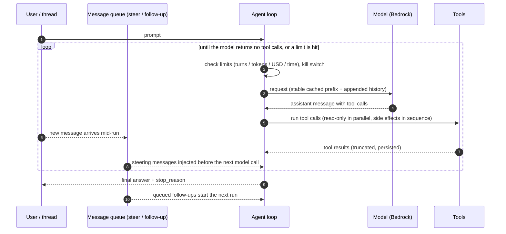
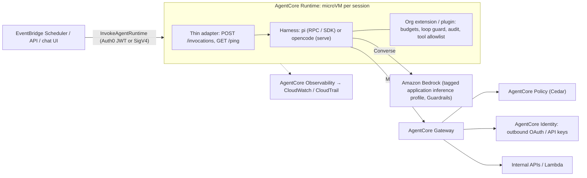

# Agent Building Blocks

This is a companion to [`AGENTIC_FRAMEWORK_SCOPING.md`](AGENTIC_FRAMEWORK_SCOPING.md). It covers:

- **What an agent is made of**: about 37 building blocks, grouped into 7 layers.
- **Which of them each option provides out of the box**: the frameworks (Strands, LangGraph, Pydantic AI), the harnesses (pi, opencode, Hermes Agent), and the platform (the **current Amazon Bedrock AgentCore**: managed harness, Runtime, Gateway, Policy, Identity, Memory, Observability and Evaluations, deployed with the `@aws/agentcore` CLI; not the legacy Starter Toolkit or Bedrock Agents Classic).
- **Whether pi and opencode (and Hermes) can run headless and autonomously**, and what is missing when they do.

Sources, commit SHAs and measurement method are the same as in the scoping document (§12 there). Versions are as of 2026-09-27. Where a cell could not be verified in source or docs, it says **unverified**.

**Legend:**
- ✅ Built in and usable out of the box.
- 🟡 Partial, opt-in, needs configuration, or needs an extension/plugin/package.
- ❌ Not provided.

---

## 1. Anatomy of an agent

```mermaid
flowchart TB
    subgraph IN["Interaction layer"]
        U["User / chat thread / API client / scheduler"]
        AUTHN["Inbound identity (JWT / SigV4)"]
        MQ["Message handling while busy: reject / steer / queue / interrupt"]
    end

    subgraph CORE["Agent core"]
        LOOP["Agent loop: model call, tool calls, results, repeat"]
        MODEL["Model provider (Bedrock Converse)"]
        CTX["Context assembly: system prompt, tools, history, cache points"]
        OUT["Structured output / streaming events"]
    end

    subgraph TOOLS["Tools and actions"]
        TDEF["Tool definitions (schemas)"]
        BUILTIN["Built-in tools (files, shell, web, code interpreter, browser)"]
        MCP["MCP client / Gateway tools"]
        EXEC["Execution: parallel vs sequential, timeouts, idempotency"]
    end

    subgraph CTRL["Control and safety"]
        HOOKS["Hooks / middleware / extensions"]
        HITL["Human approval (HITL)"]
        PERM["Permission rules / Cedar policy"]
        LIM["Limits: turns, tokens, USD, time, tool calls"]
        LOOPD["Loop and stuck detection, retries, cancellation"]
        SBX["Sandbox / isolation"]
        GR["Content guardrails"]
    end

    subgraph STATE["State and memory"]
        SESS["Sessions / threads (append-only)"]
        COMP["Compaction and tool-output truncation"]
        MEM["Long-term memory"]
        CACHE["Prompt / KV cache strategy"]
        SK["Skills and instruction files"]
    end

    subgraph MULTI["Multi-agent"]
        SUB["Sub-agents / agents-as-tools"]
        GRAPH["Deterministic graphs / workflows"]
        A2A["A2A (cross-agent protocol)"]
    end

    subgraph OPS["Operations"]
        OBS["Tracing (OpenTelemetry) and cost accounting"]
        EVAL["Evaluations"]
        SERVE["Serving: HTTP / SSE / WebSocket / headless"]
        TRIG["Triggers: schedules, chat gateways, webhooks"]
        OUTID["Outbound identity (OAuth / API keys)"]
    end

    U --> AUTHN --> MQ --> LOOP
    LOOP <--> MODEL
    CTX --> LOOP
    LOOP --> OUT
    LOOP --> EXEC
    EXEC --> TDEF & BUILTIN & MCP
    HOOKS -.-> LOOP
    HOOKS -.-> EXEC
    HITL -.-> EXEC
    PERM -.-> EXEC
    LIM -.-> LOOP
    LOOPD -.-> LOOP
    SBX -.-> BUILTIN
    GR -.-> MODEL
    SESS <--> LOOP
    COMP --> CTX
    MEM --> CTX
    CACHE --> CTX
    SK --> CTX
    LOOP --> SUB & GRAPH & A2A
    LOOP -.-> OBS
    EVAL -.-> OBS
    SERVE --> U
    TRIG --> U
    MCP --> OUTID
```

---

## 2. Building-block matrix

**Columns:**
- **Strands** = the `strands-agents` SDK.
- **Strands H.** = `strands-harness`.
- **LangGraph** includes LangChain v1 `create_agent` and its middleware.
- **AgentCore** = the current platform; a block marked ✅ there is provided by the platform regardless of framework.

### 2.1 Model and loop

| # | Block | Strands | Strands H. | LangGraph | Pydantic AI | pi | opencode | Hermes | AgentCore |
|---|---|---|---|---|---|---|---|---|---|
| 1 | Bedrock model access | ✅ default | ✅ default (Claude on Bedrock) | ✅ `langchain-aws` | ✅ `bedrock` extra | ✅ `pi-ai` | ✅ `amazon-bedrock` | ✅ boto3 | ✅ harness supports Bedrock, OpenAI, Gemini and LiteLLM-compatible providers |
| 2 | Agent loop | ✅ `event_loop_cycle` | ✅ | ✅ graph `model ⇄ tools` | ✅ graph nodes | ✅ `pi-agent-core` | ✅ `session/prompt.ts` | ✅ `run_conversation` | ✅ managed harness loop (Runtime hosts your own loop) |
| 3 | Streaming events | ✅ `stream_async` | ✅ | ✅ `stream` | ✅ `run_stream` / `iter` | ✅ events, JSON mode | ✅ SSE | ✅ | ✅ SSE / WebSocket |
| 4 | Structured output | ✅ `structured_output_model` | ✅ | ✅ `response_format` | ✅ (core strength) | ❌ (use a "submit" tool) | ❌ (use a "submit" tool) | ❌ | ❌ harness: unverified |

### 2.2 Tools

| # | Block | Strands | Strands H. | LangGraph | Pydantic AI | pi | opencode | Hermes | AgentCore |
|---|---|---|---|---|---|---|---|---|---|
| 5 | Tool definitions | ✅ `@tool` | ✅ | ✅ `@tool` | ✅ `@agent.tool` | 🟡 TypeBox tools through extensions | 🟡 Zod tools through plugins / `.opencode/tool` | ✅ Python tools and plugins | ✅ Gateway targets (OpenAPI, Lambda, Smithy, API Gateway, MCP) |
| 6 | Built-in tools (files, shell, web) | 🟡 a few bundled tools plus `strands-agents-tools` | ✅ shell, file edit, web, sandbox | ❌ community packages | 🟡 provider-native tools | ✅ read / write / edit / bash | ✅ full coding tool set | ✅ very broad | ✅ Code Interpreter, Browser, Web Search |
| 7 | Parallel tool execution | ✅ default | ✅ | ✅ | ✅ (sequential barriers available) | ✅ unless a tool is marked sequential | 🟡 left to the AI SDK | ✅ up to 8 workers, with conflict rules | ❌ harness: unverified |
| 8 | Tool timeouts | 🟡 build your own | 🟡 | 🟡 `step_timeout` | ✅ per tool | 🟡 bash timeout | ✅ shell 2 min | ✅ terminal 180 s | ✅ Gateway 15 min invocation timeout |
| 9 | MCP client | ✅ | ✅ | 🟡 adapter package | ✅ | ❌ (community extension) | ✅ | ✅ | ✅ Gateway exposes tools as MCP; Runtime can host MCP servers |

### 2.3 Control and safety

| # | Block | Strands | Strands H. | LangGraph | Pydantic AI | pi | opencode | Hermes | AgentCore |
|---|---|---|---|---|---|---|---|---|---|
| 10 | Hooks / middleware | ✅ typed hooks | ✅ plus plugins | ✅ middleware | ✅ capabilities | ✅ extensions (`beforeToolCall` and others) | ✅ plugins (`tool.execute.before/after` and others) | 🟡 plugins | 🟡 Policy on tool calls (outside the agent) |
| 11 | Human approval | ✅ `interrupt()` + resume | ✅ "ask" gates | ✅ `interrupt()`, HITL middleware | ✅ `requires_approval`, deferred tools | ❌ (extension) | ✅ `ask` (interactive or over the API) | ✅ approvals (`smart` mode is the default) | ✅ harness inline function tools (return of control) |
| 12 | Permission rules | 🟡 Cedar interventions | ✅ Cedar / ask | ❌ | ❌ | ❌ by design | ✅ allow / ask / deny with globs | 🟡 regex patterns plus an LLM "smart" check | ✅ **Policy (Cedar)** on every Gateway tool call |
| 13 | Sandbox / isolation | ❌ | 🟡 programmatic tool-call sandbox | ❌ | ❌ | ❌ (run it in a container) | ❌ | 🟡 docker, modal, ssh and similar backends | ✅ **one microVM per session** |
| 14 | Turn / iteration limit | 🟡 opt-in `limits.turns` | 🟡 | 🟡 default 10,007 | ✅ `request_limit=50` | ❌ | 🟡 `steps` per agent is **soft** (adds a 'max steps' prompt; tools stay available) | ❌ default unlimited | ✅ `maxIterations` = 75 |
| 15 | Token / USD budget | 🟡 soft token limits | 🟡 | 🟡 call counts only | ✅ tokens + `cost_limit` | ❌ (extension; `pi-ai` tracks cost) | ❌ | ❌ | 🟡 `maxTokens`; USD through inference profiles and AWS Budgets |
| 16 | Wall-clock timeout | 🟡 `cancel_signal`; Swarm 900 s | 🟡 | 🟡 | 🟡 per tool | ❌ | ❌ | 🟡 opt-in `run_budget_seconds` | ✅ `timeoutSeconds` = 3,600; idle 15 min; max lifetime 8 h |
| 17 | Loop / stuck detection | 🟡 Swarm only | 🟡 | ❌ | ❌ | ❌ | ✅ doom loop (3 identical calls) | ✅ tool-loop guardrails, repetition guard | ❌ |
| 18 | Retries with backoff | ✅ throttling (6 attempts) | ✅ | ✅ `RetryPolicy` | 🟡 opt-in | ✅ 3 | ✅ 5 | ✅ 3 plus provider fallback | ✅ managed |
| 19 | Cancellation / abort | ✅ `cancel()` | ✅ | 🟡 Server | ✅ `cancel()` | ✅ `abort` | ✅ abort endpoint | ✅ `/stop` | ✅ `StopRuntimeSession` |
| 20 | Content guardrails | ✅ Bedrock Guardrails on `BedrockModel` | ✅ | 🟡 through `langchain-aws` | 🟡 unverified | ❌ | ❌ | ✅ Bedrock `guardrailConfig` | ✅ Bedrock Guardrails |

### 2.4 Conversation, state and memory

| # | Block | Strands | Strands H. | LangGraph | Pydantic AI | pi | opencode | Hermes | AgentCore |
|---|---|---|---|---|---|---|---|---|---|
| 21 | Message arriving mid-run | ❌ throws (`ConcurrencyException`) | ❌ | 🟡 Server `multitask_strategy` | ✅ `enqueue(asap / when_idle)` | ✅ `steer` / `followUp` | ✅ joins at the next step | ✅ interrupt / queue / steer / redirect | 🟡 session-scoped invocations; the policy is yours |
| 22 | Session persistence | ✅ file / S3 / repository | ✅ `./.agent/sessions` | ✅ checkpointers | ❌ bring your own | ✅ JSONL | ✅ SQLite | ✅ SQLite + FTS5 | ✅ Memory (short-term); the microVM filesystem persists across sessions |
| 23 | Branch / fork / time travel | 🟡 snapshots | 🟡 | ✅ time travel | ❌ | ✅ tree, `/tree`, fork | ✅ fork, revert via git snapshots | unverified | ❌ |
| 24 | Context compaction | ✅ sliding window / summarizing / auto | ✅ auto | ✅ middleware | 🟡 history processors | ✅ auto-summary | ✅ auto-summary (`compaction.auto`) | ✅ at 50% of the window | ✅ `sliding_window` / `summarization` |
| 25 | Tool-output truncation | ✅ auto (preview over 1.5k tokens) | ✅ offloaded to storage | 🟡 context editing | ❌ | ✅ 2,000 lines / 50 KB | ✅ 2,000 lines / 50 KB (`tool_output`); pruning opt-in (`compaction.prune`, default off) | ✅ 50k characters | 🟡 unverified |
| 26 | Long-term memory | 🟡 memory tools, AgentCore Memory | ✅ markdown memory | ✅ Store | ❌ | ❌ | ❌ (AGENTS.md rules only) | ✅ MEMORY.md / USER.md plus providers (self-written) | ✅ **Memory** (long-term strategies) |
| 27 | Prompt caching | 🟡 `CacheConfig` opt-in | ✅ on by default | 🟡 Anthropic middleware | 🟡 opt-in | ✅ automatic plus cache warmer | ✅ automatic (date in the system prompt resets it daily) | ✅ automatic | ❌ harness internals not published |
| 28 | Skills / instruction files | 🟡 skills plugin | ✅ | ❌ | ❌ | ✅ skills, prompt templates, AGENTS.md | ✅ skills, rules, AGENTS.md | ✅ skills plus a remote hub | ✅ skills from Git, S3 or the AWS catalog |

### 2.5 Multi-agent

| # | Block | Strands | Strands H. | LangGraph | Pydantic AI | pi | opencode | Hermes | AgentCore |
|---|---|---|---|---|---|---|---|---|---|
| 29 | Sub-agents / agents-as-tools | ✅ `as_tool`, Swarm | ✅ `subagent` (depth 2) | ✅ subgraphs, handoffs | 🟡 delegate inside a tool | 🟡 example extension | ✅ `task` tool (no nesting by default) | ✅ `delegate_task` (depth 1, 10 concurrent) | 🟡 agents as Gateway / MCP tools, or A2A |
| 30 | Deterministic graph / workflow | ✅ `Graph`, Workflow | ✅ | ✅ (core) | ✅ `pydantic-graph` | ❌ | ❌ | ❌ | ❌ (use Step Functions) |
| 31 | A2A protocol | ✅ server + client | ✅ | 🟡 Server | ✅ `fasta2a` | ❌ | ❌ | ✅ A2A platform plugin | ✅ A2A contract (port 9000, Agent Cards) |

### 2.6 Operations

| # | Block | Strands | Strands H. | LangGraph | Pydantic AI | pi | opencode | Hermes | AgentCore |
|---|---|---|---|---|---|---|---|---|---|
| 32 | OpenTelemetry tracing | ✅ built in | ✅ | 🟡 LangSmith (commercial) / OTel | ✅ OTel / Logfire | 🟡 `pi-telemetry` (scope unverified) | 🟡 unverified | 🟡 community Grafana plugin | ✅ **Observability** (CloudWatch, CloudTrail) |
| 33 | Cost accounting | 🟡 usage metrics | 🟡 | 🟡 | ✅ `genai-prices` | ✅ `pi-ai` tracks tokens and cost | 🟡 per-message cost (unverified) | 🟡 unverified | 🟡 tagged inference profiles, AWS Budgets |
| 34 | Evaluations | ✅ `strands-agents-evals` | ✅ | 🟡 LangSmith / openevals | ✅ `pydantic-evals` | ❌ | ❌ | ❌ | ✅ **Evaluations** (Strands, LangGraph, OpenAI Agents, Vercel AI, LlamaIndex, ADK, Claude Agent SDK) |
| 35 | Serving (HTTP / headless) | 🟡 A2A server; AgentCore app wrapper | 🟡 | 🟡 Agent Server | 🟡 A2A / AG-UI adapters | ✅ print / JSON / RPC / SDK | ✅ `run`, `serve` (OpenAPI), SDK | ✅ OpenAI-compatible API, ACP, MCP | ✅ **Runtime**: HTTP `/invocations` + `/ws`, MCP, A2A, AG-UI |
| 36 | Triggers (schedules, chat, webhooks) | ❌ | ❌ | 🟡 platform cron | ❌ | ❌ | 🟡 GitHub Actions | ✅ cron plus 15+ chat platforms | ❌ (use EventBridge Scheduler / API Gateway → `InvokeAgentRuntime`) |
| 37 | Identity (inbound auth / outbound credentials) | ❌ | ❌ | ❌ | ❌ | 🟡 provider keys only | 🟡 provider keys; OAuth for MCP | 🟡 provider keys; OAuth for MCP | ✅ **Identity**: JWT authorizer (e.g. Auth0), workload identity, OAuth2 / API-key credential providers |

### 2.7 Coverage summary

Counts of ✅ out of 37 blocks (🟡 not counted), computed from the tables above. This is indicative only, since the blocks are not equally important and AgentCore's count mixes the managed harness with platform services.

| | Strands | Strands H. | LangGraph | Pydantic AI | pi | opencode | Hermes | AgentCore |
|---|---:|---:|---:|---:|---:|---:|---:|---:|
| ✅ count | 20 | 25 | 15 | 19 | 17 | 21 | 24 | 24 |

**What the matrix shows:**
- **Harnesses are strong on the agent's inner workings**: built-in tools, compaction, message handling while busy, sessions, caching and skills.
- **Harnesses are weak on governance**: identity, policy, limits, isolation, evaluations and observability.
- **AgentCore covers exactly the governance blocks** that the frameworks and harnesses lack: rows 12, 13, 14, 16, 26, 32, 34, 35 and 37.
- So the realistic designs are:
  - **framework (Strands) + AgentCore**, which is the recommended standard;
  - **a harness inside an AgentCore Runtime microVM, with Gateway, Policy and Identity around it**, which is the pattern in [`AGENT_PI_BEDROCK.md`](AGENT_PI_BEDROCK.md) and [`AGENTS_OPENCODE_BEDROCK.md`](AGENTS_OPENCODE_BEDROCK.md).

```mermaid
flowchart LR
    subgraph FW["Provided by the framework or harness (inside the agent)"]
        direction TB
        a1["Loop, streaming"]
        a2["Tool schemas, built-in tools"]
        a3["Hooks / extensions / plugins"]
        a4["Sessions, compaction, caching"]
        a5["Message handling while busy (steer / queue)"]
        a6["Sub-agents, graphs"]
    end
    subgraph WRAP["Provided by our org wrapper / extension"]
        direction TB
        w1["Turn, token and USD budgets"]
        w2["Loop detection, idempotency"]
        w3["Audit events, redaction"]
    end
    subgraph AC["Provided by AgentCore (outside the agent)"]
        direction TB
        c1["Runtime: microVM per session, lifecycle limits"]
        c2["Identity: Auth0 JWT in, OAuth / keys out"]
        c3["Gateway + Policy (Cedar): tool authorization"]
        c4["Memory, Observability, Evaluations"]
        c5["Managed harness: maxIterations, timeoutSeconds, maxTokens"]
    end
    FW --> WRAP --> AC
```

---

## 3. How the loop handles turns and mid-run messages

Semantics by system: pi `steer()` / `followUp()`; Claude Code and Codex inject messages after the current tool batch; opencode picks them up at the next step; Hermes offers `interrupt` / `queue` / `steer` / `redirect`; Pydantic AI `enqueue(asap / when_idle)`; Strands rejects.

---

## 4. Can pi and opencode (and Hermes) run headless and autonomously?

**Yes, all three can.** They differ sharply in how safe it is to leave them running unattended.

| Capability | pi | opencode | Hermes Agent |
|---|---|---|---|
| **One-shot, non-interactive** | `pi -p "…"` / `--print`: runs the prompts, prints the final text, exits | `opencode run "…"` | `hermes -q "…"` (unverified flag spelling; see the Hermes CLI docs) |
| **Machine-readable events** | `--mode json` (JSONL event stream, then exit) | `opencode run --format json` | API server streaming (SSE) |
| **Long-lived control protocol** | `--mode rpc`: JSONL commands on stdin (`prompt`, `steer`, `follow_up`, `abort`, state, compaction), events on stdout | `opencode serve`: HTTP API with an OpenAPI 3.1 spec, SSE events, basic auth via `OPENCODE_SERVER_PASSWORD` | OpenAI-compatible HTTP/SSE server, ACP over stdio, MCP server |
| **In-process embedding** | ✅ `@earendil-works/pi-coding-agent` SDK (`createAgentSession`), or `pi-agent-core` directly | 🟡 `@opencode-ai/sdk` is an HTTP client (`createOpencode()` starts a server) | 🟡 `run_agent.AIAgent` from a git checkout; no supported wheel |
| **Permissions when unattended** | **None**: it never asks, so every enabled tool runs. Isolation must come from the container / VM | **Fail-closed by default**: `run` without `--auto` **auto-rejects** any `ask` permission (verified in `cli/cmd/run.ts`). `--auto` approves everything not explicitly denied | Unattended and cron runs **deny** approvals by default; interactive default is `smart` (an LLM auto-approves low-risk commands) |
| **Tool restriction** | `--tools read,grep,find,ls`, `--no-tools`, `--no-extensions` | per-agent `permission` (allow / ask / deny, globs); tools can be denied | toolsets / config |
| **Turn limit** | ❌ (write an extension) | 🟡 `steps` per agent, **soft** (hard cap needs a plugin) | ❌ default unlimited (`max_turns` configurable) |
| **Token / USD budget** | ❌ (extension; `pi-ai` reports usage and cost) | ❌ (plugin) | ❌ |
| **Wall-clock limit** | ❌ in pi (use the process supervisor or AgentCore lifecycle) | ❌ (supervisor / AgentCore) | 🟡 `run_budget_seconds` (opt-in) |
| **Loop detection** | ❌ | ✅ doom loop (3 identical calls → `ask`, which headless `run` rejects) | ✅ tool-loop hard stops (on by default when unattended) |
| **Sessions when headless** | JSONL by default; `--no-session` for ephemeral runs; `--session-dir` | SQLite; `--continue` / `--session`, `--fork` | SQLite |
| **Scheduling / triggers** | ❌ (external: EventBridge, cron, CI) | 🟡 GitHub Actions integration (`/opencode` comments) | ✅ built-in cron plus chat gateways |
| **Bedrock credentials inside AgentCore Runtime** | needs help: pi doesn't detect instance-metadata credentials, so the adapter refreshes the environment (see `AGENT_PI_BEDROCK.md` §3.1) | needs help: the loader only enables the AWS credential chain when a profile or key is set, so use a `credential_process` profile (see `AGENTS_OPENCODE_BEDROCK.md` §3.1) | native boto3 chain |
| **Provider lock-down** | `--provider` / `--model`; `--offline` | `enabled_providers` / `disabled_providers` in config | provider config |
| **Supply-chain surface at runtime** | extensions and packages run in-process with full rights; `pi install` fetches from npm / git | npm plugins are installed at startup; the postinstall binary | Skills Hub remote installs; self-written skills |

**Verdict:**
- **Both pi and opencode can run headless and autonomously today.**
- **opencode is safer out of the box when unattended.** Anything that would need approval is rejected, and loop detection routes to that rejection. Its per-agent `steps` limit is only a soft nudge; a hard cap needs the guard plugin.
- **pi is the more embeddable and hackable.** Its RPC and SDK interfaces, steering, and cleaner loop make it the better base for our own controls. But it has no permission model, so it is only acceptable inside a sandbox (an AgentCore microVM) with tools restricted and a budget extension in place.
- **Hermes** runs unattended well (cron, gateways). Its defaults and governance rule it out (see the scoping doc §4.8).

In every case, identity, tool authorization, isolation, spend control and audit must come from **AgentCore**, not from the harness.

---

## 5. Recommendations derived from the matrix

1. **Build our standard agents on Strands + AgentCore.** Only the gaps need our own code: budgets (row 15), loop detection (17) and message handling while busy (21), all in the `org-agents` wrapper.
2. **If a harness is wanted** (for example an internal autonomous coding or ops agent), run **opencode or pi inside AgentCore Runtime**, with:
   - model access only through Bedrock;
   - tools only through Gateway (MCP) and Policy;
   - identity through AgentCore Identity (Auth0 as the IdP);
   - a mandatory org extension/plugin for budgets and audit;
   - no runtime installation of plugins, extensions or skills.

   See the two deployment guides.
3. **Copy harness techniques into the Strands wrapper:**
   - opencode's doom-loop rule;
   - pi's steer/follow-up queues;
   - pi and opencode's tool-output caps and pruning;
   - Hermes' interrupt → queue demotion while sub-agents run;
   - Codex's `<turn_aborted>` marker;
   - pi's cache warmer for long approval pauses.
