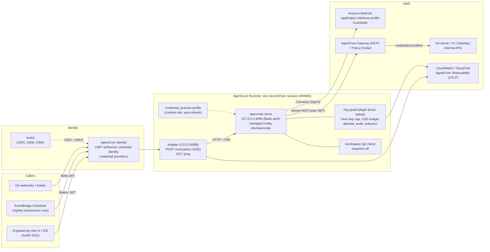
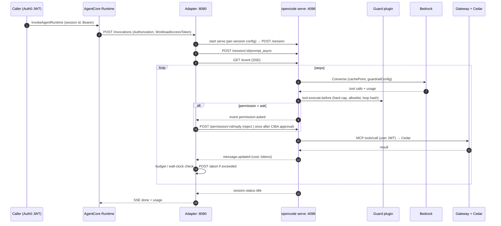
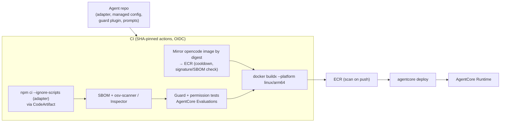

# Running opencode Agents Autonomously on Amazon Bedrock and AgentCore

**Scope:** how to configure [opencode](https://github.com/anomalyco/opencode), its agents and plugins so that they run **headless and autonomously** on **Amazon Bedrock**, hosted on the **current Amazon Bedrock AgentCore**:
- AgentCore Runtime (one microVM per session), deployed with the `@aws/agentcore` CLI;
- Gateway + Policy for tools;
- Identity with Auth0;
- Observability.

This guide does **not** use the legacy Starter Toolkit or Bedrock Agents Classic.

**Status:** design guide for the PoC (`AGENTIC_FRAMEWORK_SCOPING.md` §11). opencode is **not** the org standard; that is Strands. This guide applies when a team justifies an opencode-based agent (typically an autonomous engineering agent working on a repository), and it defines the minimum controls.

**Versions verified (2026-09-27):**
- opencode **1.18.32** (repo `anomalyco/opencode` @ `b471c2b`)
- `@aws/agentcore` CLI 0.30.0
- AWS samples `awslabs/agentcore-samples` @ `e1a55b3`

Items marked **[verify in PoC]** are designs built on verified code paths that have not been run end to end.

---

## 1. Why opencode, and what it lacks

opencode is a **client/server harness**:
- `opencode serve` exposes an HTTP API (OpenAPI 3.1 + SSE) that the TUI, IDEs and SDKs drive;
- `opencode run` is a one-shot CLI.

**Strengths for unattended use:**
- **Declarative permissions** (`allow` / `ask` / `deny` with globs, per agent and per session).
- **Headless fail-closed behaviour:** `opencode run` without `--auto` **rejects** any `ask`.
- **Doom-loop detection:** 3 identical tool calls trigger an `ask`.
- Per-agent models, prompts and permissions.
- Sub-agents without nesting.
- A plugin API with `tool.execute.before/after`.
- Native Bedrock support with automatic `cachePoint` placement.
- An official multi-arch container image.

**Gaps we must close:**

| Gap | Where we close it |
|---|---|
| Isolation (no OS sandbox) | **AgentCore Runtime** microVM per session; server bound to `127.0.0.1` behind our adapter |
| `steps` is a **soft** limit: after the limit it only appends a "max steps" prompt and still offers tools | **Org guard plugin**: hard step cap in `tool.execute.before` + adapter wall-clock abort |
| No token / USD budget | Guard plugin sums `cost` / `tokens` from `message.updated` events → `session.abort` (the cost is an *estimate* from catalog prices; reconcile with inference-profile billing) |
| No Guardrails integration | Pass `guardrailConfig` through model `options` (inferred from the AI SDK; [verify in PoC]) **plus** an IAM-level requirement [verify] |
| Runtime supply chain: npm plugins resolve to `@latest`; config dirs auto-install `@opencode-ai/plugin`; the `install` script uses `curl \| bash` | Pinned image, no npm plugins at runtime, `OPENCODE_DISABLE_PROJECT_CONFIG=1`, CodeArtifact `.npmrc` |
| Identity | **AgentCore Identity** (Auth0 JWT inbound), Gateway credential providers outbound |
| Tool authorization for business systems | **AgentCore Gateway (MCP) + Policy (Cedar)** |

> **Don't copy AWS's coding-agent sample as-is.** `agentcore-samples/…/04-coding-agents/03-code-agents-competition-e2e/coding_agents/open-code` installs opencode with `curl https://opencode.ai/install | bash`, runs it with the permission-bypass flag (a hidden alias of `--auto`), and exports a one-time IMDS credential snapshot. The sample is useful as a *reference that opencode works on AgentCore*. Its security posture is not acceptable for us.

---

## 2. Target architecture



**Principles:**
1. **One opencode server per AgentCore session.**
   - AgentCore already gives one microVM per session.
   - The adapter starts `opencode serve` lazily on the first invocation, with a per-session config (the model, the user's token for the Gateway MCP server, and the permission ruleset).
2. **Only two outbound paths from opencode:** Bedrock and AgentCore Gateway.
   - `webfetch`, `websearch` and external directories are denied.
   - Egress is restricted with VPC security groups plus a proxy.
3. **Every `ask` is decided by the adapter, not by a human at a terminal.** By default it is **rejected**. For approved categories it is routed to **Auth0 CIBA** (§7).

---

## 3. Bedrock configuration

### 3.1 Credentials inside AgentCore Runtime

opencode's v1 Bedrock loader (`packages/opencode/src/provider/provider.ts:301-420`) uses the full AWS SDK chain (`fromNodeProviderChain`, which includes IMDS). But it **only enables it** when it sees one of these:
- a profile (`options.profile` / `AWS_PROFILE`);
- `AWS_ACCESS_KEY_ID`;
- a bearer token;
- `AWS_WEB_IDENTITY_TOKEN_FILE`;
- ECS container-credential variables.

AgentCore Runtime vends the execution-role credentials through an **instance-metadata endpoint**. One AWS sample documents `AWS_EC2_METADATA_SERVICE_ENDPOINT` on a private address, and warns that credentials can disappear from long-lived containers. So the gate stays closed unless we help it.

**Recommended: a profile with `credential_process`.** Its credentials refresh automatically, and it is detected because `AWS_PROFILE` is set. **[verify in PoC]**

```ini
# /home/agent/.aws/config
[profile agentcore]
credential_process = /opt/bin/imds-creds
region = eu-west-1
```

```bash
#!/bin/sh
# /opt/bin/imds-creds: prints AWS credential_process JSON from the runtime's metadata endpoint
EP="${AWS_EC2_METADATA_SERVICE_ENDPOINT:-http://169.254.169.254}"; EP="${EP%/}"
T=$(curl -sf -X PUT "$EP/latest/api/token" -H "X-aws-ec2-metadata-token-ttl-seconds: 300")
R=$(curl -sf -H "X-aws-ec2-metadata-token: $T" "$EP/latest/meta-data/iam/security-credentials/")
curl -sf -H "X-aws-ec2-metadata-token: $T" "$EP/latest/meta-data/iam/security-credentials/$R" \
 | jq '{Version:1, AccessKeyId, SecretAccessKey, SessionToken:.Token, Expiration}'
```

Then set `AWS_PROFILE=agentcore` in the runtime `envVars`. **Never** configure `apiKey` or `AWS_BEARER_TOKEN_BEDROCK` for production. A bearer token bypasses the IAM chain entirely.

### 3.2 Managed configuration

opencode merges a **managed config** last (`/etc/opencode/opencode.json`, `config/managed.ts`). Put the org baseline there so repository `.opencode/` directories and `opencode.json` files cannot override it. Also set `OPENCODE_DISABLE_PROJECT_CONFIG=1` so repo config dirs are ignored completely.

```jsonc
// /etc/opencode/opencode.json (managed, baked into the image)
{
  "$schema": "https://opencode.ai/config.json",
  "enabled_providers": ["amazon-bedrock"],
  "model": "amazon-bedrock/claude-sonnet-ops-profile",
  "small_model": "amazon-bedrock/claude-haiku-ops-profile",
  "autoupdate": false,
  "share": "disabled",
  "snapshot": false,
  "default_agent": "ops",
  "provider": {
    "amazon-bedrock": {
      "options": {
        "region": "eu-west-1",
        "profile": "agentcore",
        "endpoint": "https://bedrock-runtime.eu-west-1.vpce-xxxx.amazonaws.com"   // VPC interface endpoint
      },
      "whitelist": ["claude-sonnet-ops-profile", "claude-haiku-ops-profile"],
      "models": {
        // Keep "claude" in the key: caching is enabled only when the model id / api id contains claude|anthropic
        "claude-sonnet-ops-profile": {
          "id": "arn:aws:bedrock:eu-west-1:123456789012:application-inference-profile/abc123",
          "options": {
            // inferred pass-through to Converse via @ai-sdk/amazon-bedrock [verify in PoC]
            "guardrailConfig": { "guardrailIdentifier": "gr-123", "guardrailVersion": "1" }
          }
        },
        "claude-haiku-ops-profile": {
          "id": "arn:aws:bedrock:eu-west-1:123456789012:application-inference-profile/def456"
        }
      }
    }
  },
  "compaction": { "auto": true, "prune": true },
  "tool_output": { "max_lines": 2000, "max_bytes": 51200 },
  "plugin": [],
  "agent": { /* see §5 */ },
  "permission": { /* see §4 */ },
  "mcp": { /* written per session by the adapter, see §6 */ }
}
```

**Notes:**
- **Prompt caching:** opencode places Bedrock `cachePoint`s on the first 2 system and last 2 non-system messages. Its system prompt contains **today's date**, so the cached prefix resets daily. That is acceptable, and good to know when reading cache metrics.
- **Model catalog:** opencode fetches `models.opencode.ai/api.json` at startup and hourly. Set `OPENCODE_DISABLE_MODELS_FETCH=1` and `OPENCODE_MODELS_PATH=/etc/opencode/models.json`, using a pinned copy of the catalog.
- **Cost figures** (`message.cost`) are estimates from that catalog. Keep the pinned catalog's Bedrock prices current, or budget in tokens and reconcile USD with the tagged inference profile in AWS Cost Explorer.
- **Guardrails:** the pass-through does not apply to small-model calls (titles, summaries). Enforce at IAM as well [verify which Bedrock IAM condition keys apply to Converse].
- **Telemetry:** there is no product analytics. OpenTelemetry export happens only when `OTEL_EXPORTER_OTLP_ENDPOINT` is set; point it at the ADOT collector / AgentCore Observability. `experimental.openTelemetry: true` adds AI SDK spans.

### 3.3 Environment for the container

| Variable | Value | Why |
|---|---|---|
| `AWS_PROFILE` | `agentcore` | Opens the Bedrock credential gate (§3.1) |
| `AWS_REGION` | e.g. `eu-west-1` | Explicit region |
| `OPENCODE_DISABLE_PROJECT_CONFIG` | `1` | Ignore repo `.opencode/` and repo `opencode.json` |
| `OPENCODE_DISABLE_MODELS_FETCH` / `OPENCODE_MODELS_PATH` | `1` / `/etc/opencode/models.json` | No catalog fetch; pinned prices |
| `OPENCODE_DISABLE_AUTOUPDATE` | `1` | Belt and braces (`run` / `serve` don't self-update anyway) |
| `OPENCODE_DISABLE_SHARE` | `1` | No share uploads |
| `OPENCODE_DISABLE_DEFAULT_PLUGINS` | `1` | Skip built-in auth plugins for other providers |
| `OPENCODE_SERVER_PASSWORD` | random per microVM | Basic auth even on loopback (defence in depth; cf. CVE-2026-22812) |
| `OPENCODE_DB` | `/tmp/oc/opencode.db` | Ephemeral session DB (transcripts exported to S3 by the adapter) |
| `XDG_DATA_HOME` / `XDG_CACHE_HOME` | `/tmp/oc/…` | Writable, ephemeral |
| `OPENCODE_EXPERIMENTAL_BASH_DEFAULT_TIMEOUT_MS` | `120000` | Bash timeout |
| `OTEL_EXPORTER_OTLP_ENDPOINT` | collector URL | Traces |

---

## 4. Permissions baseline (deny by default)

Rules are evaluated **last match wins**, and no match means `ask`. A tool whose final rule is `"*": "deny"` is hidden from the model.

```jsonc
"permission": {
  "*": "deny",
  "read": { "*": "allow", "*.env": "deny", "*.env.*": "deny", "**/.aws/**": "deny" },
  "glob": "allow", "grep": "allow", "list": "allow", "lsp": "allow",
  "edit": "allow",                                   // only inside /workspace; external_directory is denied
  "bash": { "*": "deny", "git status*": "allow", "git diff*": "allow", "npm test*": "allow", "npm run lint*": "allow" },
  "external_directory": "deny",
  "webfetch": "deny", "websearch": "deny",
  "task": { "*": "deny", "explore": "allow" },       // read-only sub-agent only
  "skill": "deny",
  "question": "deny",
  "doom_loop": "ask",                                // → adapter rejects, or escalates to a human (§7)
  "gw_*": "allow",                                   // AgentCore Gateway MCP tools; Cedar decides per call
  "gw_payments_*": "ask"                             // high-risk tools → CIBA approval (§7)
}
```

- **In `run` mode:** no `--auto`, ever. A leftover `ask` is rejected and the loop ends.
- **In `serve` mode:** the adapter answers `permission.asked` itself (§6).
- **Per-session tightening:** the adapter can pass a `permission` ruleset on `POST /session` for each run.

---

## 5. Agents

Define the agents in the managed config. **Disable** the built-in `build` agent if it isn't needed.

```jsonc
"agent": {
  "build":   { "disable": true },
  "ops": {
    "mode": "primary",
    "description": "Autonomous repository maintenance agent",
    "model": "amazon-bedrock/claude-sonnet-ops-profile",
    "prompt": "{file:/etc/opencode/prompts/ops.md}",
    "steps": 40,                                     // soft limit; the hard cap is in the guard plugin
    "permission": { "bash": { "*": "deny", "npm test*": "allow" } }
  },
  "explore": { "mode": "subagent" }                  // built-in read-only sub-agent (nesting depth 1)
}
```

---

## 6. Headless operation and the AgentCore adapter

| Interface | Use it for | Notes |
|---|---|---|
| **`opencode serve` + adapter (recommended)** | AgentCore Runtime | HTTP API + SSE; answer permissions programmatically; send messages mid-run |
| `opencode run --format json` | batch / CI jobs | One JSON event per line (`step_start`, `tool_use`, `text`, `step_finish`, `error`). Exit 1 on session error. **Without `--auto`, asks are auto-rejected** |
| GitHub Actions (`anomalyco/opencode/github`) | PR / issue automation | Installs the *latest* release via curl; uses `api.opencode.ai` token exchange unless `use_github_token: true`. **Pin and self-host the action**, and use AWS OIDC for Bedrock |

**Adapter → opencode API mapping** (`server/routes/instance/httpapi/groups/*`):

| AgentCore | opencode |
|---|---|
| First `POST /invocations` for a session id | start `opencode serve --hostname 127.0.0.1 --port 4096` with `OPENCODE_CONFIG_CONTENT` (per-session MCP headers) → `GET /global/health` → `POST /session` `{agent:"ops", permission:[…]}` |
| `POST /invocations` (streaming) | `POST /session/:id/prompt_async` `{parts:[{type:"text",text}]}` + relay `GET /event` (filter by session id and child sessions) as SSE until `session.status` is idle |
| `POST /invocations` while busy | `prompt_async` again. opencode persists the message and the running loop picks it up at the next step [verify in PoC]. Deduplicate by message id first |
| permission request | on `permission.asked`: `POST /permission/:requestID/reply` `{reply:"reject"}` by default, `"once"` only after an approval (§7) |
| cancel / wall clock / budget exceeded | `POST /session/:id/abort` (also cancels child sessions) |
| `GET /ping` | `HealthyBusy` if `GET /session/status` shows a busy session, else `Healthy` |
| never expose | `/session/:id/shell`, `/pty`, `/file/*`, `/tui/*`. The server listens on loopback and only the adapter talks to it |



---

## 7. Identity, tools and approvals (Auth0)

The shared design is in [`AGENT_IDENTITY_AUTH0.md`](AGENT_IDENTITY_AUTH0.md). What is specific to opencode:

- **Inbound:**
  - The runtime uses `CUSTOM_JWT` with the Auth0 discovery URL, validated on **`allowedAudience`** (Auth0's default tokens carry `azp`, not `client_id`) plus scopes / claims.
  - `requestHeaderAllowlist: ["Authorization"]`, so the adapter receives the caller's JWT and the `WorkloadAccessToken`.
- **Tools through Gateway:** the adapter writes the per-session MCP config into `OPENCODE_CONFIG_CONTENT`:
  ```jsonc
  "mcp": {
    "gw": { "type": "remote", "url": "https://<gateway-id>.gateway.bedrock-agentcore.eu-west-1.amazonaws.com/mcp",
            "headers": { "Authorization": "Bearer <caller JWT>" }, "oauth": false, "timeout": 30000 }
  }
  ```
  - MCP tools appear as `gw_<tool>`, which is what the `gw_*` permission rules match.
  - Gateway applies Cedar to `OAuthUser(<sub>)` with Auth0 claims as tags, and mints downstream tokens through credential providers (OBO / client credentials). **opencode never sees downstream secrets.**
  - Token lifetime: set the runtime `maxLifetime` ≤ the Auth0 access-token lifetime, or restart `serve` with a refreshed token [verify in PoC].
- **Autonomous runs:** the scheduler Lambda uses the agent's own Auth0 **M2M** app. The Cedar principal is `<client_id>@clients`, and Gateway targets use `CLIENT_CREDENTIALS`.
- **Approvals:** when `permission.asked` is for an `ask` rule the adapter recognises (`gw_payments_*`, `doom_loop`), it starts an **Auth0 CIBA** request, including RAR `authorization_details` built from the tool input, and replies:
  - `once` only if approved;
  - `reject` on denial or timeout.

  Everything else is rejected immediately. The approval token itself is used by the Gateway target, so the downstream API verifies what was approved.

---

## 8. The org guard plugin (mandatory)

This is a **local** plugin baked into the managed config dir. We use **no npm plugins**, because they resolve to `@latest` when unpinned and are fetched at startup.

```ts
// /etc/opencode/plugin/guard.ts (sketch) [verify in PoC]
import type { Plugin } from "@opencode-ai/plugin";
import { createHash } from "node:crypto";

const MAX_TOOL_CALLS = Number(process.env.AGENT_MAX_TOOL_CALLS ?? 60);
const MAX_USD = Number(process.env.AGENT_MAX_USD ?? 2);
const REPEAT = 3;

export const Guard: Plugin = async ({ client }) => {
  const calls = new Map<string, number>(), usd = new Map<string, number>(), seen = new Map<string, number>();
  const audit = (type: string, data: object) => console.log(JSON.stringify({ audit: true, type, ts: Date.now(), ...data }));
  return {
    "tool.execute.before": async (input, output) => {
      const n = (calls.get(input.sessionID) ?? 0) + 1; calls.set(input.sessionID, n);
      if (n > MAX_TOOL_CALLS) { audit("limit", { kind: "tool_calls", n }); throw new Error("tool-call budget exhausted"); }
      if (process.env.KILL_SWITCH === "1") throw new Error("kill switch");
      const key = createHash("sha256").update(input.sessionID + input.tool + JSON.stringify(output.args)).digest("hex");
      const r = (seen.get(key) ?? 0) + 1; seen.set(key, r);
      if (r >= REPEAT) { audit("loop_detected", { tool: input.tool }); throw new Error("repeated identical tool call"); }
      audit("tool_call", { session: input.sessionID, tool: input.tool });
    },
    "tool.execute.after": async (input, output) => {
      output.output = redact(output.output);              // redact before it is persisted / sent to the model
      audit("tool_result", { session: input.sessionID, tool: input.tool });
    },
    event: async ({ event }) => {
      if (event.type === "message.updated" && event.properties.info.role === "assistant") {
        const m = event.properties.info; // cost (USD, estimate) + tokens
        const total = (usd.get(m.sessionID) ?? 0) + (m.cost ?? 0);   // accumulate per final message [verify event semantics]
        usd.set(m.sessionID, total);
        if (total > MAX_USD) { audit("limit", { kind: "usd", total }); await client.session.abort({ path: { id: m.sessionID } }); }
      }
    },
    "shell.env": async (_input, output) => { delete output.env.AWS_SECRET_ACCESS_KEY; delete output.env.AWS_SESSION_TOKEN; },
  };
};
function redact(s: string) { return s.replace(/\b\d{12,19}\b/g, "[REDACTED_PAN]"); }
```

**Plugin API notes:**
- Throwing in `tool.execute.before` blocks the tool.
- `permission.ask` is **not triggered** at this commit. Handle permissions through the `event` hook or in the adapter.
- `message.updated` may fire several times per message. Deduplicate by message id before adding up cost [verify in PoC].

---

## 9. Image, supply chain and deployment

```dockerfile
# Dockerfile (sketch). ARM64 is required by AgentCore Runtime.
# Official multi-arch image (Alpine + ripgrep); pin by DIGEST, mirrored into our ECR
FROM --platform=linux/arm64 <account>.dkr.ecr.eu-west-1.amazonaws.com/mirror/opencode@sha256:<digest>   # ghcr.io/anomalyco/opencode:1.18.32
USER root
RUN apk add --no-cache git curl jq nodejs npm tini && adduser -D -u 1000 agent
COPY etc-opencode/ /etc/opencode/          # managed config, prompts, local plugins, pinned models.json
COPY aws-config /home/agent/.aws/config     # credential_process profile
COPY imds-creds /opt/bin/imds-creds
COPY adapter/ /opt/adapter/                 # built with npm ci --ignore-scripts via CodeArtifact
ENV OPENCODE_DISABLE_PROJECT_CONFIG=1 OPENCODE_DISABLE_MODELS_FETCH=1 OPENCODE_MODELS_PATH=/etc/opencode/models.json \
    OPENCODE_DISABLE_AUTOUPDATE=1 OPENCODE_DISABLE_SHARE=1 OPENCODE_DISABLE_DEFAULT_PLUGINS=1 AWS_PROFILE=agentcore
USER agent
WORKDIR /workspace
EXPOSE 8080
ENTRYPOINT ["/sbin/tini","--"]
CMD ["node","/opt/adapter/server.js"]
```

**Supply-chain rules specific to opencode:**
- **No `curl | bash` installs.** Use the digest-pinned official image mirrored into ECR, or the release tarball `opencode-linux-arm64.tar.gz` checked against a recorded SHA-256.
- The npm path (`opencode-ai`) needs its **postinstall** script to select the platform binary. Avoid it in images.
- **No npm plugins.** Every opencode config dir triggers a background install of `@opencode-ai/plugin`. Pre-bake it into the image's cache, keep config dirs read-only, and route `.npmrc` to CodeArtifact.
- The binary is a **Bun-compiled single file**, which SCA tools can't see inside. Track the upstream release SBOM / advisories (CVE-2026-22812 fixed in 1.0.216; CVE-2026-22813 fixed in 1.1.10), keep the version pinned, and upgrade only through the mirror cooldown.

**Deploy with the current AgentCore CLI:**

```bash
agentcore add agent --name oc_ops --type byo --build Container --language Other \
  --code-location app/oc_ops --entrypoint server.js \
  --network-mode VPC --subnets subnet-a,subnet-b --security-groups sg-123 \
  --authorizer-type CUSTOM_JWT --discovery-url https://fintech.eu.auth0.com/.well-known/openid-configuration \
  --allowed-audience https://agents.fintech.example --request-header-allowlist Authorization
agentcore deploy
```

`agentcore/agentcore.json` runtime entry (excerpt):

```json
{
  "name": "oc_ops", "build": "Container", "codeLocation": "app/oc_ops/", "entrypoint": "server.js",
  "networkMode": "VPC", "protocol": "HTTP",
  "envVars": [ { "name": "AWS_REGION", "value": "eu-west-1" }, { "name": "AGENT_MAX_USD", "value": "5" },
               { "name": "AGENT_MAX_TOOL_CALLS", "value": "80" } ],
  "requestHeaderAllowlist": ["Authorization"],
  "lifecycleConfiguration": { "idleRuntimeSessionTimeout": 900, "maxLifetime": 3600 }
}
```

- **Execution role:** Bedrock invoke on the **specific application inference profiles** only; CloudWatch Logs; S3 put for transcripts; Git credentials only via Gateway / Identity (never baked in).
- **Network:** VPC mode; security groups allowing only the Bedrock / AgentCore VPC endpoints, the Git server and the proxy.



---

## 10. Checklist

- [ ] Digest-pinned opencode 1.18.32+ image (arm64) mirrored to ECR; no `curl | bash`, no npm plugins, `OPENCODE_DISABLE_PROJECT_CONFIG=1`
- [ ] `credential_process` profile + `AWS_PROFILE`; no bearer tokens or API keys
- [ ] `enabled_providers: ["amazon-bedrock"]`, model whitelist, application inference profiles with "claude" in the config key
- [ ] Managed config: `share: disabled`, `snapshot: false`, `autoupdate: false`, pinned models catalog
- [ ] Deny-by-default permissions; `gw_*` tools only through Gateway + Cedar; `external_directory`, `webfetch`, `websearch` denied
- [ ] Guard plugin: hard tool-call cap, USD budget, loop hash, kill switch, audit, redaction, `shell.env` scrubbing
- [ ] Adapter: loopback server with Basic auth; rejects every `ask` except CIBA-approved ones; wall-clock abort; `/ping` HealthyBusy only while busy
- [ ] Auth0 JWT inbound (audience-based); M2M for schedules; CIBA for high-risk tools
- [ ] OTLP → AgentCore Observability; transcripts to S3 (KMS); Evaluations suite

## 11. Sources

- opencode @ `b471c2b` (1.18.32):
  - `packages/opencode/src/provider/provider.ts`
  - `provider/transform.ts`
  - `cli/cmd/run.ts`
  - `session/processor.ts`
  - `session/prompt.ts`
  - `permission/index.ts`
  - `agent/agent.ts`
  - `packages/core/src/v1/config/*.ts`
  - `packages/core/src/models-dev.ts`
  - `packages/core/src/npm.ts`
  - `packages/plugin/src/index.ts`
  - docs in `packages/web/src/content/docs/`: `cli`, `server`, `sdk`, `permissions`, `agents`, `plugins`, `providers`, `mcp-servers`, `github`, `policies`
- Advisories:
  - CVE-2026-22812: GHSA-vxw4-wv6m-9hhh
  - CVE-2026-22813: GHSA-c83v-7274-4vgp
- AgentCore:
  - Runtime service contract: https://docs.aws.amazon.com/bedrock-agentcore/latest/devguide/runtime-service-contract.html
  - Long-running agents / ping status: https://docs.aws.amazon.com/bedrock-agentcore/latest/devguide/runtime-long-run.html
  - AgentCore CLI docs: https://github.com/aws/agentcore-cli/tree/main/docs
- AWS sample (reference only): `awslabs/agentcore-samples/01-features/02-host-your-agent/01-runtime/04-coding-agents/03-code-agents-competition-e2e/coding_agents/open-code`
