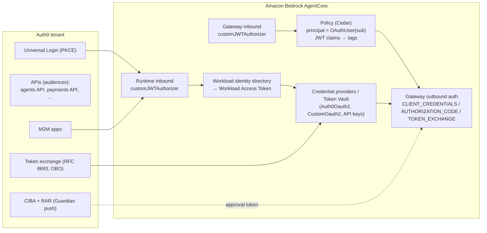
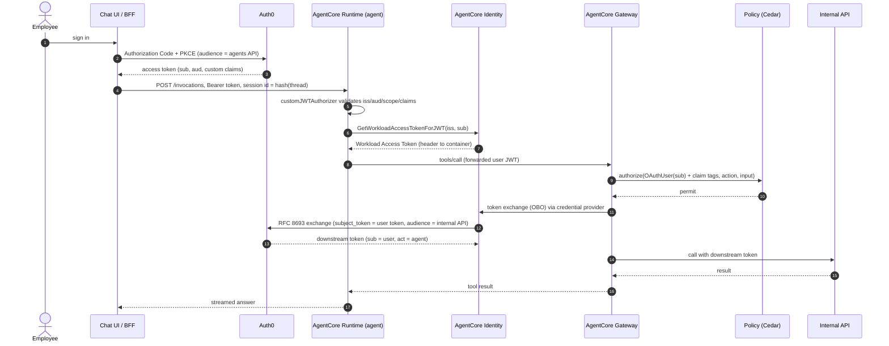
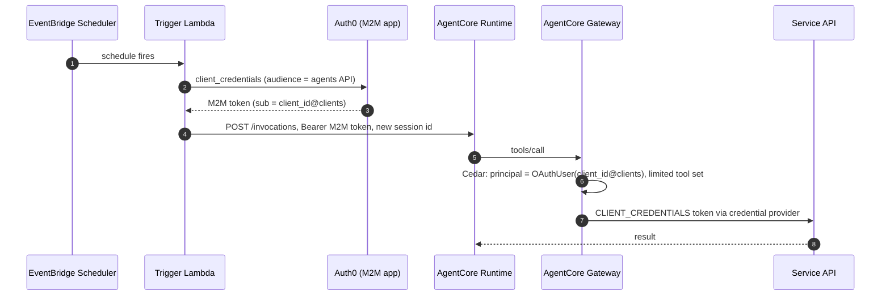
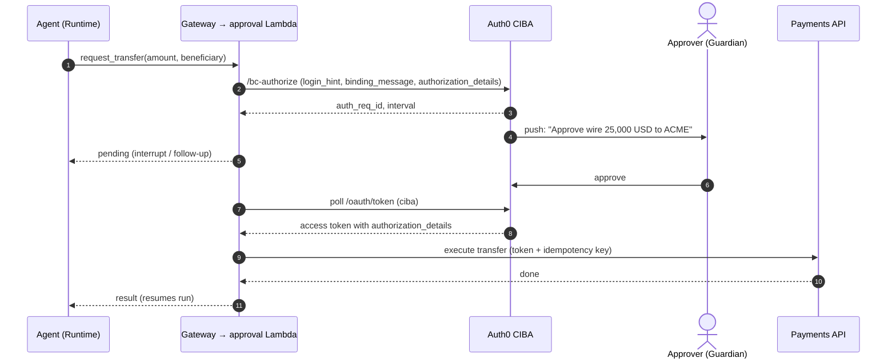

# Agent Identity with Auth0 and Amazon Bedrock AgentCore Identity

This is a companion to [`AGENTIC_FRAMEWORK_SCOPING.md`](AGENTIC_FRAMEWORK_SCOPING.md), [`AGENT_PI_BEDROCK.md`](AGENT_PI_BEDROCK.md) and [`AGENTS_OPENCODE_BEDROCK.md`](AGENTS_OPENCODE_BEDROCK.md).

**Scope:** how to use **Auth0** as the identity provider for agents on the **current AgentCore**:
- Runtime and Gateway inbound JWT authorizers;
- workload identity;
- credential providers (the Token Vault);
- Policy (Cedar);
- the `@aws/agentcore` CLI 0.30.0 and `bedrock-agentcore` Python SDK 1.23.1.

Legacy starter-toolkit setups are out of scope.

Every item was checked against the AgentCore devguide and API reference, the CLI and SDK source, `awslabs/agentcore-samples` @ `e1a55b3`, and Auth0 documentation, all on 2026-09-27. Items marked **[verify in PoC]** are unconfirmed end to end.

---

## 1. The identities involved

| Identity | Issued by | Used for |
|---|---|---|
| **Human user** (employee, or customer in future) | Auth0 (OIDC, PKCE login) | Calling agents; the Cedar principal for tool calls; subject of on-behalf-of (OBO) tokens |
| **Service caller** (scheduler, upstream system) | Auth0 M2M app (client credentials) | Autonomous or scheduled agent runs |
| **Agent workload** | AgentCore workload identity directory (auto-created per Runtime / Gateway) | Binding "this agent, acting for this user". Carried as a **Workload Access Token (WAT)** |
| **Downstream API credential** | Auth0 (M2M, OBO token exchange, CIBA) or a SaaS IdP, stored in the AgentCore **Token Vault** | Calling internal APIs, SaaS and payments from tools |
| **AWS execution role** | IAM | Bedrock model calls, AWS APIs, CloudWatch |



---

## 2. Inbound: Auth0 JWT → AgentCore Runtime and Gateway

**Configuration** (`customJWTAuthorizer`; the CLI key is `customJwtAuthorizer`):
- `discoveryUrl`: `https://<tenant-domain>/.well-known/openid-configuration`. The issuer in that document must equal the token's `iss`, and Auth0's issuer has a trailing `/`. If you use a custom domain, use the domain that actually issues the tokens.
- **At least one** of these must be set; if several are set, all are checked:
  - `allowedAudience` (checked against `aud`)
  - `allowedClients` (checked against the **`client_id`** claim)
  - `allowedScopes` (checked against `scope`)
  - `customClaims[]`, with operators `EQUALS`, `CONTAINS` and `CONTAINS_ANY`

> **Auth0 gotcha.** Auth0's *default* access-token profile puts the client in **`azp`**, not `client_id`, so `allowedClients` never matches. Pick one of:
> 1. **`allowedAudience`** set to the Auth0 API identifier, plus `allowedScopes` / `customClaims` (recommended; the AWS SRE-agent sample says "use `--allowed-audience` not `--allowed-clients`");
> 2. switch the API to the **RFC 9068** token profile;
> 3. a `customClaims` rule on `azp`, or a post-login Action that sets `client_id`.

**CLI (current AgentCore):**

```bash
agentcore add agent --name ops_agent ... \
  --authorizer-type CUSTOM_JWT \
  --discovery-url https://fintech.eu.auth0.com/.well-known/openid-configuration \
  --allowed-audience https://agents.fintech.example \
  --allowed-scopes invoke:ops_agent \
  --custom-claims '[{"inboundTokenClaimName":"https://fintech.example/org","inboundTokenClaimValueType":"STRING","authorizingClaimMatchValue":{"claimMatchOperator":"EQUALS","claimMatchValue":{"matchValueString":"fintech"}}}]' \
  --request-header-allowlist Authorization

agentcore add gateway --name tools_gw --authorizer-type CUSTOM_JWT \
  --discovery-url https://fintech.eu.auth0.com/.well-known/openid-configuration \
  --allowed-audience https://agents.fintech.example
```

**How the identity reaches the agent code:**
- A runtime accepts **either SigV4 or JWT** inbound, not both. Use separate runtimes or versions if you need both.
- JWT callers use HTTPS directly: `POST https://bedrock-agentcore.<region>.amazonaws.com/runtimes/<url-encoded-ARN>/invocations?qualifier=DEFAULT` with `Authorization: Bearer <Auth0 token>` and `X-Amzn-Bedrock-AgentCore-Runtime-Session-Id`. boto3 cannot send bearer tokens.
- Runtime validates the JWT, exchanges `iss` + `sub` for a **Workload Access Token**, and passes it to the container in the `WorkloadAccessToken` header. The Python SDK also reads `X-Amz-Bedrock-AgentCore-Identity-WAT`.
- The raw user JWT reaches the container **only** if `Authorization` is in `requestHeaderAllowlist` (at most 20 headers; `x-amz-*` is blocked). Runtime has already validated it.
- Custom containers (pi, opencode) read these headers themselves on `/invocations`.
- **Don't use `X-Amzn-Bedrock-AgentCore-Runtime-User-Id` in production.** It exists only on the SigV4 path and AWS says its value is not verified.

### 2.1 User profile in the access token: user id, email and names

Every human user has an Auth0 identity (`sub`), a **required** email address, and **optional** first and last names. They may also have an org **user id**. The templates keep two identifiers apart:

| Identifier | Source | Used for |
|---|---|---|
| `PrincipalId` = Auth0 `sub` | always in the token | authorization: thread ownership, four-eyes approvals, Cedar `OAuthUser` |
| `UserId` (e.g. `usr_…`) | `<ns>user_id` claim if present; else remembered per `sub`; else minted once | business records (ticket requester). It stays the same when the user changes email or name. |

Access tokens don't carry `email` or name claims by default. A post-login Action adds them as **namespaced** custom claims. It can also mint the user id once and keep it in `app_metadata`:

```javascript
// Auth0 post-login Action: profile claims for agent APIs.
const NS = "https://fintech.example/";

exports.onExecutePostLogin = async (event, api) => {
  if (!event.user.email || !event.user.email_verified) {
    api.access.deny("a verified email address is required");
    return;
  }
  let userId = event.user.app_metadata?.user_id;
  if (!userId) {
    userId = `usr_${require("crypto").randomUUID().replaceAll("-", "")}`;
    api.user.setAppMetadata("user_id", userId); // minted once; survives email and name changes
  }
  api.accessToken.setCustomClaim(`${NS}user_id`, userId);
  api.accessToken.setCustomClaim(`${NS}email`, event.user.email);
  if (event.user.given_name) api.accessToken.setCustomClaim(`${NS}given_name`, event.user.given_name);
  if (event.user.family_name) api.accessToken.setCustomClaim(`${NS}family_name`, event.user.family_name);
};
```

How the templates handle this (`org_agents.identity` / `@org/agents`):
- **Parse the claims.** The claims are parsed into `HumanUser(user_id, subject, email, given_name?, family_name?)` or `ServiceClient(subject)`.
  - A `sub` ending in `@clients` or `gty = client-credentials` is a service client, with no profile.
  - A human token without an email claim is refused (`invalid_request`).
  - Standard `email` / `given_name` / `family_name` claims are fallbacks.
  - The namespace is set in `[identity].claim_namespace`.
- **Resolve the user id** in this order: the token claim, then the id remembered for the `sub` (the `UserDirectory`; SQLite locally, DynamoDB keyed by `sub` in production), then a newly minted id. The profile always comes from the latest token, so email and name changes show up at once.
- **Where PII is allowed:**
  - the ticket requester (`Name <email> (user id)`);
  - approval requests (`requester` in the `approval_required` reply);
  - the model context. Only the first name goes there, as `[Context: you are assisting <first name>.]` at the start of the first user message from each speaker. It is never in the system prompt, so the prompt cache stays shared across users.
- **Audit logs** record only `sub` and ids, never email or names.
- **Tool arguments:** the harness, not the model, sets `requester_id` / `requester_name` / `requester_email` on side-effecting tools. When the Action mints the id, a Gateway Cedar policy can also bind them to the token:
  ```cedar
  forbid(principal, action == AgentCore::Action::"Tickets___create_ticket", resource)
  unless { principal.hasTag("https://fintech.example/user_id") &&
           context.input.requester_id == principal.getTag("https://fintech.example/user_id") };
  ```

---

## 3. Outbound: credential providers (Token Vault)

**The Auth0 vendor.** AgentCore Identity has a built-in **`Auth0Oauth2`** vendor, alongside `CustomOauth2`, Okta, Entra, Cognito and others:

```json
{
  "name": "auth0-payments",
  "credentialProviderVendor": "Auth0Oauth2",
  "oauth2ProviderConfigInput": { "includedOauth2ProviderConfig": {
    "clientId": "…", "clientSecret": "…",
    "authorizationEndpoint": "https://fintech.eu.auth0.com/authorize",
    "tokenEndpoint": "https://fintech.eu.auth0.com/oauth/token",
    "issuer": "https://fintech.eu.auth0.com" } }
}
```

- The response contains a **provider-specific `callbackUrl`**. Register it under Allowed Callback URLs in Auth0; for 3LO it must be a Regular Web App.
- `includedOauth2ProviderConfig` has **no OBO configuration**. For token exchange, use `CustomOauth2` with `onBehalfOfTokenExchangeConfig`.
- The CLI's `agentcore add credential --type oauth` always builds a *custom* provider config. Use the API or CDK when you need the `Auth0Oauth2` shape.

**Flows** (`GetResourceOauth2Token.oauth2Flow`):

| Flow | When | Auth0 side |
|---|---|---|
| `M2M` (client credentials) | Autonomous agents; service APIs | M2M app authorized for the API. Pass `audience` in `custom_parameters` [verify in PoC how `audiences` maps] |
| `USER_FEDERATION` (3LO, authorization code) | The user must consent to a third-party or SaaS API | Regular Web App. The app's callback must call `CompleteResourceTokenAuth` (session binding) |
| `ON_BEHALF_OF_TOKEN_EXCHANGE` (RFC 8693) | **The agent calls internal APIs as the user**, with narrower scopes | Auth0 native OBO: enable `on_behalf_of_token_exchange` on the API; `subject_token_type=urn:ietf:params:oauth:token-type:access_token`; delegation depth ≤ 4; ~30 RPS without the AI Agents add-on |

**Python (Strands tools):**

```python
from bedrock_agentcore.identity.auth import requires_access_token

@requires_access_token(provider_name="auth0-payments", auth_flow="ON_BEHALF_OF_TOKEN_EXCHANGE",
                       scopes=["payments:read"], custom_parameters={"audience": "https://payments.fintech.example",
                       "subject_token_type": "urn:ietf:params:oauth:token-type:access_token"}, into="access_token")
async def list_payments(*, access_token: str, account_id: str): ...
```

**Gateway targets** do this outbound step for you, and **this is the preferred place**: agents never hold downstream tokens.
- Configure `credentialProviderConfigurations` → `OAUTH` with `grantType` `CLIENT_CREDENTIALS`, `AUTHORIZATION_CODE` or `TOKEN_EXCHANGE`.
- Other options: `API_KEY`, `GATEWAY_IAM_ROLE`, `CALLER_IAM_CREDENTIALS`, and `JWT_PASSTHROUGH` (HTTP/Runtime targets only; not for production).
- CLI 0.30.0 has no `grantType` on targets. Use the API or CDK for `AUTHORIZATION_CODE` / `TOKEN_EXCHANGE`.

> **Status of Auth0 OBO with AgentCore: [verify in PoC].** The AWS `auth0-multi-agent-obo` sample got "Invalid subject_token_type" from a tenant without the OBO feature and built its own exchange service. Confirm that the feature is enabled on our tenant before relying on `TOKEN_EXCHANGE`.

---

## 4. Authorization: Cedar policies on Auth0 claims

AgentCore Gateway builds the authorization request like this:
- `principal = AgentCore::OAuthUser::"<sub>"`;
- `action = AgentCore::Action::"<Target>___<tool>"`;
- `context.input` = the tool arguments;
- **every JWT claim becomes a tag on the principal.**

```cedar
// Treasury users may transfer below 10k; nobody else may call transfer at all.
permit(principal, action == AgentCore::Action::"Payments___transfer", resource)
when {
  principal.hasTag("https://fintech.example/role") &&
  principal.getTag("https://fintech.example/role") == "treasury" &&
  context.input.amount < 10000
};
```

- Start in `LOG_ONLY` mode, then move to `ENFORCE`:
  ```bash
  agentcore add policy-engine --attach-to-gateways tools_gw --attach-mode ENFORCE
  agentcore add policy --engine main --source policies/payments.cedar
  ```
- **[verify in PoC]** how array claims (Auth0 `permissions`, roles) serialize into tags. Add namespaced string claims with a post-login Action to keep policies simple.

---

## 5. End-to-end flows

### 5.1 Employee chat UI → agent → internal API as the user (OBO)



### 5.2 Autonomous or scheduled agent (no human present)



For autonomous agents:
- Give each agent its **own** Auth0 M2M app. It becomes the Cedar principal and the audit identity.
- Scope it to the minimum set of tools.
- **Irreversible actions always require human approval**, as in §5.3.

### 5.3 High-risk action with human approval (Auth0 CIBA)

AgentCore has **no native CIBA**. Implement the approval as a Gateway tool (a Lambda target) or an agent tool:
1. Call Auth0 `POST /bc-authorize` with:
   - `login_hint` = the approver (`{"format":"iss_sub",…}`);
   - `binding_message` (≤ 64 characters, e.g. "Approve wire 25,000 USD to ACME");
   - `requested_expiry`;
   - **RAR** `authorization_details` (e.g. `payment_initiation`).
2. The approver receives a Guardian push.
3. The tool polls `/oauth/token` (`grant_type=urn:openid:params:grant-type:ciba`, `interval` ~5 s), or returns an **interrupt** and resumes later (Strands `interrupt()` / pi `followUp` / opencode `ask`).
4. The resulting token (audience = payments API, containing `authorization_details`) is what the payments API accepts. **The API verifies the approved details**, so the agent cannot alter the amount after approval.
5. A Cedar policy **forbids** direct `transfer` above the threshold unless it comes through the approval tool.



This needs **Auth0 Enterprise or the CIBA add-on**. Email approval is a paid add-on; Guardian push is recommended. AWS has not published this long-poll-with-CIBA pattern **[verify in PoC]**.

---

## 6. Auth0 and framework notes

- **Auth0 for AI Agents** covers Token Vault (Connected Accounts), Async Authorization (CIBA + RAR), FGA for RAG and tools, and "agent as principal".
- The `auth0-ai` SDKs exist for Python core, LangChain, LlamaIndex and the Microsoft Agent Framework. **There is no Strands package.** Wrap Strands `@tool`s with the core `auth0_ai` authorizers, or, preferably, keep authorization in AgentCore Gateway + Policy and do only CIBA in an approval tool.
- Auth0's blog walkthrough of AgentCore + Strands + CIBA (2026-02-10) uses the *legacy* starter toolkit. Treat its concepts as valid and its tooling as outdated.
- AWS samples to reuse:
  - `01-features/05-authenticate-and-authorize/auth0-multi-agent-obo/`: financial multi-agent system in Strands; Auth0 post-login Action; scoped sub-agents.
  - `02-use-cases/02-workflow-automation-agents/it-incident-response-agent/`: Gateway with Auth0 M2M.

## 7. Decisions and PoC checks

1. Auth0 is the IdP for all agent invocations. Runtimes use **JWT inbound**; SigV4 is reserved for internal AWS-to-AWS triggers that don't need a user.
2. Validate on **`aud` + scope + custom claims** (not `allowedClients`), or move the Auth0 API to RFC 9068.
3. Tools live behind **Gateway**. Cedar uses Auth0 claims. Downstream tokens are minted by Gateway credential providers and never exposed to the agent.
4. Irreversible or high-value actions go through **CIBA + RAR** approvals.
5. PoC checks:
   - Auth0 OBO enabled and working through `TOKEN_EXCHANGE`;
   - array-claim serialization into Cedar tags;
   - the CIBA long-poll / resume pattern;
   - `audience` handling in M2M flows;
   - IAM for custom containers calling `GetResourceOauth2Token`.

## 8. Sources

- AgentCore devguide: https://docs.aws.amazon.com/bedrock-agentcore/latest/devguide/ — pages `identity-idp-auth0.html`, `inbound-jwt-authorizer.html`, `runtime-oauth.html`, `runtime-header-allowlist.html`, `get-workload-access-token.html`, `on-behalf-of-token-exchange.html`, `gateway-outbound-auth.html`, `policy-authorization-flow.html`, `policy-conditions.html`
- API reference: https://docs.aws.amazon.com/bedrock-agentcore-control/latest/APIReference/API_CreateOauth2CredentialProvider.html
- AgentCore CLI 0.30.0: https://github.com/aws/agentcore-cli (`src/schema/schemas/auth.ts`, `docs/commands.md`)
- Auth0:
  - access token profiles: https://auth0.com/docs/secure/tokens/access-tokens/access-token-profiles
  - CIBA: https://auth0.com/docs/get-started/authentication-and-authorization-flow/client-initiated-backchannel-authentication-flow
  - Auth0 for AI Agents: https://auth0.com/ai/docs
  - Securing AgentCore agents with Auth0: https://auth0.com/blog/securing-amazon-bedrock-agentcore-agents-auth0-for-ai-agents/
