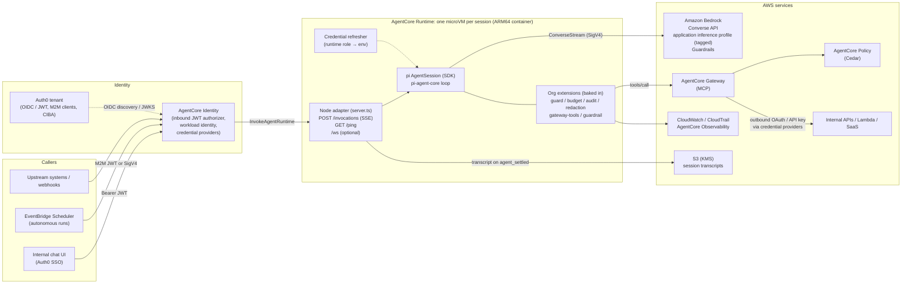
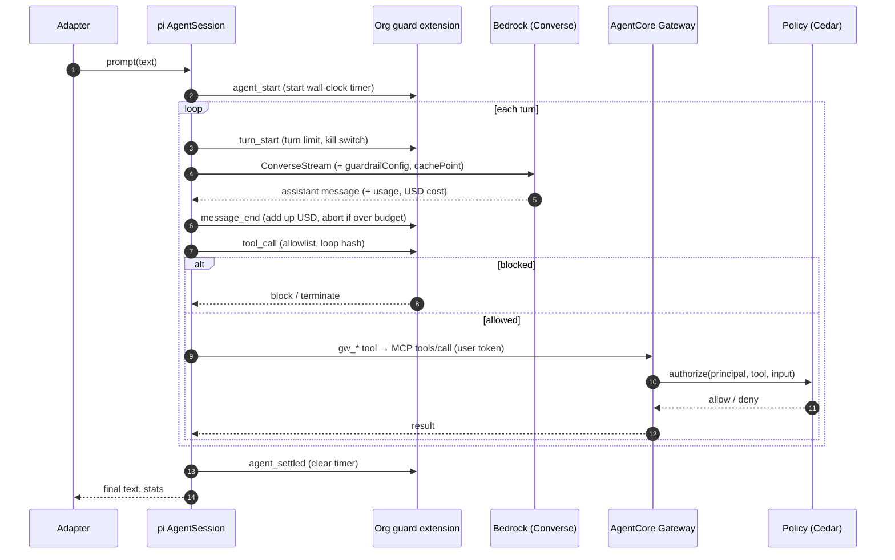
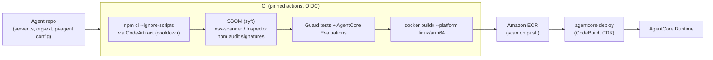

# Running pi Agents Autonomously on Amazon Bedrock and AgentCore

**Scope:** how to configure [pi](https://github.com/earendil-works/pi) and pi extensions so that agents run **headless and autonomously** on **Amazon Bedrock**, hosted on the **current Amazon Bedrock AgentCore**:
- AgentCore Runtime (one microVM per session), deployed with the `@aws/agentcore` CLI;
- Gateway + Policy for tools;
- Identity with Auth0 as the identity provider;
- Observability.

This guide does **not** use the legacy Starter Toolkit or Bedrock Agents Classic.

**Status:** design guide for the PoC (`AGENTIC_FRAMEWORK_SCOPING.md` §11). pi is **not** the org standard; that is Strands. This guide applies when a team justifies a pi-based agent, for example an autonomous internal engineering or ops agent, and it defines the minimum controls for doing so.

**Versions verified (2026-09-27):**
- `@earendil-works/pi-coding-agent` 0.87.1 (repo `earendil-works/pi` @ `2b0a123`)
- `@aws/agentcore` CLI 0.30.0
- AWS samples `awslabs/agentcore-samples` @ `e1a55b3`

Items marked **[verify in PoC]** are designs built on verified APIs that have not been run end to end.

---

## 1. Why pi, and what it lacks

pi is the most *hackable* harness reviewed:
- a clean loop (`pi-agent-core`);
- a unified model API (`pi-ai`) with native Bedrock support;
- first-class headless interfaces: print, JSON, RPC and an in-process SDK;
- **steering and follow-up queues** for messages that arrive mid-run;
- a rich extension API that can block tool calls, rewrite provider requests and abort runs.

By design it has **no permission model** ("Pi does not ask before every tool call"), no turn limit, no budgets, no guardrails integration and no MCP client. We add these in three places:

| Gap in pi | Where we close it |
|---|---|
| Isolation | **AgentCore Runtime** microVM per session; no host mounts; VPC networking |
| Tool authorization | pi tool allowlist (`tools`) + **org guard extension** (`tool_call` block) + **AgentCore Gateway + Policy (Cedar)** for every business tool |
| Turn / token / USD / time limits, loop detection | **org guard extension** + AgentCore lifecycle limits |
| Identity | **AgentCore Identity** (Auth0 JWT inbound; OAuth / API-key credential providers outbound) |
| Guardrails | Extension adds `guardrailConfig` (fails open) **plus** an IAM-level requirement [verify in PoC] |
| Audit / observability | Extension audit events → CloudWatch; AgentCore Observability |
| Supply chain | Pinned, pre-baked image; `PI_OFFLINE=1`; no runtime `pi install` |

---

## 2. Target architecture



**Principles:**
1. **pi talks to only two things:** Bedrock (models) and AgentCore Gateway (tools).
   - pi's built-in `bash` / `write` / `edit` tools are **disabled** for non-coding agents.
   - For coding agents they are allowed only inside the microVM workspace.
2. **Nothing is installed at runtime.**
   - The image contains pi, extensions, skills and prompt templates, all pinned.
   - `PI_OFFLINE=1` stops package auto-install, version checks and model-catalog refresh.
3. **Every limit exists twice:** in the org guard extension (fine-grained, per run) and in AgentCore lifecycle settings (coarse, per session).

---

## 3. Bedrock configuration in pi

### 3.1 Credentials inside AgentCore Runtime

pi's Bedrock provider (`packages/ai/src/providers/amazon-bedrock.ts`) treats Bedrock as authenticated only when it finds one of these:
- a stored key;
- `AWS_BEARER_TOKEN_BEDROCK`;
- `AWS_PROFILE`;
- `AWS_ACCESS_KEY_ID` + `AWS_SECRET_ACCESS_KEY`;
- ECS container-credential variables;
- `AWS_WEB_IDENTITY_TOKEN_FILE`.

It does **not** detect instance-metadata credentials, and **that is how AgentCore Runtime vends the execution role's credentials**:
- AWS's samples fetch them from the metadata service;
- one AWS sample documents a private endpoint via `AWS_EC2_METADATA_SERVICE_ENDPOINT`;
- the same sample warns that a long-lived container *lost* its credentials after about 70 minutes until the session was restarted (`agentcore-samples/02-use-cases/02-workflow-automation-agents/gpu-music-production-agent/README.md`).

**Recommended: refresh the credentials in the adapter** (pi reads the environment on every request, `bedrock-converse-stream.ts:1186-1197`):

```ts
// server.ts (excerpt): keep pi's env credentials fresh from the runtime role [verify in PoC]
import { fromInstanceMetadata } from "@aws-sdk/credential-providers"; // AWS SDK v3, already in the dependency tree via pi-ai
const provider = fromInstanceMetadata({ maxRetries: 3, timeout: 1000 }); // honours AWS_EC2_METADATA_SERVICE_ENDPOINT
async function refreshCreds() {
  const c = await provider();
  process.env.AWS_ACCESS_KEY_ID = c.accessKeyId;
  process.env.AWS_SECRET_ACCESS_KEY = c.secretAccessKey;
  process.env.AWS_SESSION_TOKEN = c.sessionToken ?? "";
  const ttl = c.expiration ? c.expiration.getTime() - Date.now() : 15 * 60_000;
  setTimeout(refreshCreds, Math.max(60_000, ttl - 5 * 60_000)); // refresh 5 min before expiry
}
await refreshCreds();
```

Check it with `pi auth check --provider amazon-bedrock --json`, which exits 0 when ready, 1 when not ready and 2 when invalid.

**Anti-patterns:**
- Don't copy AWS's coding-agent samples' one-time `curl` of IMDS into the environment. The credentials expire.
- **Never** put an `apiKey` for Bedrock in `models.json`. It switches pi to bearer-token mode and **disables SigV4**.

### 3.2 Region, endpoint, proxy

- **Region** is resolved in this order:
  1. the region in the ARN model ID;
  2. the `region` option;
  3. `AWS_REGION`;
  4. `AWS_DEFAULT_REGION`;
  5. the `baseUrl` host;
  6. `us-east-1`.

  **Set `AWS_REGION` explicitly** in the runtime `envVars`.
- **VPC interface endpoint:** set a non-standard `baseUrl` on the provider in `models.json`. pi always uses a non-standard host as the explicit endpoint.
- **Egress proxy:** `HTTPS_PROXY` / `NO_PROXY` are honoured by the Bedrock client.

### 3.3 Models: application inference profiles with cost

Use one **tagged application inference profile per agent** so that AWS Budgets and Cost Explorer attribute spend. Register it in `~/.pi/agent/models.json`, baked into the image:

```json
{
  "providers": {
    "amazon-bedrock": {
      "models": [
        {
          "id": "arn:aws:bedrock:eu-west-1:123456789012:application-inference-profile/abc123",
          "name": "claude-sonnet-4-6 (ops-agent-prod)",
          "reasoning": true,
          "input": ["text", "image"],
          "contextWindow": 200000,
          "maxTokens": 64000,
          "cost": { "input": 3, "output": 15, "cacheRead": 0.3, "cacheWrite": 3.75 }
        }
      ]
    }
  }
}
```

- **`cost` is mandatory for us.** A custom model defaults to cost 0, which would make every USD budget read $0. The values above are **illustrative**; take them from the Bedrock pricing page.
- **Keep the model family in `name`** (for example `claude-sonnet-4-6`). pi decides whether to add Bedrock `cachePoint` blocks by matching the model id or name. ARNs don't match, so the name has to. `AWS_BEDROCK_FORCE_CACHE=1` is the undocumented override.
- **Prompt caching:**
  - pi adds `cachePoint` to the system prompt and the last user message.
  - `PI_CACHE_RETENTION=long` switches to a 1-hour TTL. Use it where human approvals pause runs for more than 5 minutes.
  - Keep `cacheWarming: "off"` unless the PoC shows it pays off.

### 3.4 Guardrails

pi sends no `guardrailConfig`. Add it with the `before_provider_request` hook, whose payload is exactly the `ConverseStreamCommand` input:

```ts
// extensions/guardrail.ts
import type { ExtensionAPI } from "@earendil-works/pi-coding-agent";
export default function (pi: ExtensionAPI) {
  pi.on("before_provider_request", (e) => ({
    ...(e.payload as object),
    guardrailConfig: { guardrailIdentifier: process.env.GUARDRAIL_ID!, guardrailVersion: process.env.GUARDRAIL_VERSION!, trace: "enabled" },
  }));
}
```

**Caveats:**
- **This fails open:** if the handler throws, pi logs it and sends the request without the guardrail (`runner.ts:1268-1276`). Treat it as defence in depth.
- Enforce guardrails at the IAM layer as well: a runtime-role policy that requires the guardrail on Bedrock invocations **[verify in PoC which Bedrock IAM condition keys apply to Converse]**.
- An intervention surfaces as `stopReason: "error"` ("guardrail_intervened"). The adapter must report it as a policy stop, not a crash.

---

## 4. Headless operation: choosing an interface

| Interface | How | Use it for | Notes |
|---|---|---|---|
| **SDK (recommended)** | `createAgentSession()` from `@earendil-works/pi-coding-agent` inside our Node adapter | AgentCore Runtime | In-process; full event stream; `prompt` / `steer` / `followUp` / `abort` / `getSessionStats` |
| RPC subprocess | `pi --mode rpc --no-session` + `RpcClient` | when you want process isolation between the adapter and pi | Commands: `prompt` (with `streamingBehavior: "steer" \| "followUp"`), `steer`, `follow_up`, `abort`, `get_state`, `get_session_stats`, `compact`. Wait for `agent_settled` |
| JSON one-shot | `pi --mode json -p --no-session "…"` | batch jobs, CI | **Exits 0 even when the run failed or was aborted.** Check `stopReason` in the events |
| Print one-shot | `pi -p "…"` | simple scripts | Exits 1 when the final `stopReason` is `error` or `aborted` |

**Useful flags:**
- `--tools read,grep,find,ls` (allowlist) or `--no-builtin-tools`
- `--no-extensions` together with explicit `-e <path>` (loads *only* our extensions)
- `-nc` (ignore `AGENTS.md` / `CLAUDE.md` context files from the workspace)
- `--system-prompt` / `--append-system-prompt`
- `--offline`
- `--session-dir`

### 4.1 Adapter sketch (AgentCore HTTP contract)

The **AgentCore Runtime HTTP contract** (verified from the docs):
- ARM64 container, listening on `0.0.0.0:8080`;
- `POST /invocations` returns JSON or SSE;
- `GET /ping` returns `{"status":"Healthy"}` when idle and `{"status":"HealthyBusy"}` while working. `HealthyBusy` keeps the session alive past the idle timeout;
- `/ws` is optional;
- the session id arrives in `X-Amzn-Bedrock-AgentCore-Runtime-Session-Id`.

```ts
// server.ts (sketch) [verify in PoC]
import http from "node:http";
import { createAgentSession, DefaultResourceLoader, SessionManager, SettingsManager } from "@earendil-works/pi-coding-agent";

const sessions = new Map<string, { s: any; busy: boolean }>();

async function getSession(id: string) {
  if (sessions.has(id)) return sessions.get(id)!;
  const cwd = "/workspace";
  const loader = new DefaultResourceLoader({
    cwd, agentDir: "/opt/pi-agent", noContextFiles: true, noExtensions: true,
    additionalExtensionPaths: ["/opt/org-ext/guard.ts", "/opt/org-ext/guardrail.ts", "/opt/org-ext/gateway-tools.ts", "/opt/org-ext/audit.ts"],
    appendSystemPrompt: "/opt/prompts/agent.md",
  });
  await loader.reload();
  const { session } = await createAgentSession({
    cwd, agentDir: "/opt/pi-agent",
    tools: ["read", "grep", "find", "ls"],            // no bash/write/edit for non-coding agents
    resourceLoader: loader,
    sessionManager: SessionManager.inMemory(cwd),     // transcript exported to S3 on settle
    settingsManager: SettingsManager.inMemory({ compaction: { enabled: true }, retry: { enabled: true, maxRetries: 3 } }),
  });
  const entry = { s: session, busy: false };
  sessions.set(id, entry);
  return entry;
}

http.createServer(async (req, res) => {
  if (req.method === "GET" && req.url === "/ping") {
    const busy = [...sessions.values()].some((e) => e.busy);
    res.writeHead(200, { "content-type": "application/json" }).end(JSON.stringify({ status: busy ? "HealthyBusy" : "Healthy" }));
    return;
  }
  if (req.method === "POST" && req.url === "/invocations") {
    const id = String(req.headers["x-amzn-bedrock-agentcore-runtime-session-id"] ?? "default");
    const body = JSON.parse(await readBody(req));
    const e = await getSession(id);
    if (e.busy) {                                      // mid-run message policy (see §6)
      await e.s.steer(body.prompt);
      res.writeHead(202).end(JSON.stringify({ disposition: "steered" }));
      return;
    }
    res.writeHead(200, { "content-type": "text/event-stream" });
    const unsub = e.s.subscribe((ev: any) => res.write(`data: ${JSON.stringify(project(ev))}\n\n`));
    e.busy = true;
    try { await e.s.prompt(body.prompt); }
    finally {
      e.busy = false; unsub();
      res.write(`data: ${JSON.stringify({ type: "done", stats: e.s.getSessionStats() })}\n\n`); res.end();
    }
    return;
  }
  res.writeHead(404).end();
}).listen(8080, "0.0.0.0");
```

`readBody` and `project` are ordinary helpers. `project` maps pi events to a stable, redacted client schema: text deltas, tool start/end, stop reason and usage.

---

## 5. The org guard extension (mandatory)

The extension implements the controls pi lacks, using verified extension APIs:
- `pi.on(event, (event, ctx) => …)`;
- `tool_call` can return `{ block, reason, terminate }`. **A throwing `tool_call` handler blocks the tool (fails safe).**
- `ctx.abort()` stops the run;
- `message_end.message.usage.cost.total` is in USD;
- `turn_start` / `agent_start` / `agent_settled` mark the run lifecycle.

```ts
// /opt/org-ext/guard.ts (sketch) [verify in PoC]
import type { ExtensionAPI } from "@earendil-works/pi-coding-agent";
import { createHash } from "node:crypto";

const LIMITS = {
  turns: Number(process.env.AGENT_MAX_TURNS ?? 25),
  usd: Number(process.env.AGENT_MAX_USD ?? 2.0),
  wallMs: Number(process.env.AGENT_MAX_WALL_MS ?? 15 * 60_000),
  repeat: 3,
};
const ALLOWED_TOOLS = new Set((process.env.AGENT_TOOLS ?? "read,grep,find,ls,gw_*").split(","));

export default function (pi: ExtensionAPI) {
  let turns = 0, usd = 0, timer: NodeJS.Timeout | undefined;
  const seen = new Map<string, number>();
  const audit = (type: string, data: object) => console.log(JSON.stringify({ audit: true, type, ts: Date.now(), ...data }));

  pi.on("agent_start", (_e, ctx) => {
    turns = 0; usd = 0; seen.clear();
    timer = setTimeout(() => { audit("limit", { kind: "wall_clock" }); ctx.abort(); }, LIMITS.wallMs);
  });
  pi.on("agent_settled", () => { if (timer) clearTimeout(timer); });

  pi.on("turn_start", (_e, ctx) => {
    if (++turns > LIMITS.turns) { audit("limit", { kind: "turns", turns }); ctx.abort(); }
    if (process.env.KILL_SWITCH === "1") { audit("kill_switch", {}); ctx.abort(); }
  });

  pi.on("message_end", (e: any, ctx) => {
    const cost = e.message?.usage?.cost?.total ?? 0;
    usd += cost;
    audit("usage", { usage: e.message?.usage, runUsd: usd });
    if (usd > LIMITS.usd) { audit("limit", { kind: "usd", usd }); ctx.abort(); }
  });

  pi.on("tool_call", async (e: any) => {
    const allowed = [...ALLOWED_TOOLS].some((p) => (p.endsWith("*") ? e.toolName.startsWith(p.slice(0, -1)) : p === e.toolName));
    if (!allowed) return { block: true, reason: `tool ${e.toolName} not allowed` };
    const key = createHash("sha256").update(e.toolName + JSON.stringify(e.input)).digest("hex");
    const n = (seen.get(key) ?? 0) + 1; seen.set(key, n);
    if (n >= LIMITS.repeat) { audit("loop_detected", { tool: e.toolName }); return { block: true, reason: "repeated identical tool call", terminate: true }; }
    audit("tool_call", { tool: e.toolName });
    return undefined;
  });
}
```

**Other extensions:**
- **`redaction.ts`:** rewrite tool results in `tool_result` before they are persisted. pi's JSONL stores raw tool output otherwise. Scrub outbound context in `context` / `before_provider_request`.
- **`gateway-tools.ts`:**
  - pi has no MCP client, so register one pi tool per approved AgentCore Gateway tool (`pi.registerTool({ name: "gw_<tool>", parameters: Type.Object(...), execute })`).
  - Each `execute` calls the Gateway's MCP endpoint (`tools/call`, JSON-RPC over HTTPS) with the caller's token obtained through AgentCore Identity (§7).
  - Keep the tool list **fixed per session** to protect the prompt cache.
  - Policy (Cedar) decides on every call.



---

## 6. Messages arriving mid-run and chat threads

pi natively supports **`steer`** (delivered after the current tool batch, before the next model call) and **`followUp`** (delivered when the agent would otherwise stop). Map them onto thread semantics:

| Situation | Adapter action |
|---|---|
| New message, session idle | `prompt()` |
| New message, session busy | `steer()` (default), or `followUp()` for "after you're done" UX |
| "stop" / cancel button | `abort()`; record an "aborted" marker in the transcript; report partial side effects |
| Duplicate delivery (webhook retry) | Deduplicate by message id before calling pi |
| Approval response for a pending action | Deliver to the approval flow (§7.3), not to `steer()` |

AgentCore maps a thread to a runtime session through `runtimeSessionId` (33 or more characters; use a hash of the thread id). One microVM serves one thread, which gives one active run per thread naturally.

---

## 7. Identity with Auth0 and AgentCore Identity

The shared design (Auth0 as the IdP; AgentCore Runtime and Gateway JWT authorizers; Token Vault; Cedar on Auth0 claims; CIBA approvals) is in [`AGENT_IDENTITY_AUTH0.md`](AGENT_IDENTITY_AUTH0.md). This section covers what is **specific to a pi container**.

### 7.1 Inbound

- **Runtime:** configure `--authorizer-type CUSTOM_JWT` with the Auth0 discovery URL.
  - Validate on **`allowedAudience`** (Auth0's default tokens carry `azp`, not `client_id`) plus `allowedScopes` / `customClaims`.
  - Set `requestHeaderAllowlist: ["Authorization"]`.
- **The adapter (`server.ts`) reads, per request:**
  - `Authorization`: the validated Auth0 user or M2M token (user `sub` and claims, for audit and Gateway forwarding);
  - `WorkloadAccessToken`: the agent-for-user token, for AgentCore Identity calls;
  - `X-Amzn-Bedrock-AgentCore-Runtime-Session-Id`.
- **Store identity per session.** Put the caller's `sub` and token in the per-session map, and pass them to extensions through a module-level context the extensions read. pi's `ctx` has no request identity.
- **Refuse to steer** a busy session with a message from a *different* `sub`: queue it or reject it.

### 7.2 Tools with the user's identity

- `gateway-tools.ts` calls AgentCore Gateway (`CUSTOM_JWT`, same Auth0 tenant) and **forwards the caller's JWT**.
- Gateway then:
  - evaluates Cedar with `principal = OAuthUser(<sub>)` and Auth0 claims as tags;
  - mints downstream tokens with credential providers (`TOKEN_EXCHANGE` for OBO, `CLIENT_CREDENTIALS` for service APIs).
- **The pi process never holds downstream API tokens.**
- If a tool must call an API directly, fetch the token with `GetResourceOauth2Token` (AWS SDK `@aws-sdk/client-bedrock-agentcore`) using the `WorkloadAccessToken`. **[verify in PoC]** the IAM needed for a custom container.

### 7.3 Autonomous runs and approvals

- **Scheduled runs:** a trigger Lambda obtains an Auth0 **M2M** token for this agent's own M2M app and invokes the runtime. The Cedar principal is `<client_id>@clients` with a minimal tool set.
- **High-risk tools:** use the **Auth0 CIBA** approval tool behind Gateway (`AGENT_IDENTITY_AUTH0.md` §5.3). While approval is pending, the pi run ends its turn with a "pending approval" result.
- **The approval response** is delivered back into the same session with `followUp()`, not `steer()`, so it is processed as a new, auditable turn.

---

## 8. Build, supply chain and deployment

### 8.1 Image

```dockerfile
# Dockerfile (sketch). ARM64 is required by AgentCore Runtime.
FROM --platform=linux/arm64 public.ecr.aws/docker/library/node:22-slim
RUN apt-get update && apt-get install -y --no-install-recommends ca-certificates git ripgrep && rm -rf /var/lib/apt/lists/*
WORKDIR /opt/app
# package.json pins @earendil-works/pi-coding-agent@0.87.1 (ships npm-shrinkwrap.json); lockfile committed
COPY package.json package-lock.json .npmrc ./
RUN npm ci --ignore-scripts --omit=dev          # .npmrc → CodeArtifact mirror with cooldown
COPY server.ts ./ 
COPY org-ext/ /opt/org-ext/
COPY pi-agent/ /opt/pi-agent/                   # settings.json, models.json, prompts, skills (pinned)
ENV PI_CODING_AGENT_DIR=/opt/pi-agent PI_OFFLINE=1 PI_SKIP_VERSION_CHECK=1 PI_TELEMETRY=0 \
    NODE_ENV=production
RUN useradd -u 1000 -m agent && mkdir /workspace && chown agent /workspace
USER agent
EXPOSE 8080
CMD ["npx", "tsx", "server.ts"]
```

**`/opt/pi-agent/settings.json`** (every key is from pi's `docs/settings.md`):

```json
{
  "defaultProvider": "amazon-bedrock",
  "defaultModel": "arn:aws:bedrock:eu-west-1:123456789012:application-inference-profile/abc123",
  "defaultThinkingLevel": "medium",
  "defaultTools": ["read", "grep", "find", "ls"],
  "defaultProjectTrust": "never",
  "enableInstallTelemetry": false,
  "cacheWarming": "off",
  "compaction": { "enabled": true, "reserveTokens": 16384, "keepRecentTokens": 20000 },
  "retry": { "enabled": true, "maxRetries": 3, "baseDelayMs": 2000, "maxAgentDelayMs": 60000 },
  "httpIdleTimeoutMs": 300000
}
```

**Supply-chain rules specific to pi:**
- **Never run `pi install` in the runtime.**
  - pi installs packages with `npm install` **without `--ignore-scripts`**.
  - pi **auto-installs configured-but-missing packages at startup** unless offline.
  - Bake packages into the image and set `PI_OFFLINE=1`.
- Extensions run **in-process with full rights** and can read credentials. Code-review them like application code, and pin skills and prompt templates.
- `pi-ai` always installs the OpenAI, Anthropic, Google GenAI and AWS SDKs (117 npm packages for `pi-ai` + `pi-agent-core`). Accept that, or vendor a trimmed build **[verify in PoC]**.
- Telemetry: install telemetry is interactive-only and disabled via `PI_TELEMETRY=0` / `enableInstallTelemetry: false`. `@earendil-works/pi-telemetry` is a contract library with no exporter.



### 8.2 Deploy with the current AgentCore CLI

```bash
npm install -g @aws/agentcore@0.30.0
agentcore create --name OpsAgents --build Container          # new project (agentcore/agentcore.json)
agentcore add agent --name pi_ops --type byo --build Container \
  --language TypeScript --code-location app/pi_ops --entrypoint server.ts \
  --network-mode VPC --subnets subnet-a,subnet-b --security-groups sg-123
agentcore dev        # local container loop
agentcore deploy     # remote build (CodeBuild) + deploy
```

The runtime entry in `agentcore/agentcore.json` (field names from the CLI's `docs/configuration.md`):

```json
{
  "name": "pi_ops",
  "build": "Container",
  "entrypoint": "server.ts",
  "codeLocation": "app/pi_ops/",
  "runtimeVersion": "NODE_22",
  "networkMode": "VPC",
  "protocol": "HTTP",
  "envVars": [
    { "name": "AWS_REGION", "value": "eu-west-1" },
    { "name": "AGENT_MAX_TURNS", "value": "25" },
    { "name": "AGENT_MAX_USD", "value": "2.00" },
    { "name": "PI_CACHE_RETENTION", "value": "short" }
  ],
  "requestHeaderAllowlist": ["Authorization"],
  "lifecycleConfiguration": { "idleRuntimeSessionTimeout": 900, "maxLifetime": 3600 }
}
```

Supporting pieces:
- **IAM execution role:** `bedrock:InvokeModelWithResponseStream` / `bedrock:InvokeModel` on the **specific application inference profile** only; Gateway invoke; CloudWatch Logs; S3 put on the transcript prefix. No wildcard `bedrock:*`.
- **Autonomous schedule:** EventBridge Scheduler → a small Lambda that obtains an Auth0 M2M token (or uses SigV4) and calls `InvokeAgentRuntime` with a fresh `runtimeSessionId`.
- **Stop early:** `StopRuntimeSession` from the kill-switch path.

---

## 9. Checklist

- [ ] ARM64 image; pi pinned; `npm ci --ignore-scripts` via CodeArtifact; SBOM + scans; no `pi install` at runtime; `PI_OFFLINE=1`
- [ ] Credentials refreshed from the runtime role; no Bedrock `apiKey` in `models.json`; `AWS_REGION` set
- [ ] Application inference profile per agent, **with `cost` set** in `models.json`; cost-allocation tags; Budgets alarms
- [ ] Built-in tools restricted (`tools`) and `-nc`; business tools only through Gateway + Policy
- [ ] Guard extension: turns, USD, wall clock, loop detection, allowlist, kill switch, audit
- [ ] Redaction in `tool_result`; transcripts to S3 (KMS) with retention
- [ ] Guardrail via `before_provider_request` **and** enforced at IAM [verify]
- [ ] Mid-run policy (steer / follow-up / abort) + deduplication by message id
- [ ] Auth0 inbound JWT; outbound via AgentCore Identity; human approval flow for high-risk tools
- [ ] Lifecycle: `idleRuntimeSessionTimeout`, `maxLifetime`; `/ping` HealthyBusy only while a run is active
- [ ] AgentCore Observability + audit log dashboards; Evaluations regression suite

## 10. Sources

- pi docs, all @ `2b0a123`, under `packages/coding-agent/docs/`: `cli.md`, `rpc.md`, `rpc-commands.md`, `sdk.md`, `extensions.md`, `settings.md`, `models.md`, `security.md`, `containerization.md`, `packages.md`, `environment-variables.md`.
- pi source files:
  - `packages/ai/src/providers/amazon-bedrock.ts`
  - `packages/ai/src/api/bedrock-converse-stream.ts`
  - `packages/coding-agent/src/core/extensions/types.ts`
  - `packages/coding-agent/src/core/sdk.ts`
  - `packages/coding-agent/examples/extensions/permission-gate.ts`
  - `packages/coding-agent/examples/extensions/subagent/`
- AgentCore docs:
  - Runtime service contract: https://docs.aws.amazon.com/bedrock-agentcore/latest/devguide/runtime-service-contract.html
  - HTTP protocol contract: https://docs.aws.amazon.com/bedrock-agentcore/latest/devguide/runtime-http-protocol-contract.html
  - Long-running agents / ping status: https://docs.aws.amazon.com/bedrock-agentcore/latest/devguide/runtime-long-run.html
  - Custom agent tutorial: https://docs.aws.amazon.com/bedrock-agentcore/latest/devguide/getting-started-custom.html
- AgentCore CLI: https://github.com/aws/agentcore-cli (`docs/commands.md`, `docs/container-builds.md`, `docs/configuration.md`).
- AWS coding-agents-on-AgentCore samples: `awslabs/agentcore-samples/01-features/02-host-your-agent/01-runtime/04-coding-agents/`.
