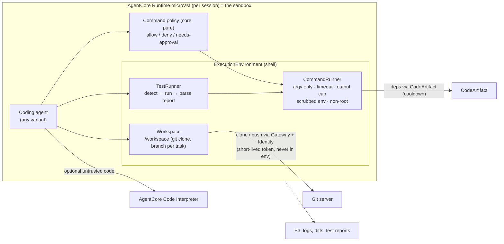

# Agent Templates

Generic, runnable, tested templates for building agents on **Amazon Bedrock** and the **current Amazon Bedrock AgentCore** (`@aws/agentcore` CLI). There is one template per framework or harness for each category of work, so teams can start from a known-good baseline.

Background and decisions: [`../AGENTIC_FRAMEWORK_SCOPING.md`](../AGENTIC_FRAMEWORK_SCOPING.md), [`../AGENTS_BUILDING_BLOCKS.md`](../AGENTS_BUILDING_BLOCKS.md), [`../AGENT_IDENTITY_AUTH0.md`](../AGENT_IDENTITY_AUTH0.md).
Coding rules: [`CODING_STANDARDS.md`](CODING_STANDARDS.md): strong domain types, parse-don't-validate, no typed serialization formats, functional core / imperative shell.

> **Status: pilot.** Built so far: `shared/` and **`generic-agents/`** in all 8 variants. The other categories follow the same layout once the pilot has been reviewed.

## Layout

```
templates/
├── CODING_STANDARDS.md
├── shared/
│   ├── python/org_agents/     # shared controls (Python): domain types, parsers, guard (limits, budget,
│   │                          # loop detection), message-while-busy policy, redaction, audit, idempotency,
│   │                          # AgentCore app helper
│   └── ts/org-agents/         # the same controls for the TypeScript harnesses (pi, opencode)
├── generic-agents/            # tool-using assistant (lookup, calculation, approval-gated ticket creation)
│   ├── tools/                 # category tools: domain, pure core, local backends, MCP server
│   ├── strands-sdk/           # Python: Strands Agents SDK (the org standard)
│   ├── strands-harness/       # Python: strands-harness (create_harness)
│   ├── pydantic-sdk/          # Python: Pydantic AI
│   ├── pydantic-harness/      # Python: thin org harness on Pydantic AI (tools, compaction, sessions, limits)
│   ├── langgraph-sdk/         # Python: LangGraph / LangChain v1 create_agent
│   ├── langgraph-harness/     # Python: LangChain deepagents
│   ├── pi-harness/            # TypeScript: pi SDK + org extension, AgentCore adapter
│   └── opencode-harness/      # TypeScript: opencode serve + org plugin, AgentCore adapter
├── coding-agents/             # planned: repo maintenance in a sandboxed execution environment (see below)
├── docs-agents/{qa,processing,authoring}/   # planned
└── workflow-agents/           # planned: Step Functions + DynamoDB durable workflows with agent steps
```

**Every variant contains:**
- `README.md`: what it is, how to run, test and deploy, and any exceptions to the standards;
- `pyproject.toml` + `uv.lock` (Python) or `package.json` + `package-lock.json` (TypeScript);
- `src/…`: `domain`, `core/` and `shell/`, following the standards;
- `prompts/`: the system prompt;
- `tests/`: offline tests against a **scripted fake model**, plus core unit tests;
- `Dockerfile` (ARM64) and `agentcore/agentcore.json`, for deployment to AgentCore Runtime.

## Variants

| Variant | Language | Framework role | Tools come from |
|---|---|---|---|
| `strands-sdk` | Python | Framework (org standard) | in-process adapters over `generic_tools` |
| `strands-harness` | Python | Harness (batteries included) | in-process adapters over `generic_tools` (built-in shell/file tools disabled) |
| `pydantic-sdk` | Python | Framework (approved alternative) | in-process adapters |
| `pydantic-harness` | Python | Org harness on Pydantic AI | in-process adapters |
| `langgraph-sdk` | Python | Framework (graph) | in-process adapters |
| `langgraph-harness` | Python | `deepagents` harness | in-process adapters |
| `pi-harness` | TypeScript | Harness (pi) | the category **MCP server**, locally or via AgentCore Gateway |
| `opencode-harness` | TypeScript | Harness (opencode) | the category **MCP server**, locally or via AgentCore Gateway |

The category `tools/` package is a single implementation with two faces:
- **in-process** for the Python frameworks;
- an **MCP server** for the TypeScript harnesses, and for deployment as an **AgentCore Gateway** target in production.

## Caller identity (all variants)

Each request carries an Auth0 access token. The token is validated by AgentCore Runtime and parsed at the boundary into a `Caller`:
- **`HumanUser`:**
  - a required email;
  - optional given and family names;
  - a stable `UserId` taken from a claim, remembered per `sub`, or minted, so people can change their email or name.
- **`ServiceClient`:** machine-to-machine callers.

The Auth0 `sub` stays the authorization key. The profile is used for:
- the ticket requester;
- approval replies (`requester`);
- a first-name preamble in the first user message from each speaker.

It never goes into the system prompt or audit logs. Setup, including the Auth0 post-login Action, is in [`../AGENT_IDENTITY_AUTH0.md`](../AGENT_IDENTITY_AUTH0.md) §2.1.

## Running offline

```bash
# Python variants
cd templates/generic-agents/strands-sdk
uv sync --locked
uv run pytest            # offline: scripted fake model, local backends
uv run mypy --strict src tests

# TypeScript variants
cd templates/generic-agents/pi-harness
npm ci --ignore-scripts
npm test
```

## Pilot status (generic-agents)

Checked on 2026-09-27. All tests run offline against scripted fake models. Python uses `mypy --strict` and `ruff`; TypeScript uses `tsc` strict. "Image smoke test" means an x86 local build with these checks: `/ping`, invalid request, no email in the token, refused cancel, non-root uid 1000.

| Package | Tests | Types / lint | Image smoke test |
|---|---|---|---|
| `shared/python` (org_agents) | 36 | clean | n/a |
| `shared/pydantic-harness` | 50 | clean | n/a |
| `shared/ts/org-agents` | 72 | clean | n/a |
| `generic-agents/tools` | 11 | clean | n/a |
| `strands-sdk` | 19 | clean | yes |
| `strands-harness` | 23 | clean | yes, before identity |
| `pydantic-sdk` | 31 | clean | yes, before identity |
| `pydantic-harness` | 19 | clean | yes, before identity |
| `langgraph-sdk` | 33 | clean | yes, before identity |
| `langgraph-harness` | 31 | clean | yes, before identity |
| `pi-harness` | 56 | clean | yes |
| `opencode-harness` | 30 | clean | yes |

**Known gaps to decide during the pilot review:**
- `merge_answers(RunFailed, Answer)` hides an earlier failure when queued follow-ups run after it.
- Some helpers are duplicated across variants (Strands hooks, `describe_failure`, dangling tool-call repair). They could move into the shared libraries.
- `RunGuard` is not thread-safe. There is one run per thread today, and one pending approval per thread.
- The LangGraph and Pydantic SDK variants have no history window (the others trim or compact).
- opencode binds one user per microVM and refuses prompts from other users.
- deepagents pulls in the Anthropic and Google LangChain packages.
- Identity:
  - Without the Auth0 `<ns>user_id` claim, user ids are only as stable as the `UserDirectory`. That is SQLite or in-memory locally; production needs a shared store (DynamoDB) or the Action-minted claim.
  - Session stores and model history contain first names. Ticket tool results contain requester name and email.
  - Sliding-window trimming can drop the first-name preamble.

## Coding agents: execution environment design

Coding agents need a **generic execution environment**: a workspace, command execution, test running, and git. It is designed now so that the shared controls already fit. The coding-agent templates themselves come after the pilot.



**Pure core:**
- `CommandPolicy` + `authorize(Command, policy) -> Allow | Deny(reason) | NeedsApproval(reason)`. Commands are **argv lists**, never shell strings. A shell string from the model is parsed into argv once, and shell composition (`;`, `|`, `$( )`, redirects) is rejected unless the policy allows it.
- `detect_project(files) -> ProjectKind` (Python/uv, Node/npm, JVM, Go, …) and `test_command(ProjectKind) -> Command`.
- `parse_test_report(junit_xml | output) -> TestReport` (passed, failed, errors, failures with locations). JUnit XML is preferred.
- `truncate_output(bytes, cap) -> TruncatedOutput`, keeping the head, the tail and a pointer to the full log in S3.

**Shell, behind one `ExecutionEnvironment` protocol:**
- `LocalProcessEnv`: a subprocess inside the AgentCore Runtime microVM. The microVM is the isolation boundary. It runs as a non-root user with a per-command timeout, CPU and memory limits (`ulimit` / cgroups where available), network egress through VPC security groups plus a proxy allowlist (CodeArtifact, the Git server), and **no AWS credentials in the child environment**.
- `ContainerEnv`: local development. `docker run --network none` on the same image, with the workspace mounted.
- `CodeInterpreterEnv`: AgentCore Code Interpreter sessions for running untrusted snippets separately from the repo workspace.

**Supporting pieces:**
- **Toolchains:** prebuilt ARM64 base images per ecosystem (Python + uv, Node, JDK, Go). Dependencies come only from CodeArtifact with the cooldown, lockfile installs only, and npm scripts disabled unless allowlisted.
- **Git:**
  - Clone and push go through Gateway tools using AgentCore Identity (short-lived tokens).
  - The agent works on a branch per task, and the output is a diff or PR.
  - The agent never holds a long-lived git credential.
- **Limits** are the shared guard limits, plus per-command timeout, total execution time, output-size caps and a maximum number of test runs.
- **pi and opencode** already have their own built-in `bash`, `read`, `write` and `edit` tools. In those variants, the org extension or plugin applies the same `CommandPolicy` to them (pi `tool_call` block, opencode `tool.execute.before` + permission globs).
