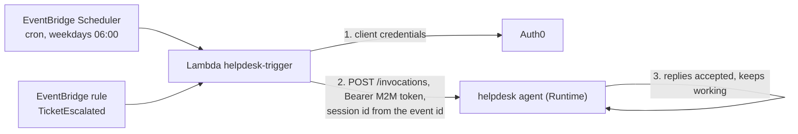

# 08. Events and schedules

You will: run the helpdesk agent every weekday morning and whenever a ticket is escalated, through one small Lambda. You need: the helpdesk agent as code ([04](04-your-own-code.md)) with Auth0 sign-in and an M2M application `agent-scheduler` ([06](06-auth0-identity.md)); `jq` and `zip` for the AWS CLI path. Cost: EventBridge Scheduler and Lambda stay within their free tiers at this volume; each run costs its model tokens (a daily Haiku digest is well under $1 a month).

The full, checked files are in [`examples/08-events-and-schedules/`](examples/08-events-and-schedules/).

## Step 1: See the path

AgentCore has no scheduler of its own. Both triggers go through one Lambda:



The Lambda does three things: get a token, pick a session id, start the run. It does not wait for the agent to finish.

Terraform: [`aws_lambda_function.trigger`](https://registry.terraform.io/providers/hashicorp/aws/latest/docs/resources/lambda_function), [`aws_scheduler_schedule.daily_digest`](https://registry.terraform.io/providers/hashicorp/aws/latest/docs/resources/scheduler_schedule), [`aws_cloudwatch_event_rule.escalated`](https://registry.terraform.io/providers/hashicorp/aws/latest/docs/resources/cloudwatch_event_rule)

## Step 2: Make the agent answer "accepted" and keep working

A Lambda runs for at most 15 minutes. An agent run can take longer. So the agent starts the work as a background task and replies at once.

While a background task is registered, the agent's `/ping` answers `HealthyBusy`. AgentCore then keeps the session alive past the 15-minute idle timeout, for up to 8 hours.

<table><tr><th>Python</th><th>TypeScript</th></tr><tr><td>

```python
async def run(task_id: str, prompt: str) -> None:
    # While the task is registered, /ping answers HealthyBusy and the session stays alive.
    ping_id = app.add_async_task("helpdesk-task", {"taskId": task_id})
    try:
        agent = Agent(model=MODEL_ID, system_prompt=SYSTEM_PROMPT)
        result = await agent.invoke_async(prompt)
        # Report the result: a queue, a ticket note, a chat message.
        print(f"task {task_id} done: {result}")
        tasks[task_id] = "done"
    except Exception as error:
        print(f"task {task_id} failed: {error!r}")
        tasks[task_id] = "failed"
    finally:
        # /ping answers Healthy again; the idle timeout starts counting.
        app.complete_async_task(ping_id)


@app.entrypoint
async def invoke(payload: dict[str, str], context: RequestContext) -> dict[str, str]:
    task_id = payload["taskId"]
    if task_id not in tasks:  # a retried event must not start a second run
        tasks[task_id] = "running"
        job = asyncio.create_task(run(task_id, payload["prompt"]))
        background.add(job)
        job.add_done_callback(background.discard)
    return {"status": "accepted", "taskId": task_id, "state": tasks[task_id]}
```

</td><td>

```typescript
async function run(taskId: string, prompt: string): Promise<void> {
  // While the task is registered, /ping answers HealthyBusy and the session stays alive.
  const pingId = app.addAsyncTask("helpdesk-task", { taskId });
  try {
    const agent = new Agent({ model: MODEL_ID, systemPrompt: SYSTEM_PROMPT });
    const result = await agent.invoke(prompt);
    // Report the result: a queue, a ticket note, a chat message.
    console.log(`task ${taskId} done: ${result.toString()}`);
    tasks.set(taskId, "done");
  } catch (error) {
    console.error(`task ${taskId} failed`, error);
    tasks.set(taskId, "failed");
  } finally {
    // /ping answers Healthy again; the idle timeout starts counting.
    app.completeAsyncTask(pingId);
  }
}

const app = new BedrockAgentCoreApp({
  invocationHandler: {
    requestSchema: z.object({ taskId: z.string(), prompt: z.string() }),
    process: async ({ taskId, prompt }) => {
      // A retried event must not start a second run.
      if (!tasks.has(taskId)) {
        tasks.set(taskId, "running");
        void run(taskId, prompt);
      }
      return { status: "accepted", taskId, state: tasks.get(taskId) };
    },
  },
});
```

</td></tr></table>

- **The same pair in both SDKs:** `add_async_task` / `complete_async_task` in Python, `addAsyncTask` / `completeAsyncTask` in TypeScript. Python also has the `@app.async_task` decorator, and TypeScript `app.asyncTask(fn)`.
- **Don't block the event loop.** `/ping` is served by the same process. A blocking call in the entrypoint stops `/ping` answering, and the session is ended after 15 minutes.
- **`tasks` lives in the session's VM.** It stops a retried event from starting a second run while that VM lives. It is lost when the session ends.

Deploy it as a second runtime next to the helpdesk agent, with the Auth0 authorizer from [06](06-auth0-identity.md). Copy `agent.py` and `pyproject.toml` into `app/events/` first. For TypeScript, use `--language TypeScript --entrypoint agent.ts`. Outside the project CLI, CI builds the zip for linux/arm64 and uploads it to S3.

<table><tr><th>agentcore CLI</th><th>AWS CLI</th><th>Terraform</th></tr><tr><td>

```bash
agentcore add agent --name helpdesk_events --type byo --language Python \
  --framework Strands --model-provider Bedrock \
  --code-location app/events/ --entrypoint agent.py \
  --authorizer-type CUSTOM_JWT \
  --discovery-url https://fintech.eu.auth0.com/.well-known/openid-configuration \
  --allowed-audience https://agents.fintech.example
agentcore deploy
```

</td><td>

```bash
AGENT_ARN=$(aws bedrock-agentcore-control create-agent-runtime --region "$REGION" \
  --agent-runtime-name helpdesk_events \
  --agent-runtime-artifact "{\"codeConfiguration\":{\"code\":{\"s3\":{\"bucket\":\"$CODE_BUCKET\",\"prefix\":\"helpdesk_events/agent.zip\"}},\"runtime\":\"PYTHON_3_12\",\"entryPoint\":[\"agent.py\"]}}" \
  --role-arn "$AGENT_ROLE_ARN" \
  --network-configuration '{"networkMode":"PUBLIC"}' \
  --authorizer-configuration '{"customJWTAuthorizer":{"discoveryUrl":"https://fintech.eu.auth0.com/.well-known/openid-configuration","allowedAudience":["https://agents.fintech.example"]}}' \
  --query agentRuntimeArn --output text)
```

</td><td>

```hcl
resource "aws_bedrockagentcore_agent_runtime" "events" {
  agent_runtime_name = "helpdesk_events"
  role_arn           = var.agent_role_arn

  agent_runtime_artifact {
    code_configuration {
      runtime     = "PYTHON_3_12"
      entry_point = ["agent.py"]
      code {
        s3 {
          bucket = var.agent_code_bucket
          prefix = "helpdesk_events/agent.zip"
        }
      }
    }
  }

  network_configuration {
    network_mode = "PUBLIC"
  }

  authorizer_configuration {
    custom_jwt_authorizer {
      discovery_url    = "https://fintech.eu.auth0.com/.well-known/openid-configuration"
      allowed_audience = ["https://agents.fintech.example"]
    }
  }
}
```

</td></tr></table>

Terraform: [`aws_bedrockagentcore_agent_runtime.events`](https://registry.terraform.io/providers/hashicorp/aws/latest/docs/resources/bedrockagentcore_agent_runtime)

## Step 3: Write the Lambda handler

The handler needs an Auth0 M2M token and a session id. Both have one rule each.

- **Cache the token.** Fetch it once per Lambda instance and reuse it until a minute before it expires. Auth0 rate-limits and bills M2M token requests.
- **Derive the session id from the event id.** EventBridge and Lambda retry deliveries with the same event id. The same id gives the same session, so a retry reaches the agent that is already working, and the `tasks` check in Step 2 ignores it. A SHA-256 hex digest is 64 characters; AgentCore needs at least 33.

The call itself is plain HTTPS. The agent accepts Auth0 bearer tokens (JWT inbound), and the AWS SDKs only sign requests with SigV4, so there is no SDK call here.

<table><tr><th>Python</th><th>TypeScript</th></tr><tr><td>

```python
def m2m_token() -> str:
    """Client-credentials token, cached for as long as this Lambda instance lives."""
    global _token, _token_expires
    if time.time() < _token_expires - 60:
        return _token
    secrets = boto3.client("secretsmanager")
    client_secret = secrets.get_secret_value(SecretId=AUTH0_SECRET_ID)["SecretString"]
    form = {
        "grant_type": "client_credentials",
        "client_id": AUTH0_CLIENT_ID,
        "client_secret": client_secret,
        "audience": AUDIENCE,
    }
    body = urllib.parse.urlencode(form).encode()
    with urllib.request.urlopen(AUTH0_TOKEN_URL, body, timeout=10) as response:
        reply = cast(TokenReply, json.load(response))
    _token, _token_expires = reply["access_token"], time.time() + reply["expires_in"]
    return _token


def session_id(event: Event) -> str:
    """Same event -> same session id. A retried delivery reaches the same agent session."""
    return hashlib.sha256(f"{event['source']}:{event['id']}".encode()).hexdigest()


def handler(event: Event, context: object) -> dict[str, str]:
    arn = urllib.parse.quote(AGENT_ARN, safe="")
    url = f"https://bedrock-agentcore.{REGION}.amazonaws.com/runtimes/{arn}/invocations?qualifier=DEFAULT"
    request = urllib.request.Request(
        url,
        data=json.dumps({"taskId": event["id"], "prompt": prompt_for(event)}).encode(),
        headers={
            "Authorization": f"Bearer {m2m_token()}",
            "Content-Type": "application/json",
            "X-Amzn-Bedrock-AgentCore-Runtime-Session-Id": session_id(event),
        },
        method="POST",
    )
    with urllib.request.urlopen(request, timeout=30) as response:
        reply: dict[str, str] = json.load(response)
    print(json.dumps({"event": event["id"], "agent": reply}))
    return reply  # {"status": "accepted", ...}: the agent keeps working on its own
```

</td><td>

```typescript
/** Client-credentials token, cached for as long as this Lambda instance lives. */
async function m2mToken(): Promise<string> {
  if (Date.now() < tokenExpires - 60_000) return token;
  const secret = await secrets.send(new GetSecretValueCommand({ SecretId: AUTH0_SECRET_ID }));
  const response = await fetch(AUTH0_TOKEN_URL, {
    method: "POST",
    body: new URLSearchParams({
      grant_type: "client_credentials",
      client_id: AUTH0_CLIENT_ID,
      client_secret: secret.SecretString!,
      audience: AUDIENCE,
    }),
  });
  const reply = (await response.json()) as { access_token: string; expires_in: number };
  token = reply.access_token;
  tokenExpires = Date.now() + reply.expires_in * 1000;
  return token;
}

/** Same event -> same session id. A retried delivery reaches the same agent session. */
export function sessionId(event: Event): string {
  return createHash("sha256").update(`${event.source}:${event.id}`).digest("hex");
}

export async function handler(event: Event): Promise<Record<string, string>> {
  const arn = encodeURIComponent(AGENT_ARN);
  const url = `https://bedrock-agentcore.${REGION}.amazonaws.com/runtimes/${arn}/invocations?qualifier=DEFAULT`;
  const response = await fetch(url, {
    method: "POST",
    headers: {
      Authorization: `Bearer ${await m2mToken()}`,
      "Content-Type": "application/json",
      "X-Amzn-Bedrock-AgentCore-Runtime-Session-Id": sessionId(event),
    },
    body: JSON.stringify({ taskId: event.id, prompt: promptFor(event) }),
    signal: AbortSignal.timeout(30_000),
  });
  if (!response.ok) throw new Error(`agent returned ${response.status}: ${await response.text()}`);
  const reply = (await response.json()) as Record<string, string>;
  console.log(JSON.stringify({ event: event.id, agent: reply }));
  return reply; // {"status": "accepted", ...}: the agent keeps working on its own
}
```

</td></tr></table>

The Python handler needs nothing outside the Lambda runtime: zip `handler.py` alone. Bundle the TypeScript handler into one `handler.js` (for example with esbuild) and zip that.

Terraform: [`aws_secretsmanager_secret.auth0`](https://registry.terraform.io/providers/hashicorp/aws/latest/docs/resources/secretsmanager_secret), [`aws_iam_role_policy.trigger_secret`](https://registry.terraform.io/providers/hashicorp/aws/latest/docs/resources/iam_role_policy) (the handler's permission to read the secret)

## Step 4: Create the Lambda

The client secret goes into Secrets Manager. The Lambda's role may read that one secret and write logs; nothing else.

<table><tr><th>agentcore CLI</th><th>AWS CLI</th><th>Terraform</th></tr><tr><td>

Not in the `agentcore` CLI: it creates only AgentCore resources. Closest: `agentcore add gateway-target --type lambda-function-arn` puts an existing Lambda behind a Gateway as a tool.

</td><td>

```bash
SECRET_ARN=$(aws secretsmanager create-secret --region "$REGION" \
  --name helpdesk/agent-scheduler-client-secret \
  --secret-string "$AUTH0_CLIENT_SECRET" --query ARN --output text)

aws iam create-role --role-name helpdesk-trigger \
  --assume-role-policy-document '{"Version":"2012-10-17","Statement":[{"Effect":"Allow","Action":"sts:AssumeRole","Principal":{"Service":"lambda.amazonaws.com"}}]}'
aws iam attach-role-policy --role-name helpdesk-trigger \
  --policy-arn arn:aws:iam::aws:policy/service-role/AWSLambdaBasicExecutionRole
aws iam put-role-policy --role-name helpdesk-trigger --policy-name read-auth0-secret \
  --policy-document "{\"Version\":\"2012-10-17\",\"Statement\":[{\"Effect\":\"Allow\",\"Action\":\"secretsmanager:GetSecretValue\",\"Resource\":\"$SECRET_ARN\"}]}"

aws lambda create-function --region "$REGION" --function-name "$FUNCTION" \
  --runtime python3.12 --handler handler.handler --timeout 60 \
  --role "arn:aws:iam::$ACCOUNT:role/helpdesk-trigger" \
  --zip-file fileb://handler.zip \
  --environment "Variables={AGENT_ARN=$AGENT_ARN,AUTH0_CLIENT_ID=$AUTH0_CLIENT_ID,AUTH0_SECRET_ID=$SECRET_ARN}"
```

</td><td>

```hcl
resource "aws_secretsmanager_secret" "auth0" {
  name = "helpdesk/agent-scheduler-client-secret"
}

resource "aws_iam_role_policy" "trigger_secret" {
  role = aws_iam_role.trigger.id
  policy = jsonencode({
    Version = "2012-10-17"
    Statement = [{
      Effect   = "Allow"
      Action   = "secretsmanager:GetSecretValue"
      Resource = aws_secretsmanager_secret.auth0.arn
    }]
  })
}

resource "aws_lambda_function" "trigger" {
  function_name = "helpdesk-trigger"
  role          = aws_iam_role.trigger.arn
  runtime       = "python3.12" # TypeScript: "nodejs22.x"
  handler       = "handler.handler"
  filename      = var.lambda_zip
  timeout       = 60

  environment {
    variables = {
      AGENT_ARN       = aws_bedrockagentcore_agent_runtime.events.agent_runtime_arn
      AUTH0_CLIENT_ID = var.auth0_client_id
      AUTH0_SECRET_ID = aws_secretsmanager_secret.auth0.arn
    }
  }
}
```

</td></tr></table>

The role itself (`aws_iam_role.trigger`, trusted by `lambda.amazonaws.com`) is in `main.tf`. With Terraform, put the secret's value in afterwards with `aws secretsmanager put-secret-value`, so it never enters the state file.

Terraform: [`aws_secretsmanager_secret.auth0`](https://registry.terraform.io/providers/hashicorp/aws/latest/docs/resources/secretsmanager_secret), [`aws_iam_role.trigger`](https://registry.terraform.io/providers/hashicorp/aws/latest/docs/resources/iam_role), [`aws_iam_role_policy_attachment.trigger_logs`](https://registry.terraform.io/providers/hashicorp/aws/latest/docs/resources/iam_role_policy_attachment), [`aws_iam_role_policy.trigger_secret`](https://registry.terraform.io/providers/hashicorp/aws/latest/docs/resources/iam_role_policy), [`aws_lambda_function.trigger`](https://registry.terraform.io/providers/hashicorp/aws/latest/docs/resources/lambda_function)

## Step 5: Add the schedule

EventBridge Scheduler calls the Lambda with an input you choose. Shape it like an EventBridge event, so the handler treats both triggers the same way.

Use `<aws.scheduler.scheduled-time>` as the event id. Scheduler fills it in, and it stays the same when Scheduler retries that firing. Don't use `<aws.scheduler.execution-id>`: it changes on every attempt.

<table><tr><th>agentcore CLI</th><th>AWS CLI</th><th>Terraform</th></tr><tr><td>

Not in the `agentcore` CLI: AgentCore has no scheduler. Closest, to run the agent once by hand:

```bash
agentcore invoke --runtime helpdesk_events \
  --bearer-token "$M2M_TOKEN" \
  '{"taskId":"manual-1","prompt":"Write the daily digest."}'
```

**[verify]** that a JSON prompt is sent as the payload unchanged.

</td><td>

```bash
INPUT='{"id":"<aws.scheduler.scheduled-time>","source":"scheduler.daily-digest","detail-type":"DailyDigest","detail":{}}'
TARGET=$(jq -n --arg arn "$FUNCTION_ARN" --arg role "arn:aws:iam::$ACCOUNT:role/helpdesk-scheduler" \
  --arg input "$INPUT" '{Arn: $arn, RoleArn: $role, Input: $input}')
aws scheduler create-schedule --region "$REGION" --name helpdesk-daily-digest \
  --schedule-expression "cron(0 6 ? * MON-FRI *)" \
  --schedule-expression-timezone Europe/Dublin \
  --flexible-time-window '{"Mode":"OFF"}' \
  --target "$TARGET"
```

</td><td>

```hcl
resource "aws_scheduler_schedule" "daily_digest" {
  name                         = "helpdesk-daily-digest"
  schedule_expression          = "cron(0 6 ? * MON-FRI *)"
  schedule_expression_timezone = "Europe/Dublin"

  flexible_time_window {
    mode = "OFF"
  }

  target {
    arn      = aws_lambda_function.trigger.arn
    role_arn = aws_iam_role.scheduler.arn
    # Shaped like an EventBridge event. The scheduled time is the same on every retry.
    input = jsonencode({
      id            = "<aws.scheduler.scheduled-time>"
      source        = "scheduler.daily-digest"
      "detail-type" = "DailyDigest"
      detail        = {}
    })
  }
}
```

</td></tr></table>

Scheduler assumes the role `helpdesk-scheduler` (trusted by `scheduler.amazonaws.com`, allowed `lambda:InvokeFunction` on this function). Both files create it.

Terraform: [`aws_scheduler_schedule.daily_digest`](https://registry.terraform.io/providers/hashicorp/aws/latest/docs/resources/scheduler_schedule), [`aws_iam_role.scheduler`](https://registry.terraform.io/providers/hashicorp/aws/latest/docs/resources/iam_role), [`aws_iam_role_policy.scheduler_invoke`](https://registry.terraform.io/providers/hashicorp/aws/latest/docs/resources/iam_role_policy)

## Step 6: Add the event rule

An EventBridge rule matches events on a bus and sends them to the Lambda. EventBridge calls Lambda with a resource-based permission, not a role.

<table><tr><th>agentcore CLI</th><th>AWS CLI</th><th>Terraform</th></tr><tr><td>

Not in the `agentcore` CLI: event rules are EventBridge resources. Closest: none; use the AWS CLI or Terraform.

</td><td>

```bash
RULE_ARN=$(aws events put-rule --region "$REGION" --name helpdesk-ticket-escalated \
  --event-pattern '{"source":["fintech.tickets"],"detail-type":["TicketEscalated"]}' \
  --query RuleArn --output text)
aws events put-targets --region "$REGION" --rule helpdesk-ticket-escalated \
  --targets "Id=trigger,Arn=$FUNCTION_ARN"
aws lambda add-permission --region "$REGION" --function-name "$FUNCTION" \
  --statement-id helpdesk-ticket-escalated --action lambda:InvokeFunction \
  --principal events.amazonaws.com --source-arn "$RULE_ARN"
```

</td><td>

```hcl
resource "aws_cloudwatch_event_rule" "escalated" {
  name = "helpdesk-ticket-escalated"
  event_pattern = jsonencode({
    source        = ["fintech.tickets"]
    "detail-type" = ["TicketEscalated"]
  })
}

resource "aws_cloudwatch_event_target" "escalated" {
  rule = aws_cloudwatch_event_rule.escalated.name
  arn  = aws_lambda_function.trigger.arn
}

resource "aws_lambda_permission" "escalated" {
  statement_id  = "helpdesk-ticket-escalated"
  action        = "lambda:InvokeFunction"
  function_name = aws_lambda_function.trigger.function_name
  principal     = "events.amazonaws.com"
  source_arn    = aws_cloudwatch_event_rule.escalated.arn
}
```

</td></tr></table>

Terraform: [`aws_cloudwatch_event_rule.escalated`](https://registry.terraform.io/providers/hashicorp/aws/latest/docs/resources/cloudwatch_event_rule), [`aws_cloudwatch_event_target.escalated`](https://registry.terraform.io/providers/hashicorp/aws/latest/docs/resources/cloudwatch_event_target), [`aws_lambda_permission.escalated`](https://registry.terraform.io/providers/hashicorp/aws/latest/docs/resources/lambda_permission)

## Step 7: Try it

Send a test event, then read both logs:

```bash
aws events put-events --region "$REGION" \
  --entries '[{"Source":"fintech.tickets","DetailType":"TicketEscalated","Detail":"{\"ticketId\":\"TCK-1234\"}"}]'
```

- The Lambda log (`/aws/lambda/helpdesk-trigger`) shows `{"status": "accepted", ...}` within a second or two.
- The agent's log (`agentcore logs --runtime helpdesk_events`) shows `task … done: …` when the run finishes.

In the tickets tool's audit log the caller is the M2M client `…@clients`, not a person. With the policies from [07](07-policy.md) it cannot open tickets.

Terraform: [`aws_cloudwatch_event_rule.escalated`](https://registry.terraform.io/providers/hashicorp/aws/latest/docs/resources/cloudwatch_event_rule), [`aws_lambda_function.trigger`](https://registry.terraform.io/providers/hashicorp/aws/latest/docs/resources/lambda_function)

## What just happened

- A schedule and an event rule both invoked one Lambda. It fetched a cached Auth0 M2M token and called the agent over HTTPS.
- The session id came from the event id, so retried deliveries reached the same session and were ignored there.
- The agent replied "accepted" at once and kept working as a background task, with `/ping` holding the session open.

## Clean up

```bash
# AWS CLI: the clean_up function in examples/08-events-and-schedules/cli.sh
# Terraform:
terraform destroy
agentcore remove agent --name helpdesk_events --yes && agentcore deploy
```

Next: [09. Observability, evals and costs](09-observability-evals-costs.md)
